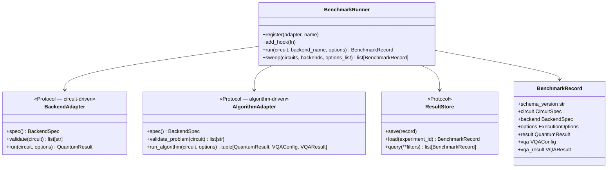

# QPUBench

[](https://python.org)
[](LICENSE)
[](docs/schemas.md)

Modality-agnostic quantum benchmark framework with a typed [Pydantic v2](https://docs.pydantic.dev/) schema layer.

qpubench separates **what you benchmark** (schemas) from **how execution happens** (adapters) and **how results are stored** (stores). The schema layer is the stable core: every run, whatever the paradigm or vendor SDK, produces the same `BenchmarkRecord`. That one record format covers benchmarks as different as gate-based circuits, MBQC on FPGA, molecular VQE problems, and evolutionary circuit search — with no quantum SDK dependency in the schemas themselves.

---

## Documentation

The first three pages after installation cover the three layers in order — schemas, adapters, stores; the pages after that cover what you can benchmark with them.

| | |
|---|---|
| **[Installation](docs/installation.md)** | pip · uv · Poetry 2 · conda |
| **[Schema reference](docs/schemas.md)** | Every Pydantic model, field, and enum |
| **[Backends & adapters](docs/backends.md)** | BackendAdapter / AlgorithmAdapter protocols, writing a new adapter |
| **[Stores & persistence](docs/persistence.md)** | Where results go: NDJSONStore · ParquetStore · S3Store (AWS S3 / HF Storage Buckets) · hooks |
| **[VQA algorithms](docs/vqa.md)** | Benchmarking variational algorithms: plain VQE, ADAPT-VQE, and the three interchangeable ADAPT-VQE engines |
| **[Integrations](docs/integrations.md)** | Cebule SDK · Xenakis · ExcitationSolve · GSOpt · Photonic · QDK Chemistry · GBS · QSE/KQD · QESEM · QCSchema/QCElemental/PennyLane · Bloqade/Aquila · SlowQuant |
| **[Compute architectures](docs/compute_architectures.md)** | CPUs, GPUs, and FPGAs across the supported simulators — incl. the MBQC-FPGA program format |
| **[Compatibility](docs/compatibility.md)** | Cross-SDK convention traps: qubit ordering, Pauli encoding, complex precision, MBQC bit conventions |
| **[Integration guide](INTEGRATION_GUIDE.md)** | Writing adapters, energy hooks, testing pattern |
| **[Examples](examples/README.md)** | Guides, demos, and tutorials — what's supported, what's partial, and why |

---

## Installation

```sh
# Minimal (schemas + stubs only — no quantum SDK needed)
pip install .

# With optional backends
pip install ".[qiskit]"      # Qiskit Aer + IBM Quantum Runtime V2
pip install ".[storage]"     # Parquet store (pyarrow + pandas)
pip install ".[s3]"          # S3 store (boto3) — AWS S3 / MinIO / HF Storage Buckets
pip install ".[all]"         # everything on PyPI
```

For development, install in editable mode instead (`pip install -e .`) so source changes take effect without reinstalling — the extras work the same way in both forms.

Full instructions for **uv**, **Poetry 2**, and **conda** → [docs/installation.md](docs/installation.md)

---

## Architecture

Three layers, three responsibilities:

- **Schemas** describe — circuits, backends, options, results, and the `BenchmarkRecord` bundling them are plain Pydantic models with no quantum SDK imports.
- **Adapters** execute — a `BackendAdapter` runs a circuit *you* provide (simulators, QPUs); an `AlgorithmAdapter` wraps a library that generates its own circuits from a problem specification (a molecule) and drives its own loop. Both protocols exist side by side because both register with the same `BenchmarkRunner`, which dispatches automatically and records either kind of run in the same format.
- **Stores** persist — every record lands in an `NDJSONStore`, `ParquetStore`, or `S3Store` through one `save`/`load`/`query` interface.



| Protocol | When to use | Examples |
|---|---|---|
| `BackendAdapter` | You provide the circuit; backend executes it | Aer, Qrack, IBM, IQM, MBQC-FPGA |
| `AlgorithmAdapter` | Library generates its own circuit from a problem spec | QForte (ADAPT-VQE, UCCNVQE) |

---

## Quick start

### Gate-based (Bell state + ZZ expectation)

The benchmark here is the smallest meaningful one: prepare a two-qubit Bell state and measure the ⟨ZZ⟩ correlation (which should be exactly 1 for a perfect Bell state — so any deviation measures the backend, not the circuit). It runs end-to-end with the bare install, using a built-in stub backend, and appends the result to an NDJSON file:

```python
import pathlib
from qpubench import (
    BenchmarkRunner, NDJSONStore, CircuitSpec,
    SparsePauliObservable, PauliTerm, PauliLabel, ComplexNumber,
)

bell_qasm = """OPENQASM 2.0;
include "qelib1.inc";
qreg q[2];
h q[0];
cx q[0],q[1];"""

circuit = CircuitSpec(
    num_qubits=2,
    serialized=bell_qasm,
    observables=[
        SparsePauliObservable(num_qubits=2, terms=[
            PauliTerm(qubit_indices=(0, 1),
                      pauli_ops=(PauliLabel.Z, PauliLabel.Z),
                      coefficient=ComplexNumber(re=1.0))
        ])
    ],
)

runner = BenchmarkRunner(store=NDJSONStore(pathlib.Path("results/bell.ndjson")))
runner.register(name="stub", seed=42)
record = runner.run(circuit, "stub", shots=4096)

ev = record.result.expectation_values[0]
print(f"⟨ZZ⟩ = {ev.value:.4f} ± {ev.std_error:.4f}")
```

What this does, step by step:

- **The circuit is plain data** — an OpenQASM string plus one observable (the two-qubit `ZZ` correlation). No quantum SDK is involved in describing it.
- **`runner.register(name="stub", seed=42)`** registers a backend without naming an adapter class, so the runner creates a **`StubGateAdapter`** for you: a built-in placeholder backend that returns random (but seed-reproducible) expectation values instead of simulating anything. It exists so you can build and test your whole benchmark pipeline — circuit, runner, result store — before installing any SDK or touching real hardware.
- **`runner.run(circuit, "stub", shots=4096)`** is shorthand for passing `ExecutionOptions(shots=4096)`. Construct a full `ExecutionOptions` yourself only when you need more than a shot count (error mitigation, transpiler settings, algorithm hyperparameters, …).

To get real numbers, register a real simulator under a new name — everything else stays identical:

```python
from qpubench.backends import AerAdapter        # pip install "qpubench[qiskit]"

runner.register(AerAdapter(), name="aer")
record = runner.run(circuit, "aer", shots=4096)   # ⟨ZZ⟩ ≈ 1.0 for a Bell state
```

### OpenQASM 3.0 circuit

```python
from qpubench import CircuitSpec

bell_qasm3 = """OPENQASM 3.0;
include "stdgates.inc";
qubit[2] q;
h q[0];
cx q[0], q[1];"""

circuit = CircuitSpec.from_openqasm3(bell_qasm3, num_qubits=2)
print(circuit.openqasm3)          # → the source string
print(circuit.format)             # → CircuitFormat.QASM3
```

`from_openqasm3()` stores the source string verbatim and tags the circuit with `CircuitFormat.QASM3`, so any adapter (and anyone reading the stored record years later) knows exactly how to parse it. OpenQASM 3.0 is the preferred format for new circuits; OpenQASM 2.0 (as in the first example) remains fully supported.

### Parameterized circuits

A `CircuitSpec` can declare named parameters. The unbound circuit is a reusable template; `.bind()` returns a copy with concrete values filled in, and backends execute only bound circuits:

```python
from qpubench import CircuitSpec

ansatz = CircuitSpec(num_qubits=2, parameters=["theta"], serialized="OPENQASM 2.0; ...")
bound  = ansatz.bind({"theta": 1.2566})     # a copy — the template stays unbound

record = runner.run(bound, "stub", shots=4096)
```

Because each `BenchmarkRecord` stores the *bound* copy, every stored run is exactly reproducible — the parameter values travel with the circuit. This bind-per-evaluation pattern is what a variational algorithm loops over: keep the parametrized template and a separate vector of parameter values, bind fresh for each energy evaluation, and let a classical optimizer update the values. The full worked VQE loop is in [docs/vqa.md](docs/vqa.md).

### VQA metadata (`VQAConfig` / `VQAResult`)

For variational runs, attach a `VQAConfig` so the stored record says what problem it belongs to:

```python
from qpubench import VQAConfig

record = runner.run(bound, "stub", shots=4096,
    vqa=VQAConfig(problem_type="chemistry", molecule="H2", basis="sto-3g"))
```

A `VQAConfig` describes the experiment *inputs* — what you chose to run; it configures nothing at execution time and never carries computed values:

- **`problem_type`** (the only required field) labels the problem domain — `"chemistry"`, `"optimization"`, or `"ml"` — so a store holding thousands of mixed records can be filtered and aggregated by domain later. It does not change how the circuit executes.
- `molecule`, `basis`, and the other optional fields (`optimizer`, `ansatz`, mapper, active space, …) make the stored record self-describing, so results remain interpretable without the code that produced them.

Computed *outputs* live in `record.vqa_result` (a `VQAResult`) and are produced, never user-supplied: algorithm adapters (ADAPT-VQE etc.) return the converged energy, convergence history, and computed references directly, and for estimator-path circuit runs (observables attached) the runner derives `final_eigenvalue` from the result's expectation values automatically. When a computed reference (`ground_truth` or `fci_energy`) is present, `vqa_result.energy_error` and `vqa_result.chemical_accuracy` (error < 1.6 mHa) are derived for you.

### Algorithm libraries (`AlgorithmAdapter`, `AlgorithmSpec`, `AlgorithmFamily`)

Everything above ran a circuit *you* wrote through a `BackendAdapter`. Some libraries invert that: they take a **problem** (a molecule), generate circuits internally, and drive their own optimization loop. Those register under the second protocol, `AlgorithmAdapter` (see [Architecture](#architecture)), and two small schema types identify what they ran:

- **`AlgorithmSpec`** carries identity — the library-specific `name` plus an `AlgorithmFamily`, the package-agnostic label saying what the algorithm *is*, independent of who implements it.
- The **family-specific config** carries the hyperparameters every implementation of that family accepts — for `AlgorithmFamily.ADAPT_VQE` that is `AdaptVQEConfig`.

The payoff of this split: the same config runs against QForte's native C++ engine, a from-scratch Qiskit-circuit engine, or a QDK/Azure Quantum-flavored one — register a different adapter under a different name, keep everything else, and the resulting `BenchmarkRecord`s are directly comparable runs of "the same algorithm":

```python
from qpubench import (
    AdaptVQEConfig, AlgorithmFamily, AlgorithmSpec, BenchmarkRunner, ExecutionOptions,
)
from qpubench.schemas.circuit import CircuitSpec
from qpubench.schemas.primitives import CircuitFormat

mol = CircuitSpec(num_qubits=0, format=CircuitFormat.MOLECULE_JSON,
                  serialized="/path/to/He-ccpvdz.json")
options = ExecutionOptions(
    algorithm_spec=AlgorithmSpec(name="ADAPTVQE", family=AlgorithmFamily.ADAPT_VQE),
    adapt_vqe_config=AdaptVQEConfig(pool_type="SD", optimizer="BFGS",
                                    gradient_threshold=1e-4, max_macro_iterations=20),
)
# register QForteAlgorithmAdapter from integrations/qforte/
record = runner.run(mol, "qforte", options)
# — or run the exact same options against a different implementation:
# register IBMQiskitAdaptVQEAdapter from integrations/ibm_qiskit_adapt_vqe/
record = runner.run(mol, "ibm_qiskit_adapt_vqe", options)
```

Here the "circuit" is really a problem description (a molecule file, `CircuitFormat.MOLECULE_JSON`) and the registered adapter is an `AlgorithmAdapter` — the library builds its own circuits internally and drives its own optimization loop, while the runner records the outcome in the same `BenchmarkRecord` format as any single-circuit run. `ExecutionOptions` is constructed explicitly here because the run needs more than a shot count: which algorithm to run (`algorithm_spec`) and its hyperparameters (`adapt_vqe_config`).

→ Full VQA documentation (VQE and ADAPT-VQE, all three interchangeable engines): [docs/vqa.md](docs/vqa.md) · runnable examples: [examples/](examples/)

---

## Schema overview

The schema layer has zero quantum SDK dependencies. Its modules fall into three groups: seven **core modules** define the record format every benchmark shares; a handful of unprefixed **cross-cutting modules** aggregate multiple external sources or framework-own catalogues (basis sets, Hamiltonian metadata, the community advantage tracker, …); and the remaining **project mirrors** each model one external project, named `<maintainer>_<package>.py` so the filename tells you the upstream source. The compact map below shows what lives where — the full per-module table (key types, computing model, qubit modality, field-level reference) is in [docs/schemas.md](docs/schemas.md).

| Group | Modules |
|---|---|
| **Core record format** | `primitives` · `circuit` · `observable` · `backend` · `execution` · `result` · `record` |
| **Cross-cutting catalogues & registries** (unprefixed — multi-source) | `advantage` · `basis_sets` · `hamiltonian_library` · `optimizer_catalog` · `polarizable_embedding` · `reactions` · `contraction_path` |
| **Project mirrors: quantum chemistry & VQA** | `microsoft_qdk` · `molssi_qcschema` · `pyscf_pyscf` · `erikkjellgren_slowquant` · `evangelistalab_qforte` · `bestquark_gsopt` · `dlr_excitation_solve` · `classiq_classiq` · `mqsdk_qse` · `mqsdk_cebule` |
| **Project mirrors: photonic / GBS** | `dtu_photonic` · `dtu_gbs` |
| **Project mirrors: other paradigms** | `johnrscott_mbqc_fpga` (MBQC on FPGA) · `quera_bloqade` (neutral-atom AHS) |
| **Project mirrors: error mitigation & vendors** | `qedma_qesem` · `qctrl_fire_opal` · `unitaryfund_mitiq` · `haiqu_rivet` · `parityqc_parityqc` · `qmatter_qmatter` · `quantum_motion_hardware` · `ibm_runtime_v2` · `ibm_cost_estimator` |
| **Project mirrors: circuit search** | `mqsdk_xenakis` (GA circuit genomes) |

### Computing model vs. qubit modality

Two of the fields you will meet on every circuit, backend, and result deserve a word of explanation, because most frameworks conflate them. `ComputingModel` says how the program is *expressed* (the paradigm — gate-based, measurement-based, boson sampling, …); `QubitModality` says what *hardware technology* realizes it (superconducting, trapped-ion, photonic, …). qpubench keeps them as independent fields on `CircuitSpec`, `BackendSpec`, and `QuantumResult` because the relationship is many-to-many: `GATE_BASED` circuits run on `SUPERCONDUCTING` (IBM, IQM), `TRAPPED_ION` (Quantinuum, IonQ), `SILICON_SPIN` (Quantum Motion), and `PHOTONIC` (Perceval, photochipsim) hardware alike, while some paradigms are realized by only one modality today (`GBS` and `FUSION_BASED` are photonic-only). Specific quantum algorithms (QPE, KQD, VQE, …) are neither of these: they are layered on top of a computing model and identified separately, by `AlgorithmFamily`.

`ComputingModel` values: `GATE_BASED` · `MBQC` · `FUSION_BASED` · `ADIABATIC` · `ANNEALING` · `GBS` · `SAMPLING`

`QubitModality` values: `SUPERCONDUCTING` · `TRAPPED_ION` · `NEUTRAL_ATOM` · `PHOTONIC` · `SILICON_SPIN`

→ Full field-level reference: [docs/schemas.md](docs/schemas.md)

---

## Repository layout

```
qpubench/
├── src/qpubench/
│   ├── schemas/           ← Pydantic schema layer (38 modules, schema v3.0.0)
│   │   ├── primitives, circuit, observable, backend, execution, result, record, reaction, advantage
│   │   ├── johnrscott_mbqc_fpga      ← MBQC-FPGA 16-bit program word
│   │   ├── mqsdk_cebule              ← Cebule SDK task I/O (solvation, MD, geometry, GNN, VQE)
│   │   ├── mqsdk_xenakis             ← Xenakis GA circuit genomes
│   │   ├── evangelistalab_qforte     ← QForte: pybind11 object layer + ADAPT-VQE/UCCN-VQE/UCCN-PQE/SPQE
│   │   ├── dlr_excitation_solve, bestquark_gsopt
│   │   ├── dtu_photonic              ← Linear-optics chips, FBQC, HOM, photonic VQE/analog
│   │   ├── microsoft_qdk             ← QDK chemistry pipeline: SCF→active space→QPE→resource est.
│   │   ├── dtu_gbs                   ← Gaussian Boson Sampling: hafnian, vibronic, TDM/Borealis
│   │   ├── mqsdk_qse                 ← Krylov Quantum Diagonalization (KQD/SQD)
│   │   ├── qedma_qesem               ← QESEM (Qedma): noise scaling, QET, device characterization
│   │   ├── molssi_qcschema           ← QCSchema/QCElemental/PennyLane interoperability
│   │   ├── quera_bloqade             ← Neutral atom AHS: Bloqade/Aquila atom arrangement, drives, results
│   │   ├── erikkjellgren_slowquant   ← SlowQuant UCC/VQE: ansatz config, SCF, optimization, linear response
│   │   ├── classiq_classiq           ← Classiq synthesis + chemistry/QAOA
│   │   └── qctrl_fire_opal, unitaryfund_mitiq, haiqu_rivet, parityqc_parityqc,
│   │       qmatter_qmatter, quantum_motion_hardware, ibm_runtime_v2  ← one module per vendor
│   ├── backends/          ← Adapter protocols, stubs, and real adapters
│   │                        (Aer, Braket, IBM Runtime, IQM, PennyLane
│   │                        Lightning, Mitiq ZNE; Qrack is a stub)
│   ├── hamiltonian_sources/ ← HamLib, PennyLane qchem, PySCF ab initio,
│   │                        Basis Set Exchange, q-vSZP loaders
│   ├── tensor_network/    ← Contraction-path finding helpers
│   ├── observability.py   ← Logging hooks
│   ├── runner.py          ← BenchmarkRunner (run, sweep, hooks, dual-protocol dispatch)
│   └── store.py           ← NDJSONStore, ParquetStore, S3Store, ResultStore protocol
│
├── integrations/          ← NOT installed; copy into your project
│   ├── template/          ← BackendAdapter + AlgorithmAdapter starter templates
│   ├── qforte/            ← Complete QForte integration (ADAPT-VQE, UCCNVQE)
│   └── classiq, slowquant, kubeflow, generic_adapt_vqe,
│       ibm_qiskit_adapt_vqe, microsoft_qdk_adapt_vqe, qrack
│
├── examples/              ← Runnable examples: guides/, demos/, tutorials/
├── tests/                 ← Schema test suite, no quantum SDK required
├── docs/                  ← Detailed documentation
├── conda-recipe/          ← conda-build recipe (meta.yaml)
├── environment.yml        ← conda development environment
├── pyproject.toml         ← pip / uv / Poetry 2 / conda-build entry point
└── INTEGRATION_GUIDE.md   ← Step-by-step adapter guide
```

---

## Tests

```sh
pytest tests/       # full schema test suite, no quantum SDK required
```

---

## Known gaps / open TODOs

Honest accounting of what isn't finished yet, kept here rather than in the
presentation slides so it's easy to keep current without touching the deck:

- **Microsoft QDK circuit optimization** — real QDK/Q# has its own
  circuit-optimization passes; `schemas/microsoft_qdk.py` stops at SCF →
  active space → QPE → resource estimation, with no schema representation
  for them yet.
- **Error mitigation adapters** — only Mitiq has a real `ErrorMitigationAdapter`
  (`backends/unitaryfund_mitiq_adapter.py`, real ZNE). Fire Opal, Haiqu
  Rivet, ParityQC, and QMatter have schema modules describing their
  techniques but no adapter implementation wraps a real `BackendAdapter`
  with them yet.
- **QPE has no runnable adapter** — `AlgorithmFamily.QPE` exists as a
  taxonomy entry and `microsoft_qdk.QPEConfig` models QPE run
  configuration, but no `AlgorithmAdapter` actually executes a QPE circuit
  through `BenchmarkRunner` yet — schema/metadata only.
- **Kubeflow Pauli/dense-matrix conversion** — `SparsePauliObservable` has
  no Pauli-term ↔ dense-matrix conversion in either direction, so 3 of 6
  Hamiltonian-representation/measurement-method branch combinations in
  `integrations/kubeflow/` raise `NotImplementedError` rather than
  inventing the math. See `integrations/kubeflow/README.md`'s TODO
  checklist for the two missing utilities
  (`SparsePauliObservable.to_dense_matrix()`/`.from_dense_matrix()`).
- **Some chemistry tutorials run on a reduced active space** — the bundled
  dense-matrix reference engine can't handle the full-size Hamiltonian for
  the larger molecules, so those tutorials build the full setup once as a
  capability check and run a reduced-active-space scan (a real simulator
  backend lifts that limit). See `examples/README.md` for the per-tutorial
  breakdown.

---

## License

GNU Lesser General Public License v3.0 or later (LGPL-3.0-or-later) — see
[LICENSE](LICENSE) (LGPL v3) and [COPYING](COPYING) (GPL v3, which the LGPL
incorporates by reference). You can use qpubench in proprietary or
differently-licensed applications; modifications to qpubench itself must be
released under the LGPL.
