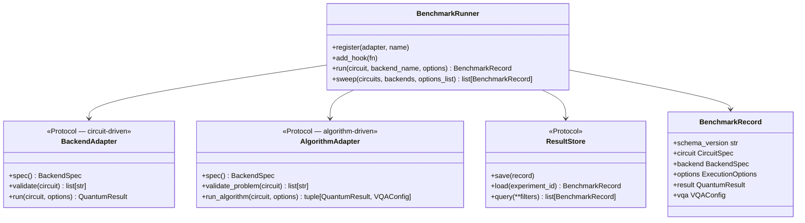

# QPUBench

[](https://python.org)
[](LICENSE)
[](docs/schemas.md)

Modality-agnostic quantum benchmark framework with a typed [Pydantic v2](https://docs.pydantic.dev/) schema layer.

qpubench separates **what you benchmark** (schemas) from **how execution happens** (adapters) and **how results are stored** (stores). The schema layer is the stable core — gate-based circuits, MBQC on FPGA, molecular VQE problems, and evolutionary circuit search all share the same `BenchmarkRecord` format, independent of any quantum SDK.

---

## Documentation

| | |
|---|---|
| **[Installation](docs/installation.md)** | pip · uv · Poetry 2 · conda |
| **[Schema reference](docs/schemas.md)** | Every Pydantic model, field, and enum |
| **[Backends & adapters](docs/backends.md)** | BackendAdapter / AlgorithmAdapter protocols, writing a new adapter |
| **[Integrations](docs/integrations.md)** | Cebule SDK · Xenakis · ExcitationSolve · GSOpt · Photonic · QDK Chemistry · GBS · QSE/KQD · QESEM · QCSchema/QCElemental/PennyLane · Bloqade/Aquila · SlowQuant |
| **[MBQC FPGA](docs/mbqc.md)** | 16-bit program word, COE files, byproduct registers |
| **[Persistence](docs/persistence.md)** | NDJSONStore · ParquetStore · S3Store (AWS S3 / HF Storage Buckets) · hooks |
| **[Compatibility](docs/compatibility.md)** | Pauli encoding, complex precision, MBQC bit conventions |
| **[Integration guide](INTEGRATION_GUIDE.md)** | Writing adapters, energy hooks, testing pattern |

---

## Installation

```sh
# Minimal (schemas + stubs only — no quantum SDK needed)
pip install .

# With optional backends
pip install ".[qiskit]"      # Qiskit Aer + IBM Quantum Runtime V2
pip install ".[storage]"     # Parquet store (pyarrow + pandas)
pip install ".[s3]"          # S3 store (boto3) — AWS S3 / MinIO / HF Storage Buckets
pip install ".[all]"         # everything on PyPI
```

Full instructions for **uv**, **Poetry 2**, and **conda** → [docs/installation.md](docs/installation.md)

---

## Architecture



| Protocol | When to use | Examples |
|---|---|---|
| `BackendAdapter` | You provide the circuit; backend executes it | Aer, Qrack, IBM, IQM, MBQC-FPGA |
| `AlgorithmAdapter` | Library generates its own circuit from a problem spec | QForte (ADAPT-VQE, UCCNVQE) |

---

## Quick start

### Gate-based (Bell state + ZZ expectation)

```python
import pathlib
from qpubench import (
    BenchmarkRunner, NDJSONStore, StubGateAdapter,
    CircuitSpec, ExecutionOptions,
    SparsePauliObservable, PauliTerm, PauliLabel, ComplexNumber,
)

circuit = CircuitSpec(
    num_qubits=2,
    serialized='OPENQASM 2.0;\ninclude "qelib1.inc";\nqreg q[2];\nh q[0];\ncx q[0],q[1];',
    observables=[
        SparsePauliObservable(num_qubits=2, terms=[
            PauliTerm(qubit_indices=(0, 1),
                      pauli_ops=(PauliLabel.Z, PauliLabel.Z),
                      coefficient=ComplexNumber(re=1.0))
        ])
    ],
)

runner = BenchmarkRunner(store=NDJSONStore(pathlib.Path("results/bell.ndjson")))
runner.register(StubGateAdapter(seed=42), name="stub")
record = runner.run(circuit, "stub", ExecutionOptions(shots=4096))
ev = record.result.expectation_values[0]
print(f"⟨ZZ⟩ = {ev.value:.4f} ± {ev.std_error:.4f}")
```

### OpenQASM 3.0 circuit

```python
from qpubench import CircuitSpec

circuit = CircuitSpec.from_openqasm3(
    'OPENQASM 3.0;\ninclude "stdgates.inc";\nqubit[2] q;\nh q[0];\ncx q[0], q[1];',
    num_qubits=2,
)
print(circuit.openqasm3)          # → the source string
print(circuit.format)             # → CircuitFormat.QASM3
```

### Parametric VQE circuit

```python
from qpubench import CircuitSpec, VQAConfig

ansatz = CircuitSpec(num_qubits=2, parameters=["theta"], serialized="OPENQASM 2.0; ...")
bound  = ansatz.bind({"theta": 1.2566})

record = runner.run(bound, "stub", ExecutionOptions(shots=4096),
    vqa=VQAConfig(problem_type="chemistry", molecule="H2", basis="sto-3g",
                  final_eigenvalue=-1.137, ground_truth=-1.1373))
print(f"Chemical accuracy: {record.vqa.chemical_accuracy}")
```

### Algorithm library (ADAPT-VQE — switch implementations freely)

`AlgorithmSpec` carries identity (`name` + `AlgorithmFamily`); hyperparameters
for `AlgorithmFamily.ADAPT_VQE` live in the package-agnostic `AdaptVQEConfig`,
so the same config runs against QForte's native engine, a from-scratch
Qiskit-circuit engine, or a QDK/Azure Quantum-flavored one — just register a
different adapter under a different name:

```python
from qpubench import (
    AdaptVQEConfig, AlgorithmFamily, AlgorithmSpec, BenchmarkRunner, ExecutionOptions,
)
from qpubench.schemas.circuit import CircuitSpec
from qpubench.schemas.primitives import CircuitFormat

mol = CircuitSpec(num_qubits=0, format=CircuitFormat.MOLECULE_JSON,
                  serialized="/path/to/He-ccpvdz.json")
options = ExecutionOptions(
    algorithm_spec=AlgorithmSpec(name="ADAPTVQE", family=AlgorithmFamily.ADAPT_VQE),
    adapt_vqe_config=AdaptVQEConfig(pool_type="SD", optimizer="BFGS",
                                    gradient_threshold=1e-4, max_macro_iterations=20),
)
# register QForteAlgorithmAdapter from integrations/qforte/
record = runner.run(mol, "qforte", options)
# — or run the exact same options against a different implementation:
# register IBMQiskitAdaptVQEAdapter from integrations/ibm_qiskit_adapt_vqe/
record = runner.run(mol, "ibm_qiskit_adapt_vqe", options)
```

→ Full examples: [examples/](examples/) · QForte adapter (native C++ engine, pybind11 schema in
`schemas/evangelistalab_qforte.py`): [integrations/qforte/](integrations/qforte/) ·
package-agnostic engine shared by the Qiskit/QDK adapters: [integrations/generic_adapt_vqe/](integrations/generic_adapt_vqe/)

---

## Schema overview

Schema version **2.3.0** — 21 of the 31 total schema modules shown below (curated selection; see [docs/schemas.md](docs/schemas.md) for the full index), zero quantum SDK dependencies. (2.0.0 broke `QPUModality` into independent `ComputingModel`/`QubitModality`; 2.1.0 split the `AlgorithmSpec` grab-bag the same way; 2.2.0 added `reaction`; 2.3.0 rewrote `mqsdk_cebule` against the real Cebule SDK source — see "Algorithm library" in Quick start, above.)

Computing model (paradigm) and qubit modality are separate, independent axes — see [Computing model vs. qubit modality](#computing-model-vs-qubit-modality) below.

| Module | Computing model | Qubit modality | Key types |
|---|---|---|---|
| `primitives` | all | all | `ComputingModel`, `QubitModality`, `CircuitFormat`, `PauliLabel`, `CebuleTaskType`, `ComplexNumber` |
| `circuit` | all | all | `CircuitSpec` (`from_openqasm3`, `openqasm3`, `bind`), `ParameterBinding` |
| `observable` | all | all | `SparsePauliObservable`, `PauliTerm` |
| `backend` | all | all | `BackendSpec` (28 factory constructors) |
| `execution` | all | all | `ExecutionOptions`, `AlgorithmSpec`, `ZNEConfig`, `TranspilerConfig` |
| `result` | all | all | `QuantumResult` (15 result-type fields), `ExpectationResult`, `ShotResult`, `TranspileLayout` |
| `record` | all | all | `BenchmarkRecord`, `VQAConfig` |
| `johnrscott_mbqc_fpga` | MBQC | — (FPGA control logic) | `MBQCPattern`, `MBQCProgramWord`, `MBQCExecutionResult` — bit-exact 16-bit FPGA word |
| `mqsdk_cebule` | GATE_BASED (`TN_QC_OPT`/`COVO`) + classical (solvation, ab initio/classical MD, geometry, GNN) | — | `CosmoResult`, `SigmaResult`, `SolubilityResult`, `AbInitioMDResult`, `GeometryOptResult`, `TNQCOptResult`, `COVOResult` |
| `mqsdk_xenakis` | GATE_BASED | — | `LayerGenome`, `BitstringGenome`, `QNEATGenome`, `GARunResult`, `XenakisRunConfig` |
| `dlr_excitation_solve` | GATE_BASED | — | `ExcitationSolveResult`, `ExcitationSolveSweep`, `ExcitationAdaptResult` |
| `bestquark_gsopt` | GATE_BASED | — | `GSOptBenchmarkResult`, `ActiveSpaceSpec`, `REFERENCE_ENERGIES`, `VQERunConfig` |
| `dtu_photonic` | GATE_BASED (LOQC) / FUSION_BASED | PHOTONIC | `PhotonicCircuitSpec`, `SinglePhotonSourceSpec`, `FockState`, `HOMResult`, `FBQCRunConfig`, `PhotonicVQEResult`, `PhotonicAnalogSimResult` |
| `microsoft_qdk` | GATE_BASED (QPE technique) | — | `QChemPipelineSpec`, `MoleculeStructureSpec`, `SCFResult`, `FermionicHamiltonianSpec`, `QPEResult`, `ResourceEstimationResult`, `ModelHamiltonianSpec` |
| `dtu_gbs` | GBS | PHOTONIC | `GBSProgramSpec`, `GaussianStateSpec`, `HafnianResult`, `GBSCliqueFindingResult`, `VibronicSpectrumResult`, `TDMGBSResult` |
| `mqsdk_qse` | GATE_BASED (KQD technique) | — | `KQDPipelineSpec`, `KQDConfig`, `KrylovSubspaceMatrices`, `KrylovEigenResult`, `SQDConvergenceResult`, `CholeskyDecompositionSpec` |
| `qedma_qesem` | GATE_BASED + QESEM | SUPERCONDUCTING | `QESEMJobRecord`, `QESEMJobSpec`, `QESEMObservableResult`, `QESEMNoiseScalingResult`, `QESEMCircuitOptions`, `QESEMExecutionDetails`, `QESEMCharacterizationResult` |
| `molssi_qcschema` | all (chemistry) | all | `QCMolecule`, `QCAtomicInput`, `QCAtomicResult`, `QCOptimizationResult`, `QCWavefunctionData`, `QCEnergyComponents`, `PennyLaneMolDataset`, `QCSchemaRecord` |
| `quera_bloqade` | ADIABATIC | NEUTRAL_ATOM | `AtomArrangement`, `AHSProgramSpec`, `AHSDrivingField`, `AHSTimeSeries`, `AHSTaskResult`, `AHSShotResult`, `AquilaDeviceSpec`, `AHSBatchSpec` |
| `erikkjellgren_slowquant` | GATE_BASED | — | `SlowQuantRecord`, `UCCWavefunctionConfig`, `UCCOptimizationResult`, `UCCLinearResponseResult`, `UCCExcitedStateResult`, `UCCCircuitSpec`, `UCCSCFResult`, `UCCRDMData` |
| `reaction` | all | all | `ReactionCoordinateSpec`, `ReactionPathResult` — ties a sweep of point calculations into one reaction path / PES |

### Computing model vs. qubit modality

`ComputingModel` (paradigm — how the program is expressed) and `QubitModality` (QPU modality — what hardware realizes it) are independent fields on `CircuitSpec`, `BackendSpec`, and `QuantumResult`. It's many-to-many, not one-to-one: a paradigm is not intrinsically tied to one QPU modality, but not every pairing is realized. `GATE_BASED` circuits run on `SUPERCONDUCTING` (IBM, IQM), `TRAPPED_ION` (Quantinuum, IonQ), `SILICON_SPIN` (Quantum Motion), and `PHOTONIC` (Perceval, photochipsim) hardware alike, while `GBS` and `FUSION_BASED` are photonic-only today. `QPE` and `KQD` are algorithmic techniques layered on `GATE_BASED` (see `microsoft_qdk.QPEMethod` / `mqsdk_qse.KQDMethod`), not separate paradigms.

`ComputingModel` values: `GATE_BASED` · `MBQC` · `FUSION_BASED` · `ADIABATIC` · `ANNEALING` · `GBS` · `SAMPLING`

`QubitModality` values: `SUPERCONDUCTING` · `TRAPPED_ION` · `NEUTRAL_ATOM` · `PHOTONIC` · `SILICON_SPIN`

→ Full field-level reference: [docs/schemas.md](docs/schemas.md)

---

## Repository layout

```
qpubench/
├── src/qpubench/
│   ├── schemas/           ← Pydantic schema layer (31 modules, schema v2.3.0)
│   │   ├── primitives, circuit, observable, backend, execution, result, record, reaction, advantage
│   │   ├── johnrscott_mbqc_fpga      ← MBQC-FPGA 16-bit program word
│   │   ├── mqsdk_cebule              ← Cebule SDK task I/O (solvation, MD, geometry, GNN, VQE)
│   │   ├── mqsdk_xenakis             ← Xenakis GA circuit genomes
│   │   ├── evangelistalab_qforte     ← QForte: pybind11 object layer + ADAPT-VQE/UCCN-VQE/UCCN-PQE/SPQE
│   │   ├── dlr_excitation_solve, bestquark_gsopt
│   │   ├── dtu_photonic              ← Linear-optics chips, FBQC, HOM, photonic VQE/analog
│   │   ├── microsoft_qdk             ← QDK chemistry pipeline: SCF→active space→QPE→resource est.
│   │   ├── dtu_gbs                   ← Gaussian Boson Sampling: hafnian, vibronic, TDM/Borealis
│   │   ├── mqsdk_qse                 ← Krylov Quantum Diagonalization (KQD/SQD)
│   │   ├── qedma_qesem               ← QESEM (Qedma): noise scaling, QET, device characterization
│   │   ├── molssi_qcschema           ← QCSchema/QCElemental/PennyLane interoperability
│   │   ├── quera_bloqade             ← Neutral atom AHS: Bloqade/Aquila atom arrangement, drives, results
│   │   ├── erikkjellgren_slowquant   ← SlowQuant UCC/VQE: ansatz config, SCF, optimization, linear response
│   │   ├── classiq                  ← Classiq synthesis + chemistry/QAOA (org == package name)
│   │   └── qctrl_fire_opal, unitaryfund_mitiq, haiqu_rivet, parityqc_parityqc,
│   │       qmatter_qmatter, quantum_motion_hardware, ibm_runtime_v2  ← one module per vendor
│   ├── backends/          ← BackendAdapter/AlgorithmAdapter protocols + stubs
│   ├── runner.py          ← BenchmarkRunner (run, sweep, hooks, dual-protocol dispatch)
│   └── store.py           ← NDJSONStore, ParquetStore, S3Store, ResultStore protocol
│
├── integrations/          ← NOT installed; copy into your project
│   ├── template/          ← BackendAdapter + AlgorithmAdapter starter templates
│   └── qforte/            ← Complete QForte integration (ADAPT-VQE, UCCNVQE)
│
├── examples/              ← Runnable examples (gate-based, MBQC, QForte VQE)
├── tests/                 ← 156 schema tests, no quantum SDK required
├── docs/                  ← Detailed documentation
├── conda-recipe/          ← conda-build recipe (meta.yaml)
├── environment.yml        ← conda development environment
├── pyproject.toml         ← pip / uv / Poetry 2 / conda-build entry point
└── INTEGRATION_GUIDE.md   ← Step-by-step adapter guide
```

---

## Tests

```sh
pytest tests/       # 156 tests, no quantum SDK required
```

---

## License

MIT — see [LICENSE](LICENSE).
