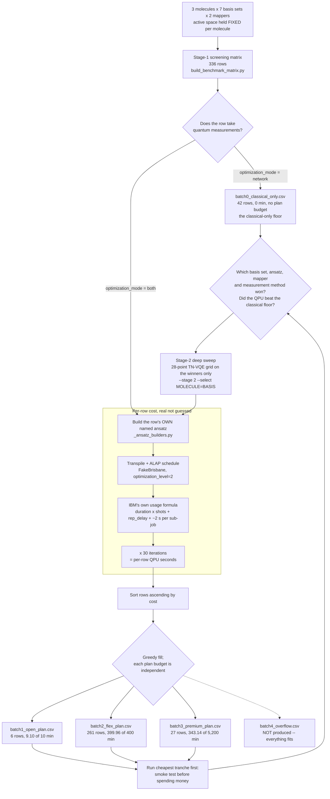

# Benchmark batches, split by IBM access plan budget

`data/IBM_VQE_Test_Benchmark.csv` (336 rows, the stage-1 screening
matrix) split into sequential tranches sized to each IBM access plan's
QPU-time budget, generated by
[`examples/guides/split_benchmark_batches.py`](../../examples/guides/split_benchmark_batches.py).
Regenerate with:

```sh
PYTHONPATH=src python examples/guides/split_benchmark_batches.py
```

`PYTHONPATH=src` (or a `pip install -e .`) is required: the script adds
the repo root to `sys.path`, not `src/`, so a fresh checkout without it
fails on `import qpubench`.

## Files

| File | Rows | Est. QPU time | Plan budget | Fits? |
|---|---|---|---|---|
| `batch0_classical_only.csv` | 42 | 0.00 min | none — takes no quantum measurements | n/a |
| `batch1_open_plan.csv` | 6 | 9.10 min | 10 min (Open Plan, free) | Yes, 0.90 min headroom |
| `batch2_flex_plan.csv` | 261 | 399.96 min | 400 min (Flex Plan minimum purchase) | Yes, 2.1 s headroom |
| `batch3_premium_plan.csv` | 27 | 343.14 min | 5,200 min (Premium Plan annual minimum) | Yes, 4,856.86 min headroom |

**336 rows, 752.21 minutes total.** Every row from the master CSV is
accounted for in exactly one file. batch2's headroom is thin *by
construction*, not by luck: the fill is greedy, so each tranche takes
rows until the next one would not fit.

These batches cover **stage 1 only**. Stage 2 is generated on demand from
stage-1 results and is not committed, so it has no batch files until it
exists.

## The study, end to end



Two things that diagram is making explicit. The **loop back into the
estimator** is the point of the two-stage design: stage 2 is costed by
the same machinery, on the small set of (molecule, basis, ansatz)
combinations stage 1 selected, rather than on all seven bases
speculatively. And the **classical-only branch rejoins at the decision
node**, not at the end — a `both` row that does not beat its `network`
control has not shown the quantum circuit contributed anything, which is
a stage-1 finding in its own right.

## Methodology

**Each plan's budget is independent, not cumulative.** batch2's 400
minutes is a *fresh* Flex Plan purchase, not "400 minutes on top of
whatever Open already covered". This matches the real workflow: exhaust
the free Open Plan quota, then buy a separate Flex Plan (or subscribe to
Premium) for the next tranche, each with its own budget.

**Rows are sorted ascending by estimated per-row QPU time** before being
greedily filled into each budget in order, so batch1 gets the cheapest
calculations available (a smoke test before spending real money or
quota), batch2 the next-cheapest tranche, batch3 the rest. That is why
batch1 is dominated by the 2-qubit `H2` `mol_map` cases rather than, say,
one row per molecule. If you would rather the first batch prioritise
*coverage* over strict cost minimisation, that is a different and equally
valid sort strategy; ask and I will regenerate with it.

**The 42 zero-QPU rows are held out of that sort.** They run
`optimization_mode="network"` — θ optimised by classical tensor-network
contraction, φ frozen, no quantum measurements — so their cost is
genuinely zero rather than merely unknown. Left in the ascending sort
they would fill the free tier with rows that cost nothing and displace
the smoke tests it exists for, so they go to `batch0_classical_only.csv`
instead. That file is not the old `batch0_unestimable_*`: those were rows
whose cost could not be *computed*, and they no longer exist.

**Per-row QPU-time estimates are real, not guessed.** Same method as
[`backends/ibm_cost_estimator.py`](../../docs/integrations/ibm_cost_estimator.md):
real ALAP-scheduled transpilation against `FakeBrisbane` (no credentials
needed) plus IBM's own documented usage formula. Only 14 distinct
circuits are actually transpiled across all 294 costed rows, cached per
(ansatz, qubits, reps, electrons, shots).

**The estimate transpiles at the level the run really gets.**
TN-VQE calls `transpile(circuit, backend)` with no `optimization_level`
and no way to pass one, and `transpile`'s own default resolves to **2**
under Qiskit 2.x (it was 1 under 1.x). The estimator's signature default
is 1, so these scripts now pass level 2 explicitly. Note that "Qiskit's
default" is therefore a version-dependent value, which is why the master
CSV records `Qiskit_Version` rather than an optimisation level — see
`data/README.md`.

**Each row's own ansatz is built, not a stand-in — and for the platform
it runs on.** The estimator builds what the row names: Qiskit's
`efficient_su2` / `real_amplitudes`, a real first-order Trotterized
`UCCSD` over the project's own Jordan-Wigner singles-and-doubles
excitation pool, and — on TN-VQE rows — `n_local` with an RzRyRz rotation
block and `'sca'` CX entanglement, which is the circuit Cebule TN_QC_OPT
builds on its **Qiskit** path. Its PennyLane path builds
`StronglyEntanglingLayers` instead, a different circuit with a different
parameter count (`3nR` against `3n(R+1)`); costing an IBM row on that one
is what earlier revisions did.

**That choice is what shapes these batches.** At 12 qubits, real UCCSD
transpiles to ~1,381 s per row against ~92 s for EfficientSU2, a **15x**
difference. batch3 is *entirely* UCCSD, and the 14 UCCSD rows at 12
qubits alone account for ~322 of the campaign's 752 minutes: 43% of the
budget in 4% of the rows. Everything else clusters between 91 and 97 s
per row, where the assumed 30 separate submissions at ~2 s of overhead
each dominate the circuit's own execution time.

**Shots are a recorded input now, not an assumption.** `n_shots` is a
real `TNQCOptInput` field, so the 4,096 in each row's `Shots` column is a
pinned campaign choice, and the estimator reads it per row rather than
from a module constant.

**`Measurement_Method` (`pauli` vs `grouped`) does not change this
estimate.** The resource estimator has no way to know how many distinct
circuits Cebule's basis-state-pair grouping would really produce for a
given Hamiltonian; that is an output of a real run, not derivable from
the inputs. So every `pauli`/`grouped` pair of an otherwise-identical row
gets an identical cost estimate here, and both land in the same batch
together. This is a known simplification, not a claim that the two
measurement methods really cost the same on hardware. `grouped` is
expected to cost less, which is the whole point of the method, so real
per-row costs would very likely reshuffle rows between batches,
especially near batch2's two-second boundary.

**One assumption remains**, carried over from
`examples/guides/estimate_ibm_cost.py`: 30 VQE iterations per case, i.e.
30 separate circuit submissions, each paying its own ~2 s per-sub-job
overhead. Still an open campaign decision — see `data/README.md`.

**Extra columns** (`Est_QPU_Time_S_At_30_Iter`,
`Est_QPU_Time_Cumulative_S`) are appended to each batch file beyond the
master CSV's own columns, for auditability. The cumulative column should
never exceed that file's plan budget converted to seconds.

## What the estimator/run corrections were worth

Two mismatches between the estimate and the run were found in the
2026-08-07 review and are now fixed. Their combined effect was measured,
not argued:

| | Total | batch3 |
|---|---|---|
| Before: `StronglyEntanglingLayers` for TN rows, `optimization_level=1` | 793.45 min | 385.38 min |
| After: `n_local` for TN rows, `optimization_level=2` | 752.21 min | 343.14 min |

The review measured this on batch2 alone and found it worth about half a
minute, which was correct for batch2 — the TN rows all live there and the
circuit swap moves each by under 2%. Nearly all of the 41-minute saving
is somewhere else: the 12-qubit UCCSD rows in batch3, which drop from
~1,554 s to ~1,381 s each at optimisation level 2. The estimator was
overstating the campaign's single most expensive circuit by ~11%.

The lesson worth keeping: a correction measured on one batch does not
generalise to the others, because the batches differ in *kind* — batch2
is hardware-efficient circuits where fixed overhead dominates, batch3 is
deep UCCSD where the circuit itself does.

**Still open, and it may not stay small.** These figures are stage 1, at
2–12 qubits and 1–2 reps. Stage 2 runs 14–32 qubits at up to 4 reps,
where the circuit's own execution time stops being a rounding error next
to the ~2 s per-sub-job overhead. Re-cost when stage 2 is generated
rather than extrapolating from here.

## What this costs, and where the savings came from

> **Superseded figures, kept only as history.** The numbers in this
> section describe the pre-`2e13e4d` cross-product matrix, which no
> longer exists. They are the same numbers a stale checkout produces, so
> do not cite them as current state — the current state is the table at
> the top of this file.

That earlier revision crossed every dimension with every other: 2,436
rows, of which only 1,566 could be costed at all, for ~2,463 minutes of
estimated QPU time. Restructuring it into a screening stage (see
`data/README.md`) brought that to 294 costed rows and, after the
corrections above, 752 minutes — while *increasing* coverage in the
dimensions being chosen between: four ansatz families instead of one
assumed one, and every row costable instead of 64% of them.

Two changes did the work. Holding the active space fixed per molecule
decouples qubit count from basis-set size, so `H2O`/cc-pVTZ costs 12 JW
qubits instead of 116. Deferring the 28-point tensor-network sweep to
stage 2 means it runs only on the basis sets screening actually selects,
rather than on all seven speculatively.

## No overflow

All 294 costed rows fit within Open + Flex + Premium's combined budget
(no `batch4_overflow.csv` was produced), and Premium's tranche has
enormous slack: 343 of 5,200 minutes. If you scale up the assumptions
(more shots, more iterations) or stage 2 turns out larger than expected,
that headroom is what absorbs it. Re-run this split after any assumption
change to confirm batch1 and batch2 still fit their much tighter budgets
— batch1 has 54 seconds of headroom and batch2 has two.
