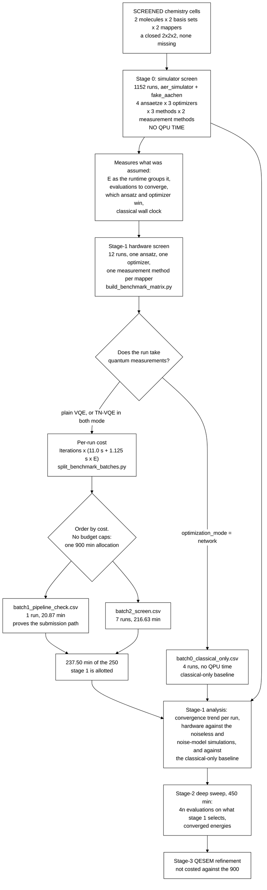

# TN-VQE on IBM hardware, with QESEM-mitigated final energies

## Objective

This campaign measures how much a tensor-network based VQE method
(TN-VQE) improves
molecular ground-state energies over a conventional VQE treatment of the
same system on IBM superconducting hardware. In TN-VQE part of the
variational work is carried out classically: a tensor-network
transformation `U(θ)` is contracted on CPU and optimised jointly with a
parameterised quantum circuit `U(φ)` that runs on the QPU. The method
under test is Cebule's `TN_QC_OPT`, following the hybrid tensor-network
and circuit construction of [1].

Plain VQE is the reference treatment, and the measured quantities are:

1. the error of the returned energy against a classical reference energy
   for the same active space and basis set;
2. the convergence behaviour of the optimisation, that is the cost
   history as a function of the number of cost-function evaluations, for
   TN-VQE against plain VQE at matched circuit width and depth;
3. the QPU time consumed to reach a given error. Moving variational work
   onto CPU is not automatically a saving on the quantum side, since
   `U†HU` generally carries more Pauli terms than `H` and a deeper
   network can raise the measurement cost of every evaluation. Whether
   the displacement is real is therefore measured rather than assumed;
4. the dependence of the above on basis set, ansatz, fermion-to-qubit
   mapping and measurement method.

Stage 1 is a screen: it ranks the discrete experimental factors so that
stage 2's more expensive parameter sweep is spent only on the
combinations that earned it.

The campaign holds **900 QPU minutes for everything**, which is the
binding constraint on its design. That allocation buys 250 minutes of
hardware screening, 450 of converged deep sweep and 200 held in reserve,
and it is small enough that scope is chosen rather than derived: what a
combination costs is measured first, and a combination earns its place or
is dropped. Everything a simulator can answer is answered there instead,
at no cost to the allocation.

The folder name reads *vendor, method, mitigation*: `ibm` is the hardware
provider whose access plans the campaign buys time on, `tn-vqe` the
method under test, `qesem` the Qedma error-mitigation service applied to
the final energies.

## Campaign structure

The study is divided into three stages at the points where the
experimental decisions fall. Only stage 1 is committed to the repository,
since the inputs of a later stage are an output of the stage preceding
it.

Each row of a stage's CSV file defines one VQE or TN-VQE run, and that
is how they are referred to below: a run is a single optimisation of one
Hamiltonian by one method, with its own ansatz, mapper, measurement
method and evaluation budget.

| Stage | Question | File | Runs |
|---|---|---|---|
| **0, simulation** | What does each combination really cost, which ansatz and which optimizer are worth hardware, and does the pipeline run? | `stage0_simulator_screen.csv` | 1152, generated on demand |
| **1, screening** | Which mapper, method and basis warrant converged runs? | `stage1_screening_matrix.csv` | 12, committed |
| **2, deep sweep** | For the selected combinations, how do the TN-VQE sweep parameters `θ` and `φ` behave? | `stage2_deep_sweep.csv` | generated on demand |
| **3, QESEM refinement** | Does error mitigation move the converged energy closer to the classical reference? | `stage3_qesem_refinement.csv` | generated on demand |

[`ibm_tn_vqe_campaign.ipynb`](ibm_tn_vqe_campaign.ipynb), beside this
file, generates the campaign, costs it and cuts the batches, and carries the
commands for all three stages. It needs only the standard library and
this repository, uses no IBM credentials and submits nothing.

Two things execute the campaign, and they build their runs through the
same module ([`_campaign_runner.py`](../../../utils/_campaign_runner.py)),
so neither can drift from the other. Both submit nothing until told to,
both checkpoint per run so an interrupted pass resumes rather than
re-spending purchased time, and both read credentials from the environment
rather than from a notebook cell or a command line.

[`run_campaign.py`](../../../utils/run_campaign.py) runs a stage in
batches from the command line, selected with `--where` filters and resumed
by repeating the command. This is how stage 0 is run, since 1152 runs is
not something to start in one go:

```sh
PYTHONPATH=src python utils/run_campaign.py --group-by Molecule,Basis,Mapper
PYTHONPATH=src python utils/run_campaign.py --submit \
    --where Molecule=H2 --where Basis=6-31g --where Mapper=JW
```

[`run_campaign_batch.ipynb`](run_campaign_batch.ipynb) executes one batch
whole and shows its working, which suits the twelve stage-1 runs.

**Which backend a run uses is the run's own `Backend_Platform`**, not a
choice made at submission time. Stage 0 crosses the backend as a factor,
half its runs on `aer_simulator` and half on `fake_aachen`, so overriding
it would run one arm twice and the other never. The override exists for
the one case the column cannot express, executing a hardware-targeted
stage-1 run on a simulator first, and the script refuses a hardware
backend unless `--allow-hardware` says otherwise.

Each stage prohibits generation without its selection: no `--select`, no
`--refine`, no `--precision`, no output. A silently defaulted selection
would make the provenance of a later stage unrecoverable.

**Stage 1 does not produce converged energies, and is not meant to.**
Every run is budgeted at roughly half of its achievable descent, so what
a stage-1 run exposes is the initial descent rather than the asymptotic
energy. The data generated here, together with the parameter settings
that performed best, are what the design of experiments for stage 2 is
built from: the comparison is made on convergence trends, that is the
cost history per evaluation and the descent achieved per unit of QPU
time, across the factors being screened. Converged energies are the
product of stage 2, and the stage-2 QPU compute-time budget takes the
same form at a larger multiplier.

### Every ansatz is run by every method

Every ansatz is run by all three methods, that is plain VQE, TN-VQE with
`optimization_mode="both"`, and the classical-only `network` control, on
the same Hamiltonian, from the same pinned circuit file and at the same
`Phi_Init`. The three runs of such a triple therefore differ in method
alone, which is what makes a difference between them attributable to the
method. Stage 0 runs all four ansätze this way; stage 1 buys one of them
on hardware.

## Stage 0: the simulator screen

Stage 0 is where the campaign's breadth lives. It buys no QPU time, so it
is not constrained by the 900 minutes, and it carries every axis hardware
cannot afford. **1152 runs**, regenerated with

```sh
PYTHONPATH=src python utils/build_benchmark_matrix.py --stage 0
```

### What it varies

Six factors, fully crossed, with nothing missing.

| Factor | Levels | |
|---|---:|---|
| **Chemistry** | 8 | `{H2, H2O(4,4)} × {6-31g, qvSZP} × {JW, mol_map}` — a closed 2×2×2, no cell missing |
| **Ansatz** | 4 | RealAmplitudes, EfficientSU2_circular, n_local_rzryrz_sca, UCCSD |
| **Optimizer** | 3 | COBYLA, SPSA, ExcitationSolve |
| **Method** | 3 | plain VQE, TN-VQE `both`, the classical-only `network` control |
| **Measurement** | 2 | `pauli`, `grouped` |
| **Backend** | 2 | `aer_simulator`, `fake_aachen` |

`8 × 4 × 3 × 3 × 2 × 2 = 1152`, complete, which is the point of a
factorial design: an optimizer effect can be read at every ansatz, a
mapper effect at both bases and both molecules, and an interaction
between any two can be seen at all.

### The chemistry cells

| Molecule | Active space | Basis | JW qubits | mol_map qubits | `E` (JW / mol_map) |
|---|---|---|---:|---:|---:|
| H2 | unrestricted | 6-31g | 8 | 4 | **34** / **37** |
| H2 | unrestricted | qvSZP | **16** | 6 | 538 / 364 |
| H2O | CAS(4,4) | 6-31g | 8 | 6 | 25 / 233 |
| H2O | CAS(4,4) | qvSZP | 8 | 6 | 25 / 233 |

The two bold values are billed measurements from real `ibm_aachen` jobs;
the rest are counted from the committed Hamiltonians by greedy
qubit-wise-commuting grouping, and so are upper bounds. Where both exist
they differ by about 2× — H2/6-31g under Jordan-Wigner counts 68 and
billed 34 — which is the gap stage 0 closes.

The two molecules answer different halves of the basis question, which is
why both are here. **H2 is unrestricted**, all its electrons in every
orbital the basis provides, so the basis moves the width: 4 spatial
orbitals under 6-31g against 8 under qvSZP, and the Jordan-Wigner arm
doubles from 8 qubits to 16. **H2O is held at a fixed CAS(4,4)**, so
width, `E` and cost are identical in both bases and only the orbitals
themselves differ — a basis effect with the cost held constant. Neither
alone would separate "the basis changed the chemistry" from "the basis
changed the size of the problem".

`6-31g` and `qvSZP` are the two **ends** of the basis axis rather than
two points along it: a fixed Pople split-valence set against Grimme's
charge-adaptive one, whose exponents depend on the molecular environment.
It is also the campaign's only non-Basis-Set-Exchange basis. The interior
bases are dropped for the reason in
[What hardware does not buy](#what-hardware-does-not-buy).

Every Hamiltonian above is committed under `hamiltonian_data/` and its
`E` counted from it, not assumed.

### The ansätze

Ordered by how much structure they assume, which is the axis the
comparison is really about.

| Ansatz | Parameters | Structure |
|---|---|---|
| `RealAmplitudes` | `n(R+1)` | Ry only, reverse-linear entangler. Real amplitudes only; the cheapest circuit in the set, and stage 1's |
| `EfficientSU2_circular` | `2n(R+1)` | Ry+Rz, ring entangler. Complex amplitudes and twice the parameters |
| `n_local_rzryrz_sca` | `3n(R+1)` | Rz+Ry+Rz, shifted-circular-alternating entangler |
| `UCCSD` | 15, 63 or 26 — see below | A restricted singles-and-doubles ansatz out of the reference determinant, supplied as pinned QASM rather than built here |

`n_local_rzryrz_sca` is the third family for a specific reason: it is the
circuit `TN_QC_OPT` builds for itself when no `qasm_ansatz` is supplied.
Putting the vendor's own default into the comparison is better than
leaving it as the unmeasured thing every other run is implicitly read
against.

`UCCSD` is the chemistry baseline the other three are trying to beat per
unit of QPU time. All four reach TN-VQE the same way, as a pinned QASM
file through `TNQCOptInput.qasm_ansatz`, so each is run by all three
methods.

**UCCSD is supplied, not generated.** The other three families are built
from `_ansatz_builders.py` and pinned; UCCSD's six files are written by
hand and this repository never overwrites them. It is a *restricted*
ansatz rather than the generalized singles-and-doubles pool the builder
here can produce — 15 parameters at H2/6-31g against the pool's 40 — and
the two encodings are matched parameter for parameter:

| Cell | JW | mol_map | Parameters |
|---|---|---|---:|
| H2 / 6-31G | `UCCSD_JW_8q_2r_2e` | `UCCSD_molmap_4q_2r_2e_4o` | 15 |
| H2 / qvSZP | `UCCSD_JW_16q_2r_2e` | `UCCSD_molmap_6q_2r_2e_8o` | 63 |
| H2O CAS(4,4) | `UCCSD_JW_8q_2r_4e` | `UCCSD_molmap_6q_2r_4e_4o` | 26 |

That matching is what makes the mapper comparison a comparison on these
runs: a JW row and its mol_map counterpart differ in the encoding and not
in the ansatz, so a difference between them is attributable to the
encoding. `Num_Opt_Params_Phi` is therefore **read off the pinned file**
for UCCSD rather than derived from (qubits, electrons), since a derived
count would describe a circuit the campaign does not run.

The mol_map circuits are deep — 8,565 gates at H2O and 18,523 at
H2/qvSZP, against 17 to 65 operations for the JW files, which are pinned
at a higher gate level. Nothing here reaches hardware: stage 1 runs
`RealAmplitudes` alone, so the cost model's shallow-circuit range is not
being relied on for any UCCSD row.

Note that RealAmplitudes against EfficientSU2_circular moves the rotation
set **and** the entangler at once, so a difference between those two
cannot be attributed to either alone. That is a recorded choice; a common
entangler is a one-word change to the builder.

### The optimizers

| Optimizer | How it spends the budget |
|---|---|
| `COBYLA` | An `n+1` point simplex, then descent steps. The campaign's incumbent, and the optimizer every committed cost estimate was made under |
| `SPSA` | `⌊budget/2⌋` steps at two evaluations each — a stochastic two-point gradient estimate whose per-step cost does **not** grow with the parameter count |
| `ExcitationSolve` | Reconstructs the energy's exact trigonometric dependence on one parameter and jumps to that parameter's global minimum, so its evaluations buy exact coordinate minima rather than descent steps |

**All three are given the same evaluation budget.** That is deliberate:
the budget is what the QPU is billed for, so holding it fixed makes the
observable *descent per evaluation*, which is descent per QPU-second,
which is the quantity the campaign is choosing between. A per-optimizer
budget would compare three different purchases.

The consequence is that each spends it differently, and one of those
differences is a real risk worth stating: ExcitationSolve's
reconstruction costs a fixed number of evaluations per parameter, so a
budget of `~1.3n` does not complete one full sweep over `n` parameters.
If it turns out to need a full sweep before it says anything, the finding
is that ExcitationSolve is not affordable at a screening multiplier —
which is itself a result, and one that costs nothing to establish here.

SPSA and ExcitationSolve are Cebule's own additions and do not go through
`scipy.optimize.minimize`. **Confirm the exact `opt_method` spellings
against upstream's dispatch before submitting**, since an unrecognised
optimizer name fails after the queue rather than before it.

### The backends

| Configuration | `TNQCOptInput.backend` | What it establishes |
|---|---|---|
| Noiseless statevector or shot-based simulation | `aer_simulator` | The algorithmic result in the absence of device error, and the reference against which every hardware result is read |
| Noisy simulation with the target device's noise model | `fake_aachen` | The energy shift and the change in convergence behaviour attributable to device error alone |

`fake_aachen` is `qiskit-ibm-runtime`'s offline calibration snapshot of
`ibm_aachen` itself, so the noisy configuration characterises the target
device rather than a stand-in for it, and it needs no credentials.

Both measurement methods run on every cell. `GROUPED_ONLY`, which drops
the `pauli` arm on mol_map H2O, is a **hardware** reduction costing about
840 QPU minutes; nothing is billed here, so the comparison that mol_map's
constraint encoding exists to win is run in full.

### What stage 0 is for

Four things come out of it, none of which needs purchased time:

- **`E` as the runtime really groups it**, per cell. The counted values
  are greedy upper bounds and run about 2× what the runtime achieves.
- **Evaluations really needed to converge**, against the `1.3n` and `4n`
  multipliers, which come from a synthetic objective and have never been
  checked on a real VQE surface.
- **The classical wall clock of the tensor-network contraction**, which
  is the other half of the displacement TN-VQE claims and has never been
  measured at all.
- **That the pipeline runs end to end**, before it costs anything.

A caution on its own cost: 1152 runs is free of the QPU allocation but
not of CPU time, and the widest cells are 16 qubits with 1,177 Pauli
terms in 538 groups. If it proves too slow to run whole, the optimizer
axis is the one to cut back first — it is a question about the classical
half of the loop, so it can be run on a slice of the chemistry cells
without costing the design its other factors.

### The classical-only control

Stage 1 has a zero-QPU arm of its own, and it belongs to the same
pre-hardware phase. The runs in `batch0_classical_only.csv` never reach
hardware: they optimise `θ` by classical
tensor-network contraction at a frozen `φ`, take no quantum measurements,
and are the baseline every hardware result is read against. Each uses the
same circuit as the runs it controls, at the same `Phi_Init`, which is
why a control on one ansatz type gives a different baseline from a
control on another.

These runs consume no QPU time but do consume CPU time, and that time is
not currently recorded: `TNQCOptResult` returns `cost_history` and
`function_calls` but no timing field, so the classical cost of TN-VQE
has to be measured as wall-clock around the task. Capturing it would
quantify the classical overhead the method trades QPU time for, and is
listed under [Open campaign decisions](#open-campaign-decisions).

Together these give three points of comparison for every hardware
result: the classical-only value, the noiseless simulated value and the
noise-model value, which is what allows an observed hardware error to be
attributed between algorithmic limitation and device error.

## QPU time: what a run costs, and what the 900 minutes buy

The QPU time a run consumes is the product of two quantities measured
separately: what a single evaluation of the cost function costs, and how
many evaluations the run is given. Their product, summed over runs, is
what the 900-minute allocation has to fit.

### What one evaluation costs

Evaluating the expectation value `⟨H⟩` requires one circuit per
measurement basis rather than a single circuit per evaluation. Denoting
that count `E`, it is a property of the Hamiltonian rather than of the
circuit preparing the state, since it follows from the number of mutually
commuting sets into which the Hamiltonian's Pauli terms partition. The
campaign's QPU time is approximately proportional to it, and it is
recorded per run in `Num_ExpVals_Per_Iter`.

Runs are costed from what earlier executions on `ibm_aachen` were
actually billed, at the shot count and options this campaign submits
under:

```
billed QPU seconds per evaluation = 11.0 + 1.125 x Num_ExpVals_Per_Iter
```

The line holds to within 4% from `E = 2` to `E = 81`. The fit lives in
[`split_benchmark_batches.py`](../../../utils/split_benchmark_batches.py).
IBM's own pre-run estimate is not used, since it stands in no fixed ratio
to what is billed. Two consequences carry into the design:

- **The fixed 11 seconds is readout-error calibration**, requested once
  per job by the default Estimator options. It dominates every small run
  and is the largest single lever available: submitting with
  `measure_mitigation` disabled acts on all of it.
- **Circuit depth does not enter, but only up to a point.** Cost is set
  by the Hamiltonian's measurement count and the run's evaluation count
  rather than by the ansatz, until circuits run far deeper than anything
  screened here. The campaign's deepest transpiled circuit is 120, well
  inside the range the fit covers.

**Runs are submitted as individual jobs, not in a session.** A dedicated
session reserves the QPU and bills the reservation, so the classical time
between iterations is charged as QPU time. Measured on a 32-iteration VQE
session, the jobs themselves billed 13 s each while the session billed
1,284 s, so 68% of the reservation was idle.

### E is what rescoped the campaign

An earlier revision carried an `assumed` measurement count of 37 wherever
none had been counted. Every screened Hamiltonian is now committed under
`hamiltonian_data/` and counted, and the assumption was wrong by up to a
factor of 36:

| Combination | assumed `E` | counted `E` | one screening run |
|---|---:|---:|---:|
| H2/6-31g mol_map | 37 | 39 | 26 min |
| H2O mol_map, any basis | 37 | **233** | 137 min |
| H2/qvSZP mol_map | 37 | **364** | 210 min |
| H2/cc-pVDZ mol_map | 37 | **1322** | **749 min** |

The cause is structural. mol_map's constraint encoding trades qubits for
density: H2/cc-pVDZ is 10,069 Pauli terms on 7 qubits, so its cost climbs
with the **orbital** count while its width stays flat. A single
H2/cc-pVDZ mol_map run would spend 83% of the whole campaign. H2O is the
opposite case: a fixed CAS(4,4) holds width, `E` and cost identical
across every basis, and only the orbitals themselves differ.

At the counted values a full crossing costs 21,643 minutes against 900
available, which is why the scope in `SCREENED` is chosen rather than
derived.

These counts are greedy upper bounds. Where a measurement also exists the
two disagree by about a factor of two, the runtime's own grouping being
better than greedy: H2/6-31g under Jordan-Wigner counts 68 and billed 34.
The measured value is used where there is one. **Replacing the rest with
measurement is what stage 0 is for.**

### How many evaluations each run is given

`Iterations` is computed per run as `max(30, ceil(1.3 x n_params))` from
that run's own free-parameter count. The budget is proportional rather
than additive because COBYLA needs evaluations in proportion to the
parameter count to make a given amount of progress: reaching a fixed
fraction of the achievable descent costs about `1.3n` evaluations for
50%, `4n` for 80%. A rule of the form `n + constant` would reach a
shrinking fraction as circuits widen, making the optimizer budget a
confound correlated with qubit count.

The multipliers come from a synthetic objective, so they are the right
functional form rather than tuned values. Stage 0 measures them on a real
VQE surface, which is the first time they will have been checked.

### What the 900 minutes buy

| Phase | Minutes | What it establishes |
|---|---:|---|
| **Stage 0**, simulated | **0** | `E` as the runtime really groups it, evaluations really needed to converge, the classical wall clock of the TN contraction, and that the pipeline runs |
| **Stage 1**, hardware | **250** | Device error and real QPU consumption, across mapper, method and basis |
| **Stage 2**, hardware | **450** | Converged energies on whatever stage 1 selects |
| **Reserve** | **200** | Two things have already come in far off estimate: a job billed 14x its estimate, and counted `E` runs about 2x what the runtime groups into |

Stage 2 takes the larger share deliberately. Stage 1 at `1.3n` reaches
about half the achievable descent, which ranks factors but does not
answer whether TN-VQE reaches a given accuracy for less QPU time. A
ranking of combinations that were never converged answers nothing.

Stage 3, the QESEM refinement, is not costed here and holds no share of
the 900. Its analytical mode quantises to 30-minute steps, so it needs
its own allocation or it comes off the plan.

### Stage 1 on hardware

Twelve runs, 237.50 minutes, of which four are zero-cost classical
controls:

| Molecule | Basis | Mapper | `E` | Costed runs | Minutes |
|---|---|---|---:|---:|---:|
| H2 | 6-31g | JW | 34 | 2 | 71 |
| H2O | 6-31g | JW | 25 | 2 | 57 |
| H2O | qvSZP | JW | 25 | 2 | 57 |
| H2 | 6-31g | mol_map | 37 | 2 | 53 |

H2/6-31g carries the **mapper comparison**, at 4 spatial orbitals: 34
measurement bases under Jordan-Wigner against 37 under mol_map, which is
the only size both encodings can afford. H2O carries the **basis axis**
at its two extremes, a Pople split-valence against Grimme's adaptive
basis, at a fixed CAS(4,4) that holds everything else equal. Each
combination runs plain VQE, TN-VQE and the classical-only control on the
same circuit at the same `Phi_Init`, so a difference between them is
attributable to the method.

Three reductions make it fit, and all three move a question to stage 0
rather than dropping it. **One ansatz** of the four: which circuit family
wins is a question about circuits, which a simulator answers honestly and
for nothing. **One optimizer** of the three: which optimizer descends
fastest per evaluation is a question about the classical half of the
loop, and a simulated evaluation is the same evaluation. **One
measurement method per mapper**: `pauli` is the baseline Jordan-Wigner
wants and `grouped` is the feature mol_map exists to exploit, so the
other diagonal of that square is stage 0's.

Hardware buys what simulation cannot answer — device error, and the QPU
time a method really consumes — and nothing else.

### What hardware does not buy

Dropped from the campaign entirely, hardware and simulator alike:

| Dropped | Reason |
|---|---|
| sto-3g, both molecules | 2 measurement bases under mol_map and 5 under JW: too small for either comparison to show anything |
| def2-SVP, both molecules | the same orbital count as cc-pVDZ, so the same width, the same `E` and the same budget: a second point where there is already one |
| H2/cc-pVDZ, H2/def2-TZVP | 1,322 counted bases at 7 mol_map qubits, i.e. 749 min for one run; the Jordan-Wigner arms are 20 and 24 qubits |
| H2O/cc-pVDZ, H2O/def2-TZVP | at a fixed CAS(4,4) they have identical width, `E` and cost to the two bases screened: interior points on an axis whose two ends are already bought |
| H2O/cc-pVTZ | no committed Hamiltonian, and it would cost and measure exactly as the other H2O bases do |

Screened on the simulator, never bought on hardware:

| Simulator-only cell | Reason |
|---|---|
| H2/qvSZP JW | 538 counted bases, ~10 min per **evaluation** — unaffordable at any budget, and the reason it is worth simulating |
| H2/qvSZP mol_map | 210 min a run, 23% of the campaign for one point |
| H2O/6-31g mol_map | 137 min a run, 15% of the campaign for one point |
| H2O/qvSZP mol_map | 137 min a run; identical width and `E` to its 6-31g twin |

The mol_map rows are the campaign's real loss: the mapper comparison
reaches hardware for H2/6-31g alone, and water's mol_map arm exists only
in simulation. That is a consequence of the encoding's density — it
trades qubits for Hamiltonian terms — rather than of the budget alone,
and it is recorded rather than hidden. Every one of these cells is run in
full in stage 0, so what is lost is the device error on them, not the
result.

### Batches

Batches are no longer sized to a budget. The campaign used to be cut
against IBM's access plans, because each was a separate purchase that had
to be filled before the next. One allocation replaces them, so what the
batches carry now is **order**: `batch1_pipeline_check.csv` holds the
single cheapest run, which proves the submission path end to end, and
`batch2_screen.csv` holds the rest. `batch0_classical_only.csv` takes no
quantum measurements at all.

The partition is regenerated rather than edited:

```sh
PYTHONPATH=src python utils/split_benchmark_batches.py
```

## Workflow



Two features carry experimental weight. Everything is simulated before
anything is submitted, so the split that follows is only about which runs
consume purchased hardware time, and every hardware result has a
noiseless value, a noise-model value and a classical-only value to be
read against. And each stage depends on the one before it: stage 2 sweeps
what stage 1's convergence trends selected, and stage 3 refines
parameters only a converged stage-2 run produces.

## Ansatz types under test

Four ansatz types appear in stage 0 and one of them, `RealAmplitudes`, in
the stage-1 matrix. Each is run by all three
methods, and every run supplies its circuit as a committed OpenQASM 3.0
file under `data/qasm/`, named in `Qasm_Ansatz_File` and hashed in
`Qasm_Ansatz_SHA256`. A named ansatz is not a circuit: it is a name that
a library version resolves, and two runs naming one ansatz type are
comparable only if they resolve it identically. The files are generated
by [`pin_qasm_ansatz.py`](../../../utils/pin_qasm_ansatz.py),
one per distinct (ansatz type, qubits, repetitions), and are dumped with
their parameters free, so that the file says which parameters the
optimisation varies.

Every stage-1 run uses two repetitions of its ansatz type. The repetition
count is a property of the pinned file rather than of the method running
it, so it is recorded once, in `Ansatz_Reps`, on every run alike.

The families differ in what the circuit can reach, not only in size.
`RealAmplitudes` builds from Ry rotations and CX alone, so every
amplitude it produces is real, while `EfficientSU2_circular` adds an Rz
layer per block and can produce complex ones, at twice the parameters. A
real orbital basis gives a real symmetric electronic Hamiltonian, and
mol_map's determinant Hamiltonian is real symmetric too, so a real ground
state always exists and the cheaper family is not handicapped by
construction. Whether the phase freedom earns its cost is therefore a
question with an answer, and under the proportional evaluation budget
that cost is explicit, since twice the parameters is twice the
evaluations.

The diagrams below are drawn from
[`_ansatz_builders.py`](../../../utils/_ansatz_builders.py) and
rendered in the `{Ry, Rz, CX}` basis. They are the same objects the QASM
files hold.

**`RealAmplitudes`**, shown at 4 qubits with `reps = 2` (12 parameters).
One Ry rotation layer per repetition and a reverse-linear CX chain,
Qiskit's default entanglement for this family.

```text
     ┌──────────┐                             ┌──────────┐                          ┌──────────┐
q_0: ┤ Ry(θ[0]) ├──────────────────────■──────┤ Ry(θ[4]) ├───────────────────■──────┤ Ry(θ[8]) ├
     ├──────────┤                    ┌─┴─┐    ├──────────┤                 ┌─┴─┐    ├──────────┤
q_1: ┤ Ry(θ[1]) ├──────────■─────────┤ X ├────┤ Ry(θ[5]) ├──────■──────────┤ X ├────┤ Ry(θ[9]) ├
     ├──────────┤        ┌─┴─┐    ┌──┴───┴───┐└──────────┘    ┌─┴─┐    ┌───┴───┴───┐└──────────┘
q_2: ┤ Ry(θ[2]) ├──■─────┤ X ├────┤ Ry(θ[6]) ├─────■──────────┤ X ├────┤ Ry(θ[10]) ├────────────
     ├──────────┤┌─┴─┐┌──┴───┴───┐└──────────┘   ┌─┴─┐    ┌───┴───┴───┐└───────────┘
q_3: ┤ Ry(θ[3]) ├┤ X ├┤ Ry(θ[7]) ├───────────────┤ X ├────┤ Ry(θ[11]) ├─────────────────────────
     └──────────┘└───┘└──────────┘               └───┘    └───────────┘
```

**`EfficientSU2_circular`**, shown at 4 qubits with `reps = 2` (24
parameters). Ry and Rz rotation layers per repetition, entangled on a
ring rather than the library's default reverse-linear chain. The
wrap-around CX from the last qubit to the first is one more CX per
repetition, 16 against 14 at 8 qubits. At 2 qubits a ring is the chain,
so the two coincide there.

```text
     ┌──────────┐┌──────────┐┌───┐     ┌──────────┐┌───────────┐                          ┌───┐     »
q_0: ┤ Ry(θ[0]) ├┤ Rz(θ[4]) ├┤ X ├──■──┤ Ry(θ[8]) ├┤ Rz(θ[12]) ├──────────────────────────┤ X ├──■──»
     ├──────────┤├──────────┤└─┬─┘┌─┴─┐└──────────┘└┬──────────┤┌───────────┐             └─┬─┘┌─┴─┐»
q_1: ┤ Ry(θ[1]) ├┤ Rz(θ[5]) ├──┼──┤ X ├─────■───────┤ Ry(θ[9]) ├┤ Rz(θ[13]) ├───────────────┼──┤ X ├»
     ├──────────┤├──────────┤  │  └───┘   ┌─┴─┐     └──────────┘├───────────┤┌───────────┐  │  └───┘»
q_2: ┤ Ry(θ[2]) ├┤ Rz(θ[6]) ├──┼──────────┤ X ├──────────■──────┤ Ry(θ[10]) ├┤ Rz(θ[14]) ├──┼───────»
     ├──────────┤├──────────┤  │          └───┘        ┌─┴─┐    ├───────────┤├───────────┤  │       »
q_3: ┤ Ry(θ[3]) ├┤ Rz(θ[7]) ├──■───────────────────────┤ X ├────┤ Ry(θ[11]) ├┤ Rz(θ[15]) ├──■───────»
     └──────────┘└──────────┘                          └───┘    └───────────┘└───────────┘          »
«     ┌───────────┐┌───────────┐
«q_0: ┤ Ry(θ[16]) ├┤ Rz(θ[20]) ├──────────────────────────
«     └───────────┘├───────────┤┌───────────┐
«q_1: ──────■──────┤ Ry(θ[17]) ├┤ Rz(θ[21]) ├─────────────
«         ┌─┴─┐    └───────────┘├───────────┤┌───────────┐
«q_2: ────┤ X ├──────────■──────┤ Ry(θ[18]) ├┤ Rz(θ[22]) ├
«         └───┘        ┌─┴─┐    ├───────────┤├───────────┤
«q_3: ─────────────────┤ X ├────┤ Ry(θ[19]) ├┤ Rz(θ[23]) ├
«                      └───┘    └───────────┘└───────────┘
```

**`n_local_rzryrz_sca`**, at 4 qubits with `reps = 2`, 36 parameters. Rz,
Ry and Rz rotation layers per repetition, entangled with Qiskit's
shifted-circular-alternating pattern: a circular CX chain whose starting
qubit shifts each repetition and whose control/target orientation
alternates. This is `n_local(n, ["rz","ry","rz"], "cx",
entanglement="sca")`, which is exactly what `TN_QC_OPT` builds for itself
when no `qasm_ansatz` is supplied. It is in the comparison so that the
vendor's own default is measured rather than assumed. Note that its
leading Rz layer acts on `|0…0⟩`, where Rz is a global phase, so 4 of its
36 parameters at this width do nothing.

**`UCCSD`**, a restricted singles-and-doubles ansatz out of the reference
determinant: 15 parameters at H2/6-31G, 26 at H2O, 63 at H2/qvSZP, under
either mapper. It is the chemistry baseline the hardware-efficient
families are trying to beat per unit of QPU time, and it alone starts
from `Phi_Init = zeros`, since zero amplitudes *are* the Hartree-Fock
reference.

Its six files are **written by hand and never regenerated**. That is not
a convenience: mol_map's qubits index determinants and have no
occupied/virtual split for excitation operators to be built from, so no
mol_map UCCSD could be generated here at all; and the JW files are the
same restricted ansatz rather than the generalized pool
`_ansatz_builders.uccsd` produces, so regenerating them would silently
replace 15 parameters with 40. `pin_qasm_ansatz.py` reports these six as
`supplied externally` and leaves them alone —
`_ansatz_builders.UCCSD_BUILDABLE_MAPPERS` is empty, which is what
enforces it.

Neither `n_local_rzryrz_sca` nor `UCCSD` is drawn here: at 4 qubits the
first is three times the width of the RealAmplitudes diagram, and the
mol_map UCCSD circuits run to thousands of gates. All are in
`data/qasm/`, where the pinned file is the authority anyway.

**Why the circuits are supplied rather than defaulted.** A run that let
its stack build a circuit for it would carry a circuit defined by the
installed versions of Qiskit and `TN_QC_OPT` at the moment it ran, and
neither the parameter count nor the entanglement pattern would be
recoverable from the matrix afterwards. Committing the QASM makes the
circuit part of the record, so a reader reproducing a run years later
need not reconstruct which library versions were installed. One
interaction is worth knowing: supplying `qasm_ansatz` changes
`n_layers_circuit`'s effective default from 3 to 1, so pass it
explicitly.

## Active spaces and qubit counts

**H2 carries no active-space restriction.** Every H2 run uses all of its
electrons in every orbital the basis provides, so the basis set is what
the basis-set screen varies. The price is that H2's qubit count follows
the basis:

| Basis | Spatial orbitals | JW qubits | mol_map qubits | Run in |
|---|---|---|---|---|
| sto-3g | 2 | 4 | 2 | nothing: dropped |
| 6-31G | 4 | 8 | 4 | stage 0 and stage 1, both mappers |
| qvSZP | 8 | **16** | 6 | stage 0 only, both mappers |
| cc-pVDZ | 10 | 20 | 7 | nothing: dropped |
| def2-TZVP | 12 | 24 | 8 | nothing: dropped |

**Above 8 Jordan-Wigner qubits nothing reaches hardware.** The limit is
`MAX_JW_QUBITS` in the generator, and it is a measurement limit rather
than a circuit one: the number of qubit-wise-commuting measurement bases
of a JW-mapped Hamiltonian grows as roughly N³, measured on these runs at
5 bases for 4 qubits and 34 for 8, then 538 at 16 and, by the same
scaling, worse above. H2/qvSZP under Jordan-Wigner is 538 bases, about 10
minutes of billed QPU time per *evaluation*, so no evaluation budget puts
it inside 900 minutes.

The limit therefore applies to stages 1 and 2 and **not** to stage 0: a
simulator buys no measurement circuits, so the 16-qubit cell is run there
in full. That is what turns "too expensive for hardware" into a measured
statement about how the Jordan-Wigner cost really scales, instead of a
gap. What is given up is the device error on that cell, recorded under
[Known limitations](#known-limitations).

**H2O is screened at CAS(4,4)**, provisionally, with the O 1s frozen:
8 Jordan-Wigner qubits and 6 under mol_map. It is smaller than water's
standard CAS(8,6) valence space because measurement cost grows steeply
with qubit count and because stage 1 ranks experimental factors rather
than quoting water's correlation energy. It is therefore a screening
space rather than a converged-chemistry one, and how far to restrict this
molecule is an open decision awaiting expert input.

| Molecule | Electrons | Active space | Frozen | JW qubits | mol_map qubits |
|---|---|---|---|---|---|
| `H2` | 2 | none: all orbitals of the basis | nothing | 8 and 16 screened | 4 and 6 |
| `H2O` | 10 | CAS(4,4), provisional | O 1s and the outer valence | 8 | 6 |

**Every run is at the experimental equilibrium geometry**, given in
Angstrom in the `Geometry` column: H2 at `r = 0.74144`, H2O at
`r = 0.9572` and `104.52` degrees. Stage 1 varies discrete factors at a
single fixed geometry, so what matters is less the value than that it is
recorded: an energy is comparable against a classical reference only when
both are computed at the same nuclear positions.

### mol_map qubit counts

Cebule's MOL_MAP encoding indexes only those determinants satisfying the
particle-number and spin constraints, so its qubit count follows the
active space rather than the size of the basis set:

```
n_qubits = ceil(log2( C(n_orbitals, n_alpha) x C(n_orbitals, n_beta) ))
```

The relation is inferred rather than documented by Cebule, but reproduces
exactly all eight real MOL_MAP counts available to this project
([`hamiltonian_sources/mol_map.py`](../../../src/qpubench/hamiltonian_sources/mol_map.py),
pinned by `tests/test_mol_map.py`). Four of the five screened H2 counts
come from real runs on exactly the unrestricted space these runs use;
H2/qvSZP and every H2O run derives from the formula and are marked
`mol_map_inferred` in `N_Qubit_Source`. Two observations in that
reference data distinguish the relation from a coincidental fit: two
different basis sets sharing an orbital count report the same qubit
count, which no basis-size formula predicts, and two spaces sharing 10
orbitals but differing in electron count give the two counts the formula
requires.

## Mapper, method and ansatz are separate columns

`Mapper` records the fermion-to-qubit mapping, `Method` whether the run
is conventional VQE or TN-VQE through `TN_QC_OPT`, and `Ansatz` the
ansatz type. The three vary independently:

| Column | Values | Meaning |
|---|---|---|
| `Mapper` | `JW` | Jordan-Wigner, `2 x active_orbitals` qubits |
| | `mol_map` | Cebule's constraint-based encoding, fewer than `2N` qubits |
| `Method` | `VQE` | plain variational quantum eigensolver |
| | `TN-VQE` | Cebule `TN_QC_OPT`, classical tensor network plus quantum circuit |
| `Ansatz` | `RealAmplitudes`, `EfficientSU2_circular`, `n_local_rzryrz_sca`, `UCCSD` | the ansatz type, as described above. Stage 1 runs the first alone |

Each ansatz type is run by each method under each mapper the run is
screened on. Every hardware run reads `ibm_aachen` in `Backend_Platform`, one
named device for VQE and TN-VQE alike, so the two differ in method rather
than in machine.

## Tensor-network rotation families

`TN_Ansatz` names the family that constructs `U(θ)` on the network side.
All four are members of `M_ANSATZE` (`functions_U.py:150-161`):

| `TN_Ansatz` | Construction | params/node | Entangles | Conserves N |
|---|---|---|---|---|
| `rotation_1param` | one rotation angle per network node | 1 | no | no |
| `rotation_3param` | three angles per node, a general single-qubit rotation; the task default | 3 | no | no |
| `givens` | a Givens rotation per node: one angle, an orbital rotation | 1 | **yes** | **yes** |
| `number_preserving` | five angles per node, the most expressive and the most expensive | 5 | **yes** | **yes** |

Both `rotation_*` families are non-entangling: the network factorises
across the two wires of every M gate, so `U(θ)` only rotates each qubit's
local basis. A design sweeping those two alone never reaches the regime
the method exists for.

**Stage 1 screens on `givens`.** It entangles, conserves particle number,
and is the only family with a fast evaluation path in the implementation,
since `_orbital_pauli_terms` routes it through `OrbitalRotationHamiltonian`
at O(N⁵) cost rather than contracting the network at 2ⁿ cost, so its
stage-1 timings are representative of stage 2's. The choice does not
affect the cost accounting, since the family determines `U(θ)` and not
the circuit. Screening on the task's own default instead is a
single-constant change, `STAGE1_TN_REFERENCE`.

`number_preserving` is marked in `Notes` as a control rather than a
candidate: it is a strict superset of `givens` that is not a
single-particle transformation, so `U†HU` acquires higher-body terms and
substantially more Pauli strings.

### Composition of the stage-2 grid

The stage-2 sweep comprises 28 points, allocated so that all four
families are represented without applying the full grid to each:

| Slice | Points |
|---|---|
| `givens` on the full grid: `network=0` x 4 repetition counts, plus `network∈{1,2,3}` x 4 | 16 |
| family comparison: `rotation_1param` / `rotation_3param` / `number_preserving`, at `network∈{1,3}` x `reps∈{1,2}` | 12 |
| **total** | **28** |

The sweep uses the ansatz type stage 1 selected, and every distinct
circuit shape in it also gets a plain-VQE baseline run at the same
repetition count. Carrying both molecules forward gives 256 runs.
`--sweep-circuit-ansatz` additionally crosses the comparison slice with
`excitation_preserving_linear`, taking the sweep to 40 points and the
file to 368 runs. It is off by default, since `xx_plus_yy` is not an IBM
basis gate on any current device.

## Columns

| Column | Meaning |
|---|---|
| `Case_ID` | Row index |
| `Stage` | `1_screen`, `2_deep` or `3_refine` |
| `Molecule`, `Charge`, `Multiplicity`, `Num_Electrons` | `H2` and `H2O`, both neutral closed-shell singlets |
| `Geometry` | Nuclear positions in Angstrom, the experimental equilibrium geometry in every row; see [Active spaces and qubit counts](#active-spaces-and-qubit-counts) |
| `Basis`, `Basis_Source` | 6 Basis Set Exchange [6] names or `qvSZP` |
| `Active_Space` | `full` (no restriction, every H2 row) or `valence_cas` (core frozen, every H2O row) |
| `Active_Electrons`, `Active_Orbitals` | The space the Hamiltonian is built in |
| `Mapper`, `Method`, `Ansatz` | See the table above |
| `Ansatz_Reps` | Repetitions of the ansatz type, 2 on every stage-1 row and identical across the three methods, since the pinned QASM file fixes it |
| `N_Qubit`, `N_Qubit_Source` | Qubit count and its provenance: `jw_exact`, `mol_map_run` or `mol_map_inferred` |
| `Backend_Platform` | The device the row runs on, `ibm_aachen` throughout |
| `Optimizer`, `Opt_Options` | `COBYLA` on every stage-1 row, matching the default of `TNQCOptInput.opt_method`; stage 0 also runs `SPSA` and `ExcitationSolve`, at the same evaluation budget. `Opt_Options` is the dictionary passed to `scipy.optimize.minimize`, and `{}` is a recorded choice, since `rhobeg` affects the evaluation count and therefore the row's cost |
| `Iterations` | Cost-function evaluations the row's optimizer will consume, `max(30, ceil(1.3 x n_params))` on stage-1 rows |
| `Shots` | 4,096, pinned via `TNQCOptInput.n_shots`; `n/a (network mode)` where no quantum measurement is taken |
| `Qiskit_Version` | The installed Qiskit, which fixes the transpiler optimisation level the run receives |
| `TN_Layers_Network` | Layers of θ on the classical tensor-network side, 0 to 3, where 0 is the circuit-only reference; range follows [1]. The φ side of that sweep is `Ansatz_Reps` |
| `TN_Ansatz` | One of the four families above, or `n/a (no TN layers)` / `n/a (not TN-VQE)` |
| `Optimization_Mode` | `both` (jointly optimise θ and φ) or `network` (θ only, no quantum measurements) |
| `Measurement_Method` | `pauli` or `grouped`, matching `TNQCOptInput.measurement_method` |
| `Qasm_Ansatz_File`, `Qasm_Ansatz_SHA256` | The pinned circuit and a hash prefix of it, so that an edited circuit ceases to match |
| `Num_Opt_Params_Phi` | Circuit-side parameter count, and the `num_parameters` the pinned QASM loads with. On a `network` row it is the count held fixed |
| `Phi_Init` | How the circuit's parameters are initialised, fixed by `Ansatz` alone so that rows sharing a circuit share a starting point |
| `Num_Opt_Params_Theta` | Network-side parameter count. U is one even row of adjacent pairs then `TN_Layers_Network` repetitions of (odd, even), so `even + layers x (odd + even)` gates times `params_per_node`, with `even = w // 2` and `odd = (w - 1) // 2`. The width `w` is the qubit count, except for `givens` on a mol_map run, where the transformation is an orbital rotation and `w` is `Active_Orbitals` |
| `Num_ExpVals_Per_Iter`, `Num_ExpVals_Source` | Measurement circuits one evaluation submits, and where that number came from; see [What one cost-function evaluation costs](#what-one-cost-function-evaluation-costs) |
| `Error_Mitigation` | `none` or `qesem`. Every stage-1 and stage-2 row is genuinely `none` |
| `Precision` | QESEM target σ in Hartree on mitigated rows; `n/a (shot-based)` elsewhere |
| `QESEM_Execution_Mode` | `batch` or `session`; `n/a (not QESEM)` elsewhere |
| `Refines_Case_ID`, `Converged_Params_File`, `Converged_Params_SHA256` | Stage-3 provenance |
| `Notes` | Per-row provenance and caveats |

The batch files carry three further columns, `Est_QPU_Time_Per_Iter_S`,
`Est_QPU_Time_S` and `Est_QPU_Time_Cumulative_S`: what one evaluation
costs, that figure times the run's `Iterations`, and a running total
within the file. `Notes` stays last in every file.

### `Phi_Init`

φ is the circuit's parameter vector, so every run has one: a plain VQE
run has circuit parameters exactly as a TN-VQE run does, and a `network`
run has them frozen rather than absent. The column is therefore keyed on
`Ansatz` alone, so that two runs sharing an ansatz type, qubit count and
repetition count start from the same φ. The three hardware-efficient
families take a seeded
random draw of `2π·U(0,1)` from `numpy.random.default_rng(20260811)`,
passed explicitly through `phi_init`, since all-zero rotations make these
circuits the identity and upstream's own randomisation is unseeded and so
cannot be reproduced.

`UCCSD` is the exception and takes zeros, because zero amplitudes *are*
the Hartree-Fock reference: `t = 0` is the standard start for a
coupled-cluster ansatz, and randomising it would be an experimental
choice rather than a reproducibility fix.

### `Measurement_Method`: `pauli` and `grouped`

- **`pauli`** is the traditional route: the mapped Hamiltonian is
  decomposed into Pauli strings, each commuting set is measured on the
  device, and the results are recombined with the Hamiltonian's
  coefficients. The number of measurement circuits follows the number of
  commuting sets.
- **`grouped`** instead groups terms by the computational basis-state
  pairs they connect and generates one circuit per grouping,
  reconstructing the expectation value from the resulting bitstring
  distributions. For a constraint-encoded Hamiltonian this is expected to
  need fewer circuits. The scheme is documented in [2] and mirrored in
  [docs/integrations/cebule.md](../../../docs/integrations/cebule.md).

`Num_ExpVals_Per_Iter` records the `pauli` count, so a `grouped` run is
costed conservatively.

## Stage 3: QESEM-mitigated final energies

Stage 3 takes the parameters stage 2 converged to and resubmits each one
twice on `ibm_aachen`, once through Qedma's QESEM [4] and once without
it, reporting both as errors against the classical reference energy. Each
refinement emits two runs, identical except for `Error_Mitigation`, since
a mitigated energy is interpretable only against the same circuit at the
same parameters on the same device. `Iterations` is 1, the parameters
being already converged.

The stage is not yet costed. QESEM's own estimate is either analytical,
consuming no QPU but quantised to 30-minute steps, or empirical, and
neither is comparable to the per-evaluation model used above, so stage 3
needs its own batch and its own cost source. The target σ is also
unsettled: chemical accuracy is about 1.6 mHa, sampling cost scales as
1/σ², and the two ends of that range buy different results, a chemistry
result at the tight end and a demonstration that mitigation reduces error
at the loose end. Both decisions can wait until the service's
documentation covers the submission path this campaign would use.

## Known limitations

- **Every measurement count is a greedy upper bound except two.** The
  counts come from qubit-wise-commuting grouping of the committed
  Hamiltonians, and where a real billing also exists the runtime's own
  grouping beat greedy by about a factor of two. Stage 0 replaces them
  with measurement before any hardware time is spent, which is the whole
  reason it exists.
- **TN-VQE runs are costed at the untransformed Hamiltonian's count.**
  `U†HU` carries more terms than `H`, so every `both`-mode run is a lower
  bound as well.
- **The mapper comparison reaches hardware for H2/6-31g alone.** mol_map
  at more than 4 orbitals costs between 137 and 210 minutes a run against
  a 900-minute campaign, and the Jordan-Wigner arm at qvSZP is worse
  still at 538 measurement bases, so three of the eight chemistry cells
  exist only in simulation. This is the campaign's largest single
  concession, and it follows from the encoding's density rather than from
  the budget alone.
- **The ansatz and optimizer axes never reach hardware at all.** All four
  ansätze and all three optimizers are crossed in stage 0; stage 1 buys
  one of each. So whichever circuit and optimizer stage 0 picks, the
  claim that it also wins *under device error* is untested — stage 1
  inherits the choice rather than checking it.
- **`SPSA` and `ExcitationSolve` are unverified as `opt_method` strings.**
  They are Cebule additions rather than scipy methods, and the spellings
  used here are the ones supplied by hand. Confirm them against
  upstream's dispatch before a batch is submitted.
- **The UCCSD circuits are outside this repository's reach.** All six are
  supplied by hand, so nothing here can regenerate or verify them beyond
  the SHA256 pin and the parameter count read off the file. A change to
  one is detectable but not reproducible from this repository alone.
- **`TN_Layers_Network` is 2 everywhere.** A Givens network spans the
  rotation group only after roughly `n_spatial/2` layers, so at 4 orbitals
  the ansatz is complete and at more it is restricted. Nothing in the
  current scope exceeds 4 orbitals on hardware, but stage 0 does — H2 at
  qvSZP is 8 — and the restriction varies along the very axis the screen
  measures.
- **H2O's active space is a screening space.** CAS(4,4) is chosen for
  measurement cost, not water's valence space, so an H2O energy here is
  not a chemistry result.

## Open campaign decisions

1. **What a mol_map evaluation costs in circuits at 6, 7 and 8 qubits.**
   Everything else about the budget is measured; this is not, and it is
   half the campaign. A handful of real runs settles it, and the same
   runs would settle Cebule's `grouped` scheme and the transformed
   Hamiltonian's term count on TN-VQE runs.
2. **Whether to submit with readout-error calibration enabled.** It is
   24% of the estimated time and is requested by the default Estimator
   options rather than by the campaign.
3. **How far to restrict H2O**, pending expert input: freeze the core
   only, keep a valence CAS, or something between.
4. **Whether to run the full space on the larger basis sets.**
5. **The evaluation-budget multipliers against real convergence data.**
   The functional form is settled and the constants are not: 1.3 and 4.0
   come from a synthetic objective, and `cost_history` from a handful of
   deliberately generous runs would refine them.
6. **What σ stage 3 targets**, and which stage-2 runs it refines.
7. **Whether to record the classical CPU time of every run.** TN-VQE
   trades QPU time for tensor-network contraction on CPU, and the
   campaign currently measures only the first, so the classical overhead
   of the method is not quantified. `TNQCOptResult` returns no timing
   field, so this means timing the task at the caller.

## References

1. Y. Sun *et al.*, "Quantum simulation with hybrid tensor networks",
   [arXiv:2402.12105](https://arxiv.org/abs/2402.12105). The hybrid
   tensor-network and circuit construction `TN_QC_OPT` implements, and
   the source of the `TN_Layers_Network` and `Ansatz_Reps` ranges.
2. MQS documentation, quantum-computing section:
   [docs.mqs.dk](https://docs.mqs.dk/sections/section_014_quantum_computing/).
   Cebule's TN-VQE task, the MOL_MAP encoding and the `grouped`
   measurement scheme (checked 2026-07-09).
3. IBM Quantum documentation, "Estimate job run time":
   [quantum.cloud.ibm.com](https://quantum.cloud.ibm.com/docs/en/guides/estimate-job-run-time).
4. Qedma QESEM documentation: [docs.qedma.io](https://docs.qedma.io/),
   mirrored in `schemas/mirrors/qedma_qesem.py`.
5. "Quantum-centric supercomputing at utility scale",
   [arXiv:2508.10997](https://arxiv.org/abs/2508.10997). The precedent
   for refining pre-optimised parameters with error mitigation.
6. Basis Set Exchange:
   [basissetexchange.org](https://www.basissetexchange.org/). The source
   of five of the six basis sets; the sixth, `qvSZP`, is Grimme's.
