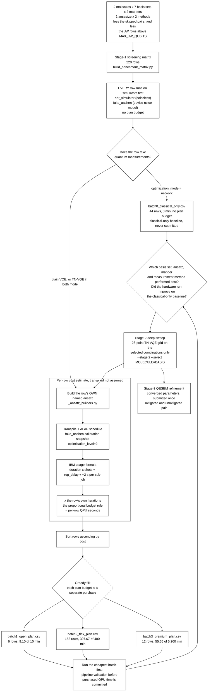

# TN-VQE on IBM hardware, with QESEM-mitigated final energies

## Objective

This campaign measures **how much tensor-network VQE (TN-VQE) improves
molecular ground-state energies over a conventional VQE treatment of the
same system on IBM superconducting hardware.** In TN-VQE part of the
variational work is carried out classically: a tensor-network
transformation `U(θ)` is contracted on CPU and optimised jointly with a
parameterised quantum circuit `U(φ)` that runs on the QPU. The method
under test is Cebule's `TN_QC_OPT`, following the hybrid tensor-network /
circuit construction of [1].

Plain VQE is the reference treatment, and the measured quantities are:

1. the error of the returned energy against a classical reference energy
   for the same active space and basis set;
2. the convergence behaviour of the optimisation, that is the cost
   history as a function of the number of cost-function evaluations, for
   TN-VQE against plain VQE at matched circuit width and depth;
3. the QPU time consumed to reach a given error. Moving variational work
   onto CPU is not automatically a saving on the quantum side: `U†HU`
   generally carries more Pauli terms than `H`, and a deeper network can
   raise the measurement cost of every evaluation. Whether the
   displacement is real is therefore measured rather than assumed, and
   that is what the resource accounting is for;
4. the dependence of the above on basis set, ansatz, fermion-to-qubit
   mapping and measurement method.

The campaign runs in stages, and stage 1 is a screen: it ranks the
discrete experimental factors so that stage 2's much more expensive
parameter sweep is spent only on the combinations that earned it. Both
stages belong to the campaign; the screen exists to direct the spending
within it.

**The experimental design is aligned with IBM's QPU compute-time pricing
plans.** Rows are grouped into batches whose estimated QPU time fits
within the budget of a specific access plan, so that the financial cost
of quantum runtime is a controlled and reportable quantity of the study
rather than an uncontrolled consequence of it. Every row carries an
individual QPU-time estimate derived from a transpiled circuit, and the
analysis procedure can therefore report cost per row, per batch and per
conclusion drawn.

The folder name reads *vendor, method, mitigation*: `ibm` is the hardware
provider whose access plans the campaign buys time on, `tn-vqe` the
method under test, `qesem` the Qedma error-mitigation service applied to
the final energies.

## Campaign structure

The study is divided into three stages at the points where the
experimental decisions fall, so that each stage produces the information
the next one requires. Only stage 1 is committed to the repository: the
inputs of a later stage are an *output* of the stage preceding it, and
there is no defensible default for them before those results exist.

| Stage | Question | File | Rows |
|---|---|---|---|
| **1, screening** | Which basis set, ansatz, mapper and measurement method warrant further study? | `stage1_screening_matrix.csv` | 220, committed |
| **2, deep sweep** | For the selected combinations, how do the TN-VQE sweep parameters `θ` and `φ` behave? | `stage2_deep_sweep.csv` | generated on demand |
| **3, QESEM refinement** | Does error mitigation move the converged energy closer to the classical reference? | `stage3_qesem_refinement.csv` | generated on demand |

```sh
# Stage 1 (committed; regenerate after any generator change)
PYTHONPATH=src python examples/guides/build_benchmark_matrix.py

# Stage 2, once stage-1 results exist
PYTHONPATH=src python examples/guides/build_benchmark_matrix.py --stage 2 \
    --select H2=cc-pvdz --select H2O=def2-svp \
    --ansatz EfficientSU2_circular

# Stage 3, once stage-2 runs have converged
PYTHONPATH=src python examples/guides/build_benchmark_matrix.py --stage 3 \
    --from data/benchmarks/ibm_tn-vqe_qesem/stage2_deep_sweep.csv \
    --refine 17=results/converged/case_17.json --precision 0.0016
```

Each stage refuses to generate without its selection: no `--select`, no
`--refine`, no `--precision`, no output. The refusal is part of the
design, since a silently defaulted selection would make the provenance of
a later stage unrecoverable.

### Every ansatz is run by every method

Both circuit families are run by all three methods — plain VQE, TN-VQE
with `optimization_mode="both"`, and the classical-only `network`
control — on the same Hamiltonian, from the same pinned circuit file, at
the same `Phi_Init`. The three rows of such a triple differ in method and
in nothing else, which is what makes a difference between them
attributable to the method.

An earlier revision ran plain VQE on one set of families and TN-VQE on
another, so the two methods shared no circuit at all and every
VQE-against-TN-VQE difference carried the circuit as well as the method.
That is the defect this crossing fixes, and
`tests/test_docs_consistency.py` now fails the build if any family stops
being run by all three arms.

`UCCSD` is not among the families. It builds excitation operators from
fermionic modes, so it exists only on Jordan-Wigner-mapped plain VQE and
can never be run by the other two methods, nor under mol_map's
constraint encoding, whose qubits index determinants rather than spin
orbitals. A row that no other row can be compared against does not earn
its place in a screen. The builder remains in
[`_ansatz_builders.py`](../../../examples/guides/_ansatz_builders.py) for
a later stage that names it explicitly.

## Simulator characterisation before hardware submission

Before any purchased QPU time is committed, **every** stage-1 row is
executed on simulators in two configurations. Both consume no plan
budget, and both produce results that are analysed in their own right
rather than serving only to validate the pipeline. Both run the row's
own pinned OpenQASM circuit, so the simulated circuit and the submitted
circuit are the same file.

| Configuration | `TNQCOptInput.backend` | What it establishes |
|---|---|---|
| Noiseless statevector / shot-based simulation | `aer_simulator` | The algorithmic result in the absence of device error: the energy TN-VQE and VQE reach for a given basis, ansatz and mapper, and the convergence behaviour of each. This is the reference against which every hardware result is read. |
| Noisy simulation with the target device's noise model | `fake_aachen` | The energy shift and the change in convergence behaviour attributable to device error alone, before queue time or drift enter. |

The local runs use IBM's own simulation stack, Qiskit Aer, since the
campaign targets IBM hardware. `fake_aachen` is `qiskit-ibm-runtime`'s
offline calibration snapshot of `ibm_aachen` itself [7], so the noisy
configuration characterises the target device rather than a stand-in for
it. It needs no credentials, and it is the same snapshot the per-row cost
estimate transpiles against.

The rows in `batch0_classical_only.csv` belong to the same pre-hardware
phase and never reach hardware at all: they take no quantum measurements,
optimising `θ` by classical tensor-network contraction at a frozen `φ`.
They are the baseline every hardware result is read against, and are
described under
[Classical-only control rows](#classical-only-control-rows).

Together these give three points of comparison for every hardware result:
the classical-only value, the noiseless simulated value, and the
noise-model value, which is what allows an observed hardware error to be
attributed between algorithmic limitation and device error.

## Allocation of rows to IBM access plans

The stage-1 matrix is partitioned into sequential batches, each sized to
the QPU-time budget of one IBM access plan, by
[`split_benchmark_batches.py`](../../../examples/guides/split_benchmark_batches.py).

**Each plan is a separate purchase, and the batches are not one running
total.** The Open Plan's 10 free minutes are not deducted from the 400
minutes a Flex Plan purchase buys, and neither of those is deducted from
a Premium Plan allocation. Running the whole campaign therefore means
spending the free 10 minutes on batch1, buying a 400-minute Flex tranche
for batch2, and holding a Premium allocation for batch3 — the three
budgets in the table below are consumed in addition to one another, not
out of one another.

| File | Rows | Est. QPU time | Plan budget | Headroom |
|---|---|---|---|---|
| `batch0_classical_only.csv` | 44 | 0.00 min | none, since no quantum measurements are taken | n/a |
| `batch1_open_plan.csv` | 6 | 9.10 min | 10 min (Open Plan, free) | 0.90 min |
| `batch2_flex_plan.csv` | 158 | 397.67 min | 400 min (Flex Plan minimum purchase) | 2.33 min |
| `batch3_premium_plan.csv` | 12 | 55.55 min | 5,200 min (Premium Plan annual minimum) | 5,144 min |

The total is **462.33 minutes** of QPU time across 9,112 cost-function
evaluations, with every row of the master matrix accounted for in exactly
one file. The figures were cut on
2026-08-18 against the `fake_aachen` calibration snapshot; see
[Derivation of the per-row cost estimates](#derivation-of-the-per-row-cost-estimates).

**Read every figure in that table as a floor.** It charges one circuit
submission per cost-function evaluation, and evaluating ⟨H⟩ really takes
one circuit per measurement basis — a Hamiltonian-dependent number this
campaign has not measured yet. The allocation holds only at the bottom of
that range, and what it takes to invalidate it is set out under
[What the estimate leaves out](#what-the-estimate-leaves-out-measurement-circuits-per-evaluation).
Do not buy a tranche against these numbers before that factor is
measured.

`batch0` is not a plan tranche. It holds the rows that optimise `θ`
classically at a frozen `φ` and take no quantum measurements at all, so
they have no plan budget to fit into — they are the baseline the paid
rows are read against, and they are described under
[Classical-only control rows](#classical-only-control-rows).

The narrow headroom in batch2 is a property of the allocation rule rather
than a coincidence: the fill is greedy, so a batch accepts rows until the
next row would exceed its budget. Any change to the shot count, the
evaluation budget, the ansatz set or the target device moves the batch
boundary, so the partition is **regenerated rather than edited**:

```sh
PYTHONPATH=src python examples/guides/split_benchmark_batches.py
```

### Per-row evaluation budget

`Iterations` is computed per row as `max(30, ceil(1.3 x n_params))` from
that row's own free-parameter count. A single global value cannot be
used, and neither can a rule of the form `n_params + constant`, for two
separate reasons.

**The floor is what the optimizer will run anyway.** COBYLA constructs an
initial simplex of `n + 1` points before it can take a single descent
step, and `scipy.optimize.minimize` does **not** honour a `maxiter` below
that value. It raises `maxfun`, emits the warning `COBYLA: Invalid
MAXFUN`, and performs `n + 2` evaluations regardless. A budget set below
`n + 2` therefore does not reduce what the row costs; it only misstates
it, by a factor of 2.4 on the widest row in this matrix, which has 70
free parameters.

**The proportionality is what makes rows comparable.** COBYLA needs
cost-function evaluations in proportion to the parameter count to make a
given amount of progress. Measured on a trigonometric-polynomial
objective — the functional form a VQE energy takes — the evaluations
needed to reach a fixed fraction of the achievable descent scale linearly
in `n`: about `1.3n` for 50%, `4n` for 80%, `12n` for 95%. So an additive
rule delivers a *shrinking* fraction of the achievable optimisation as
`n` grows, while a proportional rule delivers a constant one. Fraction of
achievable descent reached, median over seeds:

| `n` | `max(30, n+2)` | `n+30` | `n+100` | `1.3n` | `2n` | `4n` |
|---|---|---|---|---|---|---|
| 22 | 53% | 65% | 85% | 53% | 61% | 79% |
| 46 | 41% | 54% | 75% | 47% | 64% | 81% |
| 94 | 38% | 51% | 65% | 50% | 63% | 81% |
| 142 | 38% | 49% | 60% | 51% | 65% | 85% |
| 200 | 38% | 47% | 54% | 51% | 62% | 80% |

The additive columns fall; the proportional ones are flat. The same holds
with shot noise of 4,096-shot magnitude added. Under the old `n + 2` rule
a row reached 53% of its own achievable descent at `n = 22` and 38% at
`n = 200`, which made the optimizer budget a confound **correlated with
the qubit count** — and the qubit count is one of the factors the screen
exists to compare. It also unbalanced each triple against itself: a
`network` control varies `θ` only while the `both` row it controls varies
`φ` and `θ`, so the control was run much further along its own
convergence curve than the row it is the baseline for.

The multipliers are calibrated on a synthetic objective, so they are the
right functional form and the right order of magnitude rather than tuned
values. `TN_QC_OPT` already returns `cost_history`, one entry per
cost-function evaluation, so real runs refine them with no new
instrumentation, no new column and no schema change.

`n_params` is the row's own `Num_Opt_Params_Phi + Num_Opt_Params_Theta`,
both of which are recorded per row, and neither of which follows from the
qubit count alone: φ depends on the circuit ansatz and its repetitions, θ
on the tensor-network family and `TN_Layers_Network`, and on a `network`
row φ is frozen and drops out of the count entirely. Across the stage-1
matrix the resulting budgets run from the floor of 30 to 91, and the
per-row value is read from the CSV rather than inferred from anything
else in it.

**What stage 1 resolves at this budget.** Stage 1 is a screen over the
discrete experimental factors, and its observable is the *convergence
behaviour* of the optimisation rather than a converged energy: the cost
history per evaluation, the descent achieved per unit of QPU time, and
whether TN-VQE and plain VQE differ in either at matched circuit width.
Every row now reaches roughly half of its own achievable descent, at
every width, so what stage 1 exposes is the initial descent — comparably
across rows, which is the point — and not the asymptotic energy.
**Stage-1 energies are not converged energies and must not be reported as
ground-state energies.** Converged energies are the output of stage 2,
whose budget takes the same form at a larger multiplier
(`STAGE2_EVALS_PER_PARAM`, `4n`, about 80% of achievable descent; `12n`
would reach about 95% if fully converged energies are wanted). Raising
either multiplier raises every batch total in nearly the same proportion,
which is why the evaluation budget and the plan allocation are decided
together.

`Iterations` counts **cost-function evaluations, not circuit
submissions**, and the two are not the same thing: one evaluation of ⟨H⟩
costs as many submissions as the Hamiltonian has measurement bases. The
budget rule above is therefore right about how many times the optimizer
asks for an energy and says nothing about what one such request costs;
that second factor is treated under
[What the estimate leaves out](#what-the-estimate-leaves-out-measurement-circuits-per-evaluation),
and it is where the campaign's real QPU time is decided.

### What the estimate leaves out: measurement circuits per evaluation

**The figures above are a lower bound, and the factor they are missing is
Hamiltonian-dependent.** Every batch total on this page is computed as

```
per-row QPU time = Iterations x [ ~2 s sub-job overhead
                                  + shots x (rep_delay + circuit duration) ]
```

which charges **one circuit submission per cost-function evaluation**.
That is not what an evaluation costs. Evaluating ⟨H⟩ takes one circuit
per measurement basis — one per commuting Pauli group under `pauli`, one
per basis-state-pair group under `grouped` — and each of those circuits is
measured at the row's full 4,096 shots. The real per-row cost is
therefore that expression multiplied by a factor `E`, the measurement
circuits per evaluation, which is exactly what the matrix's
`Num_ExpVals_Per_Iter` column is for and exactly why that column is
blank: it is an output of a real run.

`E` is not a constant the totals could simply be scaled by. It depends on
the Hamiltonian — molecule, basis, active space and mapper — and on
TN-VQE rows it depends on `U†HU` rather than `H`, which carries more
Pauli terms and grows with `TN_Layers_Network` and the `TN_Ansatz`
family. It also depends on `Measurement_Method`, the factor `grouped`
exists to reduce. So `E` varies across precisely the axes the screen is
comparing, and it can reorder rows within the allocation as well as
inflate the totals.

**Measured, for the Jordan-Wigner rows.** Each row's own active space,
built with PySCF, mapped with Jordan-Wigner, and grouped into qubit-wise
commuting sets — one set is one measurement basis, so one circuit, at the
row's full 4,096 shots. Reproduce with
[`count_measurement_bases.py`](../../../examples/guides/count_measurement_bases.py),
which checks every system it builds against the matrix's own `N_Qubit`:

| Row class | Qubits | Pauli terms | `E` | Floor | Re-costed |
|---|---|---|---|---|---|
| H2/sto-3g | 4 | 14 | **5** | 13.9 min | 69 min |
| H2/6-31G | 8 | 184 | **46** | 25.0 min | 1,149 min |
| every H2O CAS(4,4) | 8 | 104 | **29** | 174.9 min | 5,072 min |
| **Jordan-Wigner total** | | | | **214 min** | **6,291 min** (105 h) |

Against 5,610 minutes of Open + Flex + Premium, that is **1.12x the
combined plan budget** — the campaign is the right size to within a
re-scoping of one basis or a modest cut in shots, rather than out of
reach. Getting there is what the 8-qubit Jordan-Wigner ceiling buys: `E`
grows as roughly N³, and an earlier revision that screened H2
unrestricted at 16, 20 and 24 Jordan-Wigner qubits measured `E` at 325,
762 and 1,444 there, which put the campaign at 41x the budget with 97% of
it in those rows alone. Those bases are now screened on mol_map, where
the same active spaces sit at 6 to 8 qubits; see
[Active spaces](#active-spaces).

Three things that table does not cover, each of which can only move the
total upwards:

- **The mol_map rows**, which are the majority of the matrix. Their
  Hamiltonian is Cebule's constraint encoding over determinant indices,
  which this repository cannot build offline, so their `E` is unknown and
  they stand at the `E = 1` floor of 249 minutes. Measuring it is the
  first thing a real run should report.
- **The TN-VQE rows**, whose observable is `U†HU` rather than `H`. It
  carries more Pauli terms than `H` and grows with `TN_Layers_Network`
  and the `TN_Ansatz` family, so the numbers above are a lower bound for
  every `both`-mode row.
- **`Measurement_Method = grouped`**, whose count is a property of
  Cebule's basis-state-pair scheme and an output of a real run. It is
  expected to be *smaller* than the commuting-Pauli count, which is the
  one direction that helps, and measuring it is one of the campaign's own
  questions.

The levers, if the total needs to come down further: **shots** (4,096 per
basis sets the 1.02 s shot term and cost is linear in it, traded against
what a noisy device can resolve), **the grouping scheme** (`E` above
counts qubit-wise commuting sets; general commuting sets are fewer, at
the price of entangling basis-change circuits), and **the evaluation
budget**, since `Iterations` multiplies `E`.

The committed batch files still stand at `E = 1` and are therefore still
a floor. Re-cut them with `--circuits-per-eval` once the scheme and the
shot count are settled, noting that a single global value is itself an
approximation, since `E` varies per row.

### Distribution of estimated QPU time across rows

At `E = 1` the cost distribution is the `Iterations` distribution. Per
submission, every circuit in this matrix costs between 3.03 s and 3.05 s
— a spread of under 1% across widths from 2 to 8 qubits — because 4,096
shots at IBM's default 250 µs `rep_delay` is 1.02 s and the per-sub-job
overhead is about 2 s, while the circuits themselves execute in
microseconds. `EfficientSU2_circular` carries 61.2% of the floor against
`RealAmplitudes`' 38.8%, which is the 2:1 parameter ratio appearing as
cost, exactly as the proportional budget intends.

That ordering does **not** survive the measurement factor: once `E` is
counted, the Jordan-Wigner rows dominate, and they do so through their
Hamiltonians' term counts rather than through their circuits.

Two things follow. The circuit's own duration is negligible at these
widths, so what the transpiled estimate really contributes is the
confirmation that it is negligible rather than a number that drives the
budget. And the row ordering the batches are filled in is an ordering by
parameter count alone; once `E` enters it becomes an ordering by
parameter count times measurement cost, which is a different sort.

### Derivation of the per-row cost estimates

Costs are not assumed. Each estimate uses the method of
[`backends/ibm_cost_estimator.py`](../../../docs/integrations/ibm_cost_estimator.md):
transpilation with ALAP (as late as possible) scheduling against
`ibm_aachen`'s calibration, and IBM's own documented usage formula [3].
ALAP is the scheduling policy IBM's runtime applies, so it is the policy
under which the reported circuit duration is meaningful.

**The calibration comes from `fake_aachen`, the offline snapshot
`qiskit-ibm-runtime` ships for this device** [7]. Costing one device
against another's snapshot would estimate the wrong machine rather than
approximating the right one — the two-qubit gate differs between
processor generations, `ecr` against `cz`, so the transpiled circuit
differs before any duration is read off it — but that is not the
situation here: the snapshot is of the target device, and no substitution
is involved. What it buys is reproducibility. Regenerating the batches
needs no IBM credentials and no network, and two regenerations agree.
What it costs is currency: a snapshot is a calibration frozen at the
release it shipped in, so a figure quoted from a batch file is a planning
number rather than a quote for the device as calibrated today. Passing a
live backend to the estimator remains available for that.

Only 10 distinct circuits exist across the 176 costed rows — the 10 the
campaign pins as QASM. Each is transpiled once and cached per
`(ansatz, qubits, reps, electrons, shots)`, which is 14 cache entries
over the 10 circuits, since active spaces with different electron counts
reach the same qubit count and share a circuit at each family.

Transpilation runs at `optimization_level=2`, which is what the campaign
will actually receive; see
[Absence of a `Qiskit_Opt_Level` column](#absence-of-a-qiskit_opt_level-column).

Each row's **own** circuit is constructed for the estimate rather than a
common stand-in, from the same builders that write the pinned QASM files,
so the circuits transpiled here are the circuits committed under
`data/qasm/` and the estimate describes what runs. The circuits
themselves are shown in
[Circuit families under test](#circuit-families-under-test).

**`Measurement_Method` does not enter this estimate.** The estimator
cannot know how many distinct circuits the basis-state-pair grouping
produces for a given Hamiltonian, because that number is an output of a
real run. Every `pauli`/`grouped` pair of an otherwise identical row
therefore receives an identical estimate and is placed in the same batch.
Since `grouped` is expected to require fewer circuits, measured per-row
costs would redistribute rows between batches, most visibly at the batch2
boundary. What the two values mean is described under
[`Measurement_Method`](#measurement_method-pauli-and-grouped).

**Two columns beyond the matrix's own** (`Est_QPU_Time_S`,
`Est_QPU_Time_Cumulative_S`) are appended to each batch file for
auditability. The cumulative column must never exceed that file's plan
budget expressed in seconds.

## Workflow



Three features of this workflow carry experimental weight. **Everything
is simulated before anything is submitted**, in both configurations, so
the split that follows is only about which rows go on to consume
purchased hardware time. The **loop back into the cost estimator** is the
purpose of the staged design: stage 2 is costed by the same machinery, on
the small set of combinations stage 1 selects, rather than speculatively
across all seven basis sets. And **stage 3 depends on stage 2 rather than
on the screen**, because refinement consumes converged parameters and
only a converged run produces them.

### Ordering of rows within the allocation

Rows are sorted in ascending order of estimated per-row QPU time before
the greedy fill, so batch1 receives the least expensive calculations
available and serves as a pipeline validation run before purchased QPU
time is committed. This is why batch1 consists entirely of 2-qubit
`H2`/sto-3g `mol_map` cases rather than, for example, one row per
molecule. Prioritising *coverage* over strict cost minimisation is an
equally defensible sort criterion and is a one-line change to the sort
key; the present choice is recorded rather than assumed.

The zero-cost rows are excluded from that sort. Their cost is genuinely
zero rather than merely unknown, and if left in the ascending order they
would occupy the free tier with rows that consume no QPU time,
displacing the validation runs the free tier exists to provide.

## Circuit families under test

Two circuit families appear in the stage-1 matrix, each run by all three
methods, and **every row supplies its circuit as a committed OpenQASM 3.0
file** under `data/qasm/`, named in `Qasm_Ansatz_File` and hashed in
`Qasm_Ansatz_SHA256`. The name of an ansatz is not a circuit: it is a
name that a library version resolves, and two rows naming one family are
comparable only if they resolve it identically. A file removes that
question: for the VQE-against-TN-VQE comparison inside the campaign, for
anyone reproducing a row, and for anyone comparing these energies against
a method the campaign does not run, who then starts from the circuit
rather than from its name. The files are generated by
[`pin_qasm_ansatz.py`](../../../examples/guides/pin_qasm_ansatz.py), one
per distinct (family, qubits, repetitions), and are dumped with their
parameters **free**: OpenQASM 3's `input` declarations carry them, so the
consumer can tell which parameters the optimisation is to vary.

Every stage-1 row runs its family at two repetitions. The repetition
count is a property of the pinned file rather than of the method running
it, so it is recorded once, in `Ansatz_Reps`, on every row alike: a
plain-VQE row and the TN-VQE row it is compared against load the same
file and agree about what is in it. An earlier revision carried a second,
TN-only `TN_Layers_Circuit` column, which left the plain-VQE side of each
pair blank and read as though the two methods ran different circuits.

The two families differ in **what the circuit can reach**, not only in
size. `RealAmplitudes` builds from Ry rotations and CX alone, so every
amplitude it produces is real; `EfficientSU2_circular` adds an Rz layer
per block and can produce complex ones, at twice the parameters. A real
orbital basis gives a real symmetric electronic Hamiltonian — and
mol_map's determinant Hamiltonian is real symmetric too — so a real
ground state always exists and the cheaper family is not handicapped by
construction. Whether the phase freedom earns its cost is therefore a
question with an answer, and under the proportional evaluation budget
that cost is explicit: twice the parameters is twice the evaluations.

The diagrams below are those circuits, drawn from
[`_ansatz_builders.py`](../../../examples/guides/_ansatz_builders.py) and
rendered in the `{Ry, Rz, CX}` basis. They are the same objects that the
cost estimator transpiles and that the QASM files hold, so the resource
estimates, the diagrams and the pinned circuits describe one circuit
rather than three descriptions of one.

**`RealAmplitudes`**, shown at 4 qubits with `reps = 2` (12 parameters).
One Ry rotation layer per repetition and a reverse-linear CX chain,
Qiskit's default entanglement for this family.

```text
     ┌──────────┐                             ┌──────────┐                          ┌──────────┐
q_0: ┤ Ry(θ[0]) ├──────────────────────■──────┤ Ry(θ[4]) ├───────────────────■──────┤ Ry(θ[8]) ├
     ├──────────┤                    ┌─┴─┐    ├──────────┤                 ┌─┴─┐    ├──────────┤
q_1: ┤ Ry(θ[1]) ├──────────■─────────┤ X ├────┤ Ry(θ[5]) ├──────■──────────┤ X ├────┤ Ry(θ[9]) ├
     ├──────────┤        ┌─┴─┐    ┌──┴───┴───┐└──────────┘    ┌─┴─┐    ┌───┴───┴───┐└──────────┘
q_2: ┤ Ry(θ[2]) ├──■─────┤ X ├────┤ Ry(θ[6]) ├─────■──────────┤ X ├────┤ Ry(θ[10]) ├────────────
     ├──────────┤┌─┴─┐┌──┴───┴───┐└──────────┘   ┌─┴─┐    ┌───┴───┴───┐└───────────┘
q_3: ┤ Ry(θ[3]) ├┤ X ├┤ Ry(θ[7]) ├───────────────┤ X ├────┤ Ry(θ[11]) ├─────────────────────────
     └──────────┘└───┘└──────────┘               └───┘    └───────────┘
```

**`EfficientSU2_circular`**, shown at 4 qubits with `reps = 2` (24
parameters). Ry and Rz rotation layers per repetition, entangled on a
**ring** rather than the library's default reverse-linear chain: the
wrap-around CX from the last qubit to the first is the extra gate visible
at the start of each entangling block. That is one more CX per repetition
than a linear chain — 16 against 14 at 8 qubits — and a deeper transpiled
circuit, which is a negligible cost at these shot counts but not a
negligible difference in what the circuit entangles. At 2 qubits a ring
*is* the chain, so the two coincide there.

```text
     ┌──────────┐┌──────────┐┌───┐     ┌──────────┐┌───────────┐                          ┌───┐     »
q_0: ┤ Ry(θ[0]) ├┤ Rz(θ[4]) ├┤ X ├──■──┤ Ry(θ[8]) ├┤ Rz(θ[12]) ├──────────────────────────┤ X ├──■──»
     ├──────────┤├──────────┤└─┬─┘┌─┴─┐└──────────┘└┬──────────┤┌───────────┐             └─┬─┘┌─┴─┐»
q_1: ┤ Ry(θ[1]) ├┤ Rz(θ[5]) ├──┼──┤ X ├─────■───────┤ Ry(θ[9]) ├┤ Rz(θ[13]) ├───────────────┼──┤ X ├»
     ├──────────┤├──────────┤  │  └───┘   ┌─┴─┐     └──────────┘├───────────┤┌───────────┐  │  └───┘»
q_2: ┤ Ry(θ[2]) ├┤ Rz(θ[6]) ├──┼──────────┤ X ├──────────■──────┤ Ry(θ[10]) ├┤ Rz(θ[14]) ├──┼───────»
     ├──────────┤├──────────┤  │          └───┘        ┌─┴─┐    ├───────────┤├───────────┤  │       »
q_3: ┤ Ry(θ[3]) ├┤ Rz(θ[7]) ├──■───────────────────────┤ X ├────┤ Ry(θ[11]) ├┤ Rz(θ[15]) ├──■───────»
     └──────────┘└──────────┘                          └───┘    └───────────┘└───────────┘          »
«     ┌───────────┐┌───────────┐
«q_0: ┤ Ry(θ[16]) ├┤ Rz(θ[20]) ├──────────────────────────
«     └───────────┘├───────────┤┌───────────┐
«q_1: ──────■──────┤ Ry(θ[17]) ├┤ Rz(θ[21]) ├─────────────
«         ┌─┴─┐    └───────────┘├───────────┤┌───────────┐
«q_2: ────┤ X ├──────────■──────┤ Ry(θ[18]) ├┤ Rz(θ[22]) ├
«         └───┘        ┌─┴─┐    ├───────────┤├───────────┤
«q_3: ─────────────────┤ X ├────┤ Ry(θ[19]) ├┤ Rz(θ[23]) ├
«                      └───┘    └───────────┘└───────────┘
```

**Why the circuits are supplied rather than defaulted.** A row that let
its stack build a circuit for it would carry a circuit defined by the
installed versions of Qiskit and `TN_QC_OPT` at the moment it ran, and
neither the parameter count nor the entanglement pattern of such a
circuit is recoverable from the matrix afterwards. Committing the QASM
makes the circuit part of the record: the campaign runs these circuits
because these files say so, and a reader reproducing a row years later
does not have to reconstruct which library versions were installed, or
whether the functions involved have changed since. One interaction is
worth knowing when reproducing a row: supplying `qasm_ansatz` changes
`n_layers_circuit`'s effective default from 3 to 1, since the circuit is
then fully specified, so pass it explicitly.

## Active spaces

**H2 carries no active-space restriction.** Every H2 row uses all of its
electrons in every orbital the basis provides, so the basis set is what
the basis-set screen actually varies. An earlier revision held H2 at a
fixed CAS(2,2) across all seven bases, which is the same two orbitals
every time — the screen could then only see the difference the basis made
to those two orbitals, which is very nearly none. The price is that H2's
qubit count now follows the basis:

| Basis | Spatial orbitals | JW qubits | mol_map qubits | Screened under |
|---|---|---|---|---|
| sto-3g | 2 | 4 | 2 | both mappers |
| 6-31G | 4 | 8 | 4 | both mappers |
| qvSZP | 8 | 16 | 6 | **mol_map only** |
| cc-pVDZ | 10 | 20 | 7 | **mol_map only** |
| def2-SVP | 10 | 20 | 7 | **mol_map only** |
| def2-TZVP | 12 | 24 | 8 | **mol_map only** |
| ~~cc-pVTZ~~ | 28 | 56 | 10 | not screened |

**Above 8 Jordan-Wigner qubits, a pair is screened on mol_map alone.**
The limit is `MAX_JW_QUBITS` in the generator, and it is a measurement
limit rather than a circuit one: evaluating ⟨H⟩ costs one circuit per
measurement basis, and for a JW-mapped Hamiltonian that count grows as
roughly N³ — measured on these very rows at 5 bases for 4 qubits and 46
for 8, then 325, 762 and 1,444 at 16, 20 and 24. Screening H2's larger
bases under Jordan-Wigner would have cost about 40 times the campaign's
entire plan budget on its own.

mol_map holds the same active spaces at 6 to 8 qubits, because its
constraint encoding indexes determinants rather than spin orbitals, so
the basis series survives intact there. What is given up is the
JW/mol_map comparison at exactly those bases, which is a real loss and is
recorded under [Known limitations](#known-limitations). The compensation
is that "the constraint encoding makes large bases tractable where
Jordan-Wigner does not" is itself something this campaign is positioned
to demonstrate.

Five of the six screened mol_map counts come from real MOL_MAP runs
rather than from the inferred formula, because the runs this project has
were made on exactly this space; see
[MOL_MAP qubit counts](#mol_map-qubit-counts-are-computed-rather-than-left-blank).

**H2/cc-pVTZ is not screened at all.** Unrestricted it is 28 spatial
orbitals: 56 Jordan-Wigner qubits, and 10 under mol_map. The whole pair
was cut when the JW arm was the matrix's most expensive corner; it is
recorded in `SKIPPED_PAIRS` with that reason, and `--select H2=cc-pvtz`
is refused at stage 2, since there is no stage-1 result to carry forward.
Its mol_map arm alone would now be affordable, so restoring triple-zeta
coverage on that side is a one-line change if it is wanted.

**H2O keeps a fixed valence CAS, provisionally, and a small one.**
CAS(4,4) with the O 1s frozen — 8 Jordan-Wigner qubits, 6 under mol_map.
The standard water valence space is CAS(8,6), which an earlier revision
screened at 12 Jordan-Wigner qubits; it was cut to CAS(4,4) because
measurement cost grows as roughly the cube of the qubit count, and
because stage 1 ranks experimental factors rather than quoting water's
correlation energy. It is a screening space, not a converged-chemistry
one. How far to restrict this molecule is an open campaign decision
awaiting expert input, tracked under
[Open campaign decisions](#open-campaign-decisions). What is recorded per
row is which treatment it received, in `Active_Space` and in `Notes`, so
a later change is visible in the data rather than inferred from the date.

**Li2 is not screened at all.** At any fixed valence CAS it is the same
small active space in every basis, so its rows would have repeated one
Hamiltonian across seven bases and told the basis-set screen nothing —
the same defect that made H2's fixed CAS(2,2) worth dropping, but without
H2's remedy, since Li2 unrestricted is far beyond the budget. Dropping it
also removes a molecule whose active-space treatment would have needed
its own decision.

| Molecule | Electrons | Active space | Frozen | JW qubits | mol_map qubits |
|---|---|---|---|---|---|
| `H2` | 2 | none: all orbitals of the basis | nothing | 4 and 8 screened; 16 to 24 mol_map only | 2 to 8 |
| `H2O` | 10 | CAS(4,4), provisional | O 1s and the outer valence | 8 | 6 |

Holding H2O fixed is what keeps it executable: `H2O`/cc-pVTZ costs the
same 8 Jordan-Wigner qubits as `H2O`/sto-3g rather than 116. Stage 2 can opt into the full space with
`--active-space full` where the hardware, or the local machine running
MOL_MAP, can accommodate it; for H2 it does so unconditionally, since
there is no CAS to fall back to.

## Mapper, method and ansatz are separate columns

`Mapper` records the fermion-to-qubit mapping. `Method` records whether
the row runs conventional VQE or TN-VQE through Cebule's `TN_QC_OPT`.
`Ansatz` records the circuit family. The three vary independently, so
each has its own column:

| Column | Values | Meaning |
|---|---|---|
| `Mapper` | `JW` | Jordan-Wigner, `2 x active_orbitals` qubits |
| | `mol_map` | Cebule's constraint-based encoding, fewer than `2N` qubits |
| `Method` | `VQE` | plain variational quantum eigensolver |
| | `TN-VQE` | Cebule `TN_QC_OPT`, classical tensor network plus quantum circuit |
| `Ansatz` | `RealAmplitudes`, `EfficientSU2_circular` | the circuit family, as drawn above |

Each family is run by each method under each mapper the row is screened
on, which is what the comparison requires. The crossing is complete
except where a pair exceeds `MAX_JW_QUBITS` and is screened on mol_map
alone; see [Active spaces](#active-spaces).

### `Backend_Platform` names one device, on both sides of the comparison

Every hardware row reads `ibm_aachen`: one named device, for VQE and
TN-VQE alike, so the two differ in method rather than in machine. It
reaches the two stacks by different routes, `TNQCOptInput.backend` on
TN-VQE rows and `IBMAdapter(backend_name=...)` on VQE rows, but it is the
same device in both, and the per-row cost estimate transpiles against
that device's own calibration snapshot.

**A least-busy selection is deliberately not used.** Both stacks could
take one, `QiskitRuntimeService.least_busy()` on the qpubench side and
any `ibm`-prefixed string on Cebule's. What it would cost is the cost
model: a row that landed on a different device would carry a duration
describing a machine it did not run on, and the batch it was allocated to
would be sized from that duration. Devices differ enough for that to
matter rather than to average out, since the two-qubit gate itself
differs between processor generations. A device chosen at submission time
is the right tradeoff for throughput and the wrong one for a campaign
whose budget is the measurement.

## Tensor-network rotation families

`TN_Ansatz` names the family that constructs `U(θ)` on the network side.
All four are members of `M_ANSATZE` (`functions_U.py:150-161`):

| `TN_Ansatz` | Construction | params/node | Entangles | Conserves N |
|---|---|---|---|---|
| `rotation_1param` | one rotation angle per network node, no entanglement in `U(θ)` | 1 | no | no |
| `rotation_3param` | three angles per node, a general single-qubit rotation, still non-entangling; the task default | 3 | no | no |
| `givens` | a Givens rotation per node: one angle, entangling, particle-number conserving, an orbital rotation | 1 | **yes** | **yes** |
| `number_preserving` | five angles per node, entangling, particle-number conserving; the most expressive and the most expensive | 5 | **yes** | **yes** |

Both `rotation_*` families are **non-entangling**: the network factorises
across the two wires of every M gate, so `U(θ)` cannot generate
entanglement and only rotates each qubit's local basis. A design that
sweeps those two families alone therefore sweeps two variants of "no
entanglement in `U(θ)`" and never reaches the regime the method exists
for.

**Stage 1 screens on `givens` as its single TN reference point.** It
entangles, conserves particle number, and is the only family with a fast
evaluation path in the implementation, since `_orbital_pauli_terms`
routes it through `OrbitalRotationHamiltonian` at O(N⁵) cost rather than
contracting the network at 2ⁿ cost. It is therefore also the family whose
stage-1 timings are representative of stage 2's. The choice does not
affect cost accounting: the family determines `U(θ)`, not the circuit, so
every per-row QPU estimate is unchanged by it. Screening on the task's
own default instead is a single-constant change, `STAGE1_TN_REFERENCE` in
the generator.

`number_preserving` is marked in `Notes` as a **control** rather than a
candidate. It is a strict superset of `givens` that is not a
single-particle transformation, so `U†HU` acquires higher-body terms and
substantially more Pauli strings. It is carried in order to verify that
behaviour on hardware, and it is the first candidate to remove if the
budget tightens.

### Composition of the stage-2 grid

The stage-2 sweep comprises 28 points, allocated so that all four
families are represented without applying the full grid to each. The
family comparison is a question about the method rather than about
chemistry coverage, and does not require the full grid on every family:

| Slice | Points |
|---|---|
| `givens` on the full grid: `network=0` x 4 repetition counts, plus `network∈{1,2,3}` x 4 repetition counts | 16 |
| family comparison: `rotation_1param` / `rotation_3param` / `number_preserving`, at `network∈{1,3}` x `reps∈{1,2}` | 12 |
| **total** | **28** |

The sweep runs on the circuit family stage 1 selected (`--ansatz`), and
every distinct circuit shape in it also gets a plain-VQE baseline row at
the same repetition count, so the matched-circuit comparison that stage 1
makes carries into stage 2. Carrying both molecules forward gives 256
rows; selecting one gives half that, which is the point of the screen.

`givens` rather than `rotation_3param` is the reference family the grid
is built around, because a non-entangling `U(θ)` is not a suitable
reference point for a method whose premise is that the network carries
part of the correlation. `rotation_3param` is retained inside the
comparison slice, which is where the comparison against the task default
belongs.

`--sweep-circuit-ansatz` additionally crosses the 12-point comparison
slice with `excitation_preserving_linear`. It is **off by default**,
because it takes the sweep from 28 to 40 points and the file to 368 rows,
and because `xx_plus_yy` is not an IBM basis gate on any current device.
Re-cost before enabling it rather than assuming parity.

## Columns

| Column | Meaning |
|---|---|
| `Case_ID` | Row index |
| `Stage` | `1_screen`, `2_deep` or `3_refine` |
| `Molecule`, `Charge`, `Multiplicity`, `Num_Electrons` | `H2` and `H2O`, both neutral closed-shell singlets |
| `Basis`, `Basis_Source` | 6 Basis Set Exchange [6] names or `qvSZP`; see [docs/integrations/basis_sets.md](../../../docs/integrations/basis_sets.md) |
| `Active_Space` | `full` (no restriction — every H2 row) or `valence_cas` (core frozen — every H2O row) |
| `Active_Electrons`, `Active_Orbitals` | The space the Hamiltonian is built in; maps onto `BenchmarkRecord.active_electrons` / `.active_orbitals` |
| `Mapper`, `Method`, `Ansatz` | See the table above |
| `Ansatz_Reps` | Repetitions of the circuit family, 2 on every stage-1 row and identical across the three methods, since it is the pinned QASM file that fixes it. Stage 2 sweeps it over 1 to 4 |
| `N_Qubit`, `N_Qubit_Source` | Qubit count and its provenance: `jw_exact`, `mol_map_run` (a real MOL_MAP run) or `mol_map_inferred` (see below) |
| `Backend_Platform` | The device the row runs on, `ibm_aachen` throughout: `TNQCOptInput.backend` on TN-VQE rows, `IBMAdapter(backend_name=...)` on VQE rows, and the device the cost estimate is transpiled against |
| `Optimizer`, `Opt_Options` | `COBYLA`, matching the default of `TNQCOptInput.opt_method`, and the `opt_options` dictionary passed directly to `scipy.optimize.minimize`. `{}` is a recorded choice: for COBYLA, `rhobeg` affects both convergence and the evaluation count, and therefore the row's QPU cost |
| `Iterations` | Cost-function evaluations the row's optimizer will consume, `max(30, ceil(1.3 x n_params))` on stage-1 rows; per row rather than global, see the evaluation-budget section above |
| `Shots` | 4,096, pinned via `TNQCOptInput.n_shots`; `n/a (network mode)` where no quantum measurement is taken, `n/a (QESEM: precision-driven)` on mitigated rows |
| `Qiskit_Version` | The installed Qiskit, recorded because it is what fixes the transpiler optimisation level the run receives |
| `TN_Layers_Network` | Layers of θ on the classical tensor-network side, 0 to 3, where 0 is the circuit-only reference; range follows [1]. The φ side of that sweep is `Ansatz_Reps`, which every method has |
| `TN_Ansatz` | One of the four families above, or `n/a (no TN layers)` / `n/a (not TN-VQE)` |
| `Optimization_Mode` | `both` (jointly optimise θ and φ) or `network` (θ only, no quantum measurements: the zero-cost control, see below) |
| `Measurement_Method` | `pauli` or `grouped`, matching `TNQCOptInput.measurement_method` exactly; `n/a` where the dimension does not apply |
| `Qasm_Ansatz_File`, `Qasm_Ansatz_SHA256` | The pinned circuit under `data/qasm/` and a hash prefix of it, so that an edited circuit ceases to match. Set on **every** row, VQE and TN-VQE alike. Generated by [`pin_qasm_ansatz.py`](../../../examples/guides/pin_qasm_ansatz.py) |
| `Num_Opt_Params_Phi` | Circuit-side parameter count, and the `num_parameters` the pinned QASM loads with. On a `network` row it is the count held **fixed** rather than optimised |
| `Phi_Init` | How the circuit's parameters are initialised, fixed by `Ansatz` alone so that rows sharing a circuit share a starting point: `random(seed=N)` on all three families; see below |
| `Num_Opt_Params_Theta` | Network-side parameter count, derivable from the inputs: `TN_Layers_Network x ((3n - 2) // 2) x params_per_node` |
| `Num_ExpVals_Per_Iter` | Blank, being an output of a real run. For a JW row measured per commuting Pauli set it can be computed ahead of the run — see [`count_measurement_bases.py`](../../../examples/guides/count_measurement_bases.py) — but the value Cebule's own scheme produces is what belongs here |
| `Error_Mitigation` | `none` or `qesem`. Every stage-1 and stage-2 row is genuinely `none`, so mitigation is additive |
| `Precision` | QESEM target σ in Hartree on mitigated rows; `n/a (shot-based)` on every row costed in shots |
| `QESEM_Execution_Mode` | `batch` (QPU released between classical steps) or `session`; `n/a (not QESEM)` elsewhere |
| `Refines_Case_ID`, `Converged_Params_File`, `Converged_Params_SHA256` | Stage-3 provenance: which run's converged parameters the row submits, and a hash of them |
| `Notes` | Per-row provenance and caveats |

### `Phi_Init` is fixed by the circuit family

φ is the **circuit's** parameter vector, so every row has one. A plain
VQE row has circuit parameters exactly as a TN-VQE row does, and a
`network` row has them frozen rather than absent. The initialisation is
therefore a property of the circuit family and not of the method or the
optimisation mode, and the column is keyed on `Ansatz` alone: two rows
that share a family, qubit count and repetition count start from the same
φ whatever else differs between them. That is what makes the comparison a
comparison: a difference in the result is attributable to the method
rather than to where each run began.

Both families take a **seeded random draw**. All-zero rotations make
these circuits exactly the identity, so the initial state would be
`|0…0⟩`, that is the reference determinant, and the gradient with respect
to many φ parameters vanishes there: a known poor starting point. Seeding
preserves reproducibility without altering the character of the
initialisation, and it matches the upstream default. A family whose zero
*is* its reference state — a coupled-cluster ansatz, where zero
amplitudes are the Hartree-Fock determinant — would take `zeros` instead;
the generator keeps that rule for a later stage, though no stage-1 row
uses it.

Upstream randomises φ (`2π·random`, `run_TNQCOpt`) whenever `phi_init` is
`None`, and does so **unseeded**, so an unpinned run has an
initialisation that cannot be reproduced; that is the defect the pin
fixes. The campaign draws `2π·U(0,1)` from `numpy.random.default_rng(seed)`
and passes the vector explicitly through `phi_init`, since upstream
exposes no seed of its own. The mirror's `phi_init` default is `None`
rather than `[]`: `None` is upstream's sentinel for "unset", whereas an
empty list reaches the shape check as a length-zero array against a
`phi_shape` of `(3n(R+1),)`, which is neither the documented random
initialisation nor a valid one.

### `Num_Opt_Params_Theta` and its cost implications

With COBYLA the evaluation count scales with the parameter count, so a
`number_preserving` row represents **five times** the classical
optimisation work of a `givens` row at the same layer count. At stage 1's
`TN_Layers_Network = 2` that is 4 / 12 / 20 parameters at 2 qubits,
rising to 22 / 66 / 110 at the matrix's widest 8, and through
`Iterations` it is QPU cost as well.

`Num_ExpVals_Per_Iter` remains blank because the value that belongs in
it is the one Cebule's own measurement scheme produces, and it is the
measurement that would support one of the campaign's most defensible
conclusions: whether `givens` combined with `grouped` keeps measurement
cost approximately flat as `TN_Layers_Network` grows while
`number_preserving` does not. What can be computed ahead of a run, for
the JW rows under a commuting-Pauli scheme, is in
[What the estimate leaves out](#what-the-estimate-leaves-out-measurement-circuits-per-evaluation),
and it is already large enough to change what the campaign can afford.

### Classical-only control rows

One row per (molecule, basis, mapper, ansatz) runs with
`optimization_mode="network"`: θ is optimised by classical
tensor-network contraction and φ is frozen, so **no quantum measurements
are taken at all**. They consume no IBM plan budget and are held in
`batch0_classical_only.csv`, outside the plan batches.

They exist because they are the baseline against which every `both` row
must be read. This matters most on precisely the `givens` rows that stage
1 screens with: there `U(θ)` is an orbital rotation and can capture a
substantial part of the correlation energy on its own, so without the
control a `both` run can appear to be a quantum success when most of the
improvement originated in the classical half of the method.

**"Network" mode does not mean "no circuit".** These runs use the same
quantum circuits as the other two arms, held at the same `Phi_Init`
rather than optimised, and that frozen state is the reference θ is
optimised against — which is why a control on one circuit family gives a
different baseline from a control on another. These rows therefore record
their real ansatz, repetitions, pinned QASM and φ count — a control on
one circuit gives a different floor from a control on another, so the
circuit is part of what defines it. What distinguishes the control is
that it takes no quantum measurements, and
`Optimization_Mode` already carries that distinction, so no second marker
is required; `Shots` reads `n/a (network mode)` rather than a numeric
value, since shots do not apply rather than being zero.

A control and the `both` row it controls therefore differ in one thing
only, whether φ is optimised alongside θ, and the difference between
their energies measures that and nothing else.

### `Measurement_Method`: `pauli` and `grouped`

The two values are `pauli` and `grouped`, exactly as
`schemas.mirrors.mqsdk_cebule.TNQCOptInput.measurement_method` defines
them.

- **`pauli`** is the traditional route to an expectation value: the
  mapped Hamiltonian is decomposed into Pauli strings, each string (or
  each commuting set of them) is measured on the device, and the results
  are recombined with the Hamiltonian's coefficients. The number of
  distinct measurement circuits follows the number of Pauli terms.
- **`grouped`** instead groups the Hamiltonian's terms by the
  computational basis-state pairs they connect and generates one circuit
  per grouping, reconstructing the expectation value from the resulting
  bitstring distributions. For a constraint-encoded Hamiltonian, where
  the terms connect comparatively few determinant pairs, this is expected
  to need fewer circuits than `pauli`. The scheme and its
  `postprocessing_instructions` are documented in [2] and mirrored in
  [docs/integrations/cebule.md](../../../docs/integrations/cebule.md).

How much fewer is an output of a real run rather than a property of the
inputs, which is why `Num_ExpVals_Per_Iter` is blank and why the cost
estimate treats the two identically.
`tests/test_docs_consistency.py` checks this column, and `TN_Ansatz`,
against the mirror's own vocabulary.

### Absence of a `Qiskit_Opt_Level` column

The transpiler optimisation level is fixed rather than chosen: `TN_QC_OPT`
transpiles without passing one, so the level is whatever the installed
Qiskit defaults to — 2 under Qiskit 2.x, 1 under 1.x — and there is no
task input that could set it. Such a column would therefore record a
number nothing can vary, and `Qiskit_Version` records the quantity that
in fact determines it.

## Stage 3: QESEM-mitigated final energies

Stage 3 takes the parameters stage 2 converged to and resubmits each one
twice on `ibm_aachen`: once through Qedma's QESEM [4], once without it.
Both values are then reported as errors against the classical reference
energy. That is the whole of the stage. It is deliberately small, it runs
once at the end, and it is not a sweep.

### What a refinement row submits

| | |
|---|---|
| Circuit | the row's pinned QASM, unchanged from the stage-2 run being refined |
| Parameters | the converged vector, by file and hash (`Converged_Params_File`, `Converged_Params_SHA256`), since the vector is too long for a CSV cell |
| Provenance | `Refines_Case_ID`, the stage-2 row this refines |
| Observable | the transformed Hamiltonian of that run |
| Target uncertainty | `Precision`, a requested σ in Hartree, which has no default |
| Execution | `QESEM_Execution_Mode`, `batch` or `session`; one job per row, so `Optimizer` reads `n/a (converged parameters)` and `Iterations` is 1 |

Every `--refine` emits **two** rows, identical except for
`Error_Mitigation`. A mitigated energy on its own says nothing about
mitigation: it is interpretable only against the same circuit, at the
same parameters, on the same device, unmitigated. Without the pair the
result of the stage is "QESEM returned a number".

### What comes back, and where it is recorded

QESEM returns a mitigated expectation value with an error bar. The
requested σ is a target rather than a guarantee, since a job that reaches
its QPU-time cap first will fall short of it, so requested and achieved
are recorded separately:

| Quantity | Where it is recorded |
|---|---|
| Requested σ | `QESEMJobSpec.precision`, and `Precision` in the matrix |
| Achieved 1-σ uncertainty | `QESEMExpectationValue.error_bar`, surfaced by `QESEMCircuitResult.mitigated_stds` |

A refinement result without its uncertainty cannot be read against either
its unmitigated pair or the classical reference, so the achieved value
gates whether the stage concluded anything. The mirror's
`QESEMExecutionMode` and `parameterized_values` both match the API, but
should be re-verified against what is actually submitted, as the
`TN_QC_OPT` mirror was against its implementation.

### What stage 3 cannot do

- **It cannot contribute to the `pauli`/`grouped` comparison.** QESEM
  returns an expectation value, never the raw bitstring distribution a
  basis-state grouping scheme reconstructs from, so there is nothing for
  `grouped` to consume and the dimension collapses to
  `n/a (QESEM: no bitstring distribution)`. That matters because the
  claim that grouping keeps measurement cost roughly flat is among the
  campaign's most defensible conclusions, and this stage cannot support
  it.
- **It cannot be costed by the transpilation model**, so it needs its own
  cost source and its own batch; see
  [Known limitations](#known-limitations).
- **It does not mitigate inside the variational loop.** The obstacle is
  the sequence: queue time plus mitigated sampling, strictly in order,
  once per optimiser step, across every combination the campaign screens.
  The classical step between jobs is not the obstacle, since QESEM reuses
  a characterization for 24 hours and the tensor-network contraction
  between iterations is small against that window, the contraction path
  being computed once and cached. An inner-loop experiment is therefore
  not ruled out on principle, but should measure real per-iteration
  wall-clock time first.

### What is still open

Stage 3 is the least settled part of the campaign, and the decisions
below are sized from each other rather than independently. They are
tracked with the rest under
[Open campaign decisions](#open-campaign-decisions).

- **What σ, and therefore what the stage is for.** Chemical accuracy is
  about 1.6 mHa, and an energy quoted to ±0.1 Ha distinguishes no basis
  set, ansatz or mapper. But sampling cost scales as 1/σ², so tightening
  from 0.1 Ha to 1.6 mHa is of order 10³ to 10⁴ times the sampling. The
  two ends are two different results: *"mitigation runs end to end and
  measurably reduces the error"* is worth reporting at a loose σ, and is
  not a chemistry result. Only one of them justifies spending at chemical
  accuracy, and no default is inherited from the service, whose own
  defaults are looser than chemistry needs.
- **Which stage-2 rows are refined, and on what criterion**: best energy,
  largest spread against the classical reference, or one per molecule.
  The answer is an output of stage 2, but the criterion should be
  recorded before stage 2 runs rather than chosen from its results.
- **Whether a grouping-aware submission path exists**, which is a
  question for Qedma.

Two facts constrain those choices. Refinement cost depends on **which
family produced the state**, since QESEM's sampling tracks the Pauli-term
structure of the observable and the transformed Hamiltonian's term count
follows the `TN_Ansatz`; each row therefore records what it refines. And
submitting many parameter values in one job pays off exactly where the
values are known in advance, which in this campaign means a
**dissociation curve or geometry scan**: a further reason to settle the
geometry decision.

## MOL_MAP qubit counts are computed rather than left blank

Cebule's MOL_MAP encoding indexes only those determinants satisfying the
particle-number and spin constraints, so its qubit count follows the
active space rather than the size of the basis set:

```
n_qubits = ceil(log2( C(n_orbitals, n_alpha) x C(n_orbitals, n_beta) ))
```

This relation is **inferred** rather than documented by Cebule, but it
reproduces exactly all eight real MOL_MAP counts available to this
project, including the two values that arrive independently of the fit
([`hamiltonian_sources/mol_map.py`](../../../src/qpubench/hamiltonian_sources/mol_map.py),
pinned by `tests/test_mol_map.py`):

| Molecule / basis | (orbitals, alpha, beta) | Determinants | Qubits |
|---|---|---|---|
| H2 / sto-3g | (2, 1, 1) | 4 | 2 |
| H2 / 6-31G | (4, 1, 1) | 16 | 4 |
| H2 / cc-pVDZ | (10, 1, 1) | 100 | 7 |
| H2 / def2-SVP | (10, 1, 1) | 100 | 7 |
| H2 / def2-TZVP | (12, 1, 1) | 144 | 8 |
| H2 / cc-pVTZ | (28, 1, 1) | 784 | 10 |
| H2O / sto-3g | (7, 5, 5) | 441 | 9 |
| Li2 / sto-3g | (10, 3, 3) | 14,400 | 14 |

Two observations distinguish this from a coincidental fit. H2/cc-pVDZ and
H2/def2-SVP are different basis sets with the same active space and the
same reported count, which no basis-size formula predicts; and Li2/sto-3g
and H2/cc-pVDZ share 10 orbitals but differ in electron count, giving the
14 and the 7 that the formula requires.

The first six of those runs are on H2's unrestricted space, which is what
the campaign's H2 rows use, so those rows carry measured counts rather
than predicted ones — the cc-pVTZ run among them stands as evidence for
the formula although the campaign no longer screens that pair. Rows whose
count derives from the formula instead are marked `mol_map_inferred` in
`N_Qubit_Source` and so remain distinguishable. They are adequate for sizing a circuit and costing a
batch, and are not a substitute for a real MOL_MAP run.

## Known limitations

- **The committed batch totals are a floor, not a purchase plan.** They
  charge one circuit per cost-function evaluation; ⟨H⟩ needs one per
  measurement basis. Re-costed at the measured counts the Jordan-Wigner
  rows come to 1.12x the combined plan budget, and the mol_map rows —
  most of the matrix — remain uncounted, as do the extra terms `U†HU`
  carries on every TN-VQE row. Settle the shot count and the grouping
  scheme, then re-cut with `--circuits-per-eval` before buying a tranche;
  see
  [What the estimate leaves out](#what-the-estimate-leaves-out-measurement-circuits-per-evaluation).
- **H2's larger bases are screened on mol_map only.** Above 8
  Jordan-Wigner qubits a pair is run under mol_map alone, so at qvSZP,
  cc-pVDZ, def2-SVP and def2-TZVP the campaign has no JW/mol_map
  comparison — the mapper axis exists at sto-3g and 6-31G for H2, and at
  every basis for H2O. That is the cost of keeping those bases in the
  study at all: unrestricted H2 puts them at 16 to 24 JW qubits, where
  measurement alone is 40 times the whole campaign's budget.
- **Stage-1 energies are not converged energies.** Every row is budgeted
  at roughly half of its own achievable descent by design; the rows
  resolve convergence behaviour and rank the experimental factors, and
  converged energies are the object of stage 2.
- **The multipliers are calibrated on a synthetic objective.** `1.3n` and
  `4n` are the right functional form and order of magnitude for a
  trigonometric-polynomial cost surface, not values fitted to these
  Hamiltonians. The `cost_history` of the first real runs is what should
  refine them.
- **The two ansatz families differ in two factors at once.**
  `RealAmplitudes` is Ry rotations on a reverse-linear chain;
  `EfficientSU2_circular` is Ry+Rz rotations on a ring. A difference
  between them is therefore attributable to the ansatz but not divisible
  between the rotation set and the entangler topology. Giving both
  families the same entangler would separate the two, and is a one-word
  change to the builder call.
- **H2/cc-pVTZ is not screened.** H2's basis series reaches triple-zeta
  through def2-TZVP but carries no Dunning triple-zeta point, so a
  cc-pVDZ-to-cc-pVTZ comparison — the one a basis-set study would
  normally make — is missing. That is a coverage gap chosen deliberately
  over a budget the campaign cannot fund; the pair and its reason are
  recorded in the generator rather than simply absent, and its mol_map
  arm alone would now be affordable.
- **H2O's active space is provisional, and small.** CAS(4,4) is a
  screening space chosen for measurement cost, not water's valence space,
  so an H2O energy here is not a chemistry result, and a comparison
  between H2 and H2O crosses two different treatments. Li2 is not
  screened at all.
- **Cost estimates treat `pauli` and `grouped` rows as identical.** The
  reduction in circuit count is an output of a real run, so the
  [IBM cost estimator](../../../docs/integrations/ibm_cost_estimator.md)
  cannot account for it. Since `grouped` is expected to cost less,
  measured per-row costs would redistribute rows between batches.
- **`TN_Layers_Network` is classical compute, not QPU time.** Only the
  circuit's own repetition count affects IBM billing, and the two costs
  move independently.
- **The cost estimate is a snapshot, not a quote.** `fake_aachen` is a
  calibration frozen at the `qiskit-ibm-runtime` release that shipped it,
  so the figures are reproducible but not current; the device drifts, and
  a live estimate on the day of submission will differ.
- **Stage 3 cannot be costed by the transpilation model.** QESEM's own
  estimate is either analytical (consuming no QPU, but a pessimistic
  upper bound quantised to 30-minute steps) or empirical (5-minute
  resolution, obtained with under 10 minutes of real QPU time). Neither
  is a transpiled duration, and the coarse analytical quantum cannot fit
  in batch2's seconds of headroom, so stage 3 requires its own batch and
  its own cost source. Empirical estimation on representative rows is
  preferred.
- **qvSZP qubit counts are computed offline** via
  `hamiltonian_sources.qvszp`.
- **Geometries are unspecified.** Every row names a molecule and a basis
  set but no bond length. This remains an open campaign decision, and it
  is the one whose resolution the parameterised QESEM submission path
  would most reward.

## Open campaign decisions

Tracked as a git-bug item; run `git bug bug --status open` and look for
"IBM VQE campaign". Settled and recorded above: shots, transpiler
optimisation level, the per-row evaluation budget and its functional
form, the ansatz set and its crossing with the methods, H2's active
space, scale, `optimization_mode`, `Phi_Init`, the pinned circuits, the
device (`ibm_aachen`) and the noise model (`fake_aachen`, the device's
own offline snapshot). Still open:

1. **What a mol_map evaluation costs in circuits.** The Jordan-Wigner
   side is measured and comes to 1.12x the combined plan budget; the
   mol_map rows are the majority of the matrix and their measurement
   count cannot be computed offline, so the campaign's real total is not
   yet known. The same runs would settle Cebule's `grouped` scheme and
   the transformed Hamiltonian's term count on TN-VQE rows. Until then
   the shot count and the grouping scheme stay open, since they are what
   the total is adjusted with.
2. **How far to restrict H2O**, pending expert input: freeze the core
   only, keep a valence CAS, or something between; CAS(4,4) is a
   provisional screening space chosen for cost. H2 is settled — it
   carries no restriction — so this decision governs whether the two
   molecules are treated alike.
3. **What σ, and therefore what stage 3 is for**: a chemistry result or a
   demonstration that mitigation reduces error. Everything else in that
   stage is sized from this.
4. **Geometries**, and whether to run the full space on the larger basis
   sets for the heavier molecules.
5. **The evaluation-budget multipliers against real convergence data.**
   The form is settled and the constants are not: `1.3` and `4.0` come
   from a synthetic objective, and the right way to refine them is to run
   a handful of rows — one per qubit count — at a deliberately generous
   budget and read the multiplier for any target fraction off the
   resulting `cost_history` curves. Any change raises or lowers every
   batch total in nearly the same proportion, so it re-cuts the plan
   allocation with it.
6. **Which stage-2 rows are refined, and on what criterion**: best
   energy, largest spread against the classical reference, or one per
   molecule. This is an output of stage 2 and so need not be answered
   now, but the criterion should be recorded *before* stage 2 runs rather
   than chosen afterwards from the results.
7. **Whether any grouping-aware or multi-observable QESEM submission path
   exists** (a question for Qedma). If one does, it changes the
   consequence of the grouped collapse described above rather than merely
   its labelling.

## References

1. Y. Sun *et al.*, "Quantum simulation with hybrid tensor networks",
   [arXiv:2402.12105](https://arxiv.org/abs/2402.12105) — the hybrid
   tensor-network / circuit construction `TN_QC_OPT` implements, and the
   source of the `TN_Layers_Network` and `Ansatz_Reps` sweep ranges.
2. MQS documentation, quantum-computing section:
   [docs.mqs.dk](https://docs.mqs.dk/sections/section_014_quantum_computing/)
   — Cebule's TN-VQE task, MOL_MAP encoding and the `grouped`
   measurement scheme (checked 2026-07-09).
3. IBM Quantum documentation, "Estimate job run time":
   [quantum.cloud.ibm.com](https://quantum.cloud.ibm.com/docs/en/guides/estimate-job-run-time)
   — the usage formula and the ALAP scheduling policy the per-row
   estimate applies.
4. Qedma QESEM documentation: [docs.qedma.io](https://docs.qedma.io/) —
   mirrored in `schemas/mirrors/qedma_qesem.py`.
5. "Quantum-centric supercomputing at utility scale",
   [arXiv:2508.10997](https://arxiv.org/abs/2508.10997) — the precedent
   for refining pre-optimised parameters with error mitigation, which
   stage 3 follows.
6. Basis Set Exchange:
   [basissetexchange.org](https://www.basissetexchange.org/) — the source
   of six of the seven basis sets; the seventh, `qvSZP`, is Grimme's.
7. `qiskit-ibm-runtime` fake provider: `FakeAachen` / `fake_aachen`, the
   offline calibration snapshot of `ibm_aachen`, available from
   qiskit-ibm-runtime 0.47.0 onwards.

Sources for the method mirror: [2] and [1], cross-checked against
`schemas/mirrors/mqsdk_cebule.py`, which is itself verified against the
TN-VQE implementation (cebule-tn_vqe @ dev-kba `a760489`), with file and
line citations in its docstrings.
