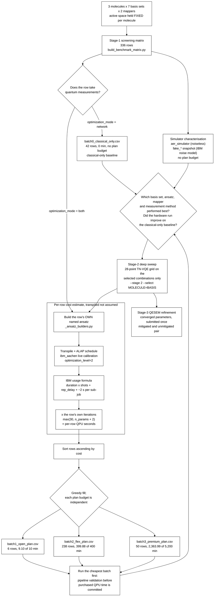

# TN-VQE on IBM hardware, with QESEM-mitigated final energies

## Objective

This campaign quantifies **to what extent tensor-network VQE (TN-VQE), in
which part of the variational work is carried out by a classical
tensor-network evaluation executed on CPU, improves the calculation of
molecular ground-state energies relative to a conventional VQE treatment
of the same system on IBM superconducting hardware.** The method under
test is Cebule's `TN_QC_OPT`, which optimises a classically contracted
network transformation `U(θ)` jointly with a parameterised quantum
circuit `U(φ)`, following the hybrid tensor-network / circuit
construction of [arXiv:2402.12105](https://arxiv.org/abs/2402.12105).

The question is therefore quantitative rather than binary. Plain VQE is
the reference treatment, and the measured quantities are:

1. the error of the returned energy against a classical reference energy
   for the same active space and basis set;
2. the convergence behaviour of the optimisation, that is the cost
   history as a function of the number of cost-function evaluations, for
   TN-VQE against plain VQE at matched circuit width and depth;
3. the QPU time consumed to reach a given error, since the classical
   tensor-network evaluation is intended to displace quantum measurement
   effort onto CPU and any such displacement has to be visible in the
   resource accounting;
4. the dependence of the above on basis set, ansatz, fermion-to-qubit
   mapping and measurement method.

A secondary objective is to establish which of these combinations justify
the deeper parameter sweep, so that the expensive part of the study is
spent only where the screen indicates it is warranted.

**The experimental design is aligned with IBM's QPU compute-time pricing
plans.** Rows are grouped into batches whose estimated QPU time fits
within the budget of a specific access plan, so that the financial cost
of quantum runtime is a controlled and reportable quantity of the study
rather than an uncontrolled consequence of it. Every row carries an
individual QPU-time estimate derived from a transpiled circuit, and the
analysis procedure can therefore report cost per row, per batch and per
conclusion drawn.

The folder name reads *vendor, method, mitigation*: `ibm` is the access
plan being spent, `tn-vqe` the method under test, `qesem` the Qedma
error-mitigation service applied to the final energies.

## Campaign structure

The study is divided into three stages at the points where the
experimental decisions fall, so that each stage produces the information
the next one requires. Only stage 1 is committed to the repository: the
inputs of a later stage are an *output* of the stage preceding it, and
there is no defensible default for them before those results exist.

| Stage | Question | File | Rows |
|---|---|---|---|
| **1, screening** | Which basis set, ansatz, mapper and measurement method warrant further study? | `stage1_screening_matrix.csv` | 336, committed |
| **2, deep sweep** | For the selected combinations, how do the TN-VQE sweep parameters `θ` and `φ` behave? | `stage2_deep_sweep.csv` | generated on demand |
| **3, QESEM refinement** | Does error mitigation move the converged energy closer to the classical reference? | `stage3_qesem_refinement.csv` | generated on demand |

```sh
# Stage 1 (committed; regenerate after any generator change)
PYTHONPATH=src python examples/guides/build_benchmark_matrix.py

# Stage 2, once stage-1 results exist
PYTHONPATH=src python examples/guides/build_benchmark_matrix.py --stage 2 \
    --select H2=cc-pvdz --select Li2=6-31g --select H2O=def2-svp \
    --ansatz EfficientSU2

# Stage 3, once stage-2 runs have converged
PYTHONPATH=src python examples/guides/build_benchmark_matrix.py --stage 3 \
    --from data/benchmarks/ibm_tn-vqe_qesem/stage2_deep_sweep.csv \
    --refine 17=results/converged/case_17.json --precision 0.0016
```

Each stage refuses to generate without its selection: no `--select`, no
`--refine`, no `--precision`, no output. The refusal is part of the
design, since a silently defaulted selection would make the provenance of
a later stage unrecoverable.

## Simulator characterisation before hardware submission

Before any purchased QPU time is committed, the committed stage-1 rows
are executed on simulators in two configurations. Both consume no plan
budget, and both produce results that are analysed in their own right
rather than serving only to validate the pipeline.

| Configuration | `TNQCOptInput.backend` | What it establishes |
|---|---|---|
| Noiseless statevector / shot-based simulation | `aer_simulator` | The algorithmic result in the absence of device error: the energy TN-VQE and VQE reach for a given basis, ansatz and mapper, and the convergence behaviour of each. This is the reference against which every hardware result is read. |
| Noisy simulation with an IBM device noise model | a `fake_*` snapshot, see below | The energy shift and the change in convergence behaviour attributable to device error alone, before queue time or drift enter. |

The local runs use IBM's own simulation stack, Qiskit Aer, since the
campaign targets IBM hardware. The circuit is not at stake in that
choice: every row supplies its circuit as a pinned OpenQASM file (see
[Circuit families under test](#circuit-families-under-test)), so the
simulated circuit and the submitted circuit are the same file.

**Which noise model, though, is unresolved.** `qiskit-ibm-runtime` ships
no calibration snapshot for `ibm_aachen`, and `TN_QC_OPT` selects its
noise model from a backend *string*, so the noisy configuration can name
a `fake_*` snapshot of a different device or nothing at all. A snapshot
of another device characterises that device's error, not the target's,
which is a weaker result than the table above claims but not a useless
one: it still separates algorithmic limitation from device error in the
right order of magnitude. Reading it as the target device's error would
be wrong. Resolving this is listed under
[Open campaign decisions](#open-campaign-decisions).

The 42 classical-only rows in `batch0_classical_only.csv` belong to the
same pre-hardware phase. They take no quantum measurements at all and are
described under [Classical-only control rows](#classical-only-control-rows).

Together these give three points of comparison for every hardware result:
the classical-only value, the noiseless simulated value, and the
noise-model value, which is what allows an observed hardware error to be
attributed between algorithmic limitation and device error.

## Allocation of rows to IBM access plans

The stage-1 matrix is partitioned into sequential batches, each sized to
the QPU-time budget of one IBM access plan, by
[`split_benchmark_batches.py`](../../../examples/guides/split_benchmark_batches.py).
**The budgets are independent, not cumulative:** batch2's 400 minutes
represent a separate Flex Plan purchase, not 400 minutes in addition to
the Open Plan allocation.

> **The committed batch files are superseded and must be re-cut before
> any purchase.** Their costs were transpiled against `ibm_brisbane`,
> which the campaign no longer targets, and the figures below are those
> costs. The re-cost is not a rounding correction: measured against the
> Heron-generation snapshots available offline, the 12-qubit UCCSD
> circuit that dominates the budget falls from 51.8 s to about 10 s per
> submission. Regenerate with
> `PYTHONPATH=src python examples/guides/split_benchmark_batches.py`,
> which now needs `$IBM_QUANTUM_TOKEN` and `$IBM_QUANTUM_INSTANCE`
> because the estimate reads `ibm_aachen`'s live calibration.

| File | Rows | Est. QPU time | Plan budget | Headroom |
|---|---|---|---|---|
| `batch0_classical_only.csv` | 42 | 0.00 min | none, since no quantum measurements are taken | n/a |
| `batch1_open_plan.csv` | 6 | 9.10 min | 10 min (Open Plan, free) | 0.90 min |
| `batch2_flex_plan.csv` | 238 | 399.88 min | 400 min (Flex Plan minimum purchase) | 7 s |
| `batch3_premium_plan.csv` | 50 | 2,363.99 min | 5,200 min (Premium Plan annual minimum) | 2,836 min |

The total is **2,772.97 minutes**, with every row of the master matrix
accounted for in exactly one file. The narrow headroom in batch2 is a
property of the allocation rule rather than a coincidence: the fill is
greedy, so a batch accepts rows until the next row would exceed its
budget. Any change to the shot count, the evaluation budget or the target
device moves the batch boundary, so the partition is **regenerated
rather than edited**, and changing the device is exactly such a change.

### Per-row evaluation budget

`Iterations` is computed per row as `max(30, n_params + 2)` from that
row's own free-parameter count. A single global value cannot be used,
for two reasons that are properties of the optimizer rather than of this
campaign:

- COBYLA constructs an initial simplex of `n + 1` points before it can
  take a single descent step, and `scipy.optimize.minimize` does **not**
  honour a `maxiter` below that value. It raises `maxfun`, emits the
  warning `COBYLA: Invalid MAXFUN`, and performs `n + 2` evaluations
  regardless.
- Measured against this repository's own SciPy, a row with 142 parameters
  given `maxiter = 30` consumes **144** evaluations and changes the
  objective by exactly zero, every evaluation being spent on simplex
  construction.

A budget set below `n + 2` therefore does not reduce what the row costs;
it only misstates it, by up to a factor of 4.8 on the widest rows in this
matrix.

`n_params` is the row's own `Num_Opt_Params_Phi + Num_Opt_Params_Theta`,
both of which are recorded per row, and neither of which follows from the
qubit count alone: φ depends on the circuit ansatz and its repetitions, θ
on the tensor-network family and `TN_Layers_Network`, and on a `network`
row φ is frozen and drops out of the count entirely. Across the stage-1
matrix the resulting budgets run from the minimum of 30 to 202, and the
per-row value is read from the CSV rather than inferred from anything
else in it.

**What stage 1 resolves at this budget.** Stage 1 is a screen over the
discrete experimental factors, and its observable is the *convergence
behaviour* of the optimisation rather than a converged energy: the cost
history per evaluation, the descent achieved per unit of QPU time, and
whether TN-VQE and plain VQE differ in either at matched circuit width.
A row at the minimum budget completes simplex construction and, where the
minimum of 30 exceeds `n + 2`, a small number of descent evaluations, so
the signal that stage 1 can resolve is the initial descent rather than
the asymptotic energy. **Stage-1 energies at 8 and 12 qubits are not
converged energies and must not be reported as ground-state energies.**
Converged energies are the output of stage 2, whose budget is a multiple
of this one set from the stage-1 convergence behaviour. Raising
`MIN_ITERATIONS` or that multiple in the generator raises every batch
total in approximately the same proportion, which is why the evaluation
budget and the convergence behaviour it can resolve remain coupled to the
plan allocation (see [Open campaign decisions](#open-campaign-decisions)).

One assumption is embedded in the accounting: **one circuit submission
per cost-function evaluation**, each paying its own overhead of
approximately 2 s per sub-job. If a row's evaluations were batched into
fewer sub-jobs that overhead would amortise and these figures would fall.
This is worth checking against a real run, though it does not restore the
validity of a flat evaluation count, because the evaluation count itself
is what varies between rows.

### Distribution of estimated QPU time across rows

The estimated cost is strongly concentrated. The 14 UCCSD rows at 12
qubits cost approximately 9,296 s each, which is **2,169 of the
campaign's 2,773 minutes: 78% of the budget in 4% of the rows.** This
follows from the 200-operator excitation pool, which yields both a deep
Trotterised circuit and 202 submissions of it. All remaining rows cluster
far lower, in the regime where the fixed per-sub-job overhead dominates
the circuit's own execution time.

The two regimes do not share a cost model, and a correction measured in
one does not transfer to the other: batch2 consists of
hardware-efficient circuits in which fixed overhead dominates, whereas
batch3 consists of deep UCCSD circuits in which the circuit duration
dominates.

### Derivation of the per-row cost estimates

Costs are not assumed. Each estimate uses the method of
[`backends/ibm_cost_estimator.py`](../../../docs/integrations/ibm_cost_estimator.md):
transpilation with ALAP (as late as possible) scheduling against
`ibm_aachen`'s own live calibration, and IBM's own documented usage
formula. ALAP is the scheduling policy IBM's
runtime applies, so it is the policy under which the reported circuit
duration is meaningful. Only 14 distinct circuits are transpiled across
all 294 costed rows, cached per (ansatz, qubits, reps, electrons, shots),
since the matrix contains many more rows than distinct circuits. They
are the same 14 the campaign pins as QASM.

**The calibration is live, which is a tradeoff rather than a free
upgrade.** `qiskit-ibm-runtime` ships offline `Fake*` snapshots for many
devices but not for `ibm_aachen`, and costing one device against
another's snapshot estimates the wrong machine rather than approximating
the right one: the two-qubit gate differs between processor generations,
`ecr` against `cz`, so the transpiled circuit differs before any duration
is read off it. The estimate is therefore taken against the device's own
calibration through `IBMAdapter.get_live_backend()`. What that buys is
accuracy; what it costs is reproducibility. Regenerating the batches
needs `$IBM_QUANTUM_TOKEN` and `$IBM_QUANTUM_INSTANCE`, and two
regenerations either side of a recalibration will not agree. Any figure
quoted from a batch file should therefore be read with the date it was
generated.

Transpilation runs at `optimization_level=2`, which is what the campaign
will actually receive: `TN_QC_OPT` calls `transpile(circuit, backend)`
without an `optimization_level` argument and provides no way to pass one,
and the default of `transpile` resolves to 2 under Qiskit 2.x and to 1
under Qiskit 1.x. The matrix therefore records `Qiskit_Version` rather
than an optimisation level, since "the Qiskit default" is a
version-dependent quantity and the version is the reproducible one.

Each row's **own** circuit is constructed for the estimate rather than a
common stand-in, from the same builders that write the pinned QASM files,
so the 14 circuits transpiled here are the 14 circuits committed under
`data/qasm/` and the estimate describes what runs. The circuits
themselves are shown in
[Circuit families under test](#circuit-families-under-test).

**`Measurement_Method` does not enter this estimate.** The estimator
cannot know how many distinct circuits Cebule's basis-state-pair grouping
produces for a given Hamiltonian, because that number is an output of a
real run. Every `pauli`/`grouped` pair of an otherwise identical row
therefore receives an identical estimate and is placed in the same batch.
Since `grouped` is expected to require fewer circuits, measured per-row
costs would redistribute rows between batches, most visibly at the batch2
boundary. What the two values mean is described under
[`Measurement_Method`](#measurement_method-uses-cebules-own-vocabulary).

**Two columns beyond the matrix's own** (`Est_QPU_Time_S`,
`Est_QPU_Time_Cumulative_S`) are appended to each batch file for
auditability. The cumulative column must never exceed that file's plan
budget expressed in seconds.

## Workflow



Three features of this workflow carry experimental weight. The **loop
back into the cost estimator** is the purpose of the staged design: stage
2 is costed by the same machinery, on the small set of combinations
stage 1 selects, rather than speculatively across all seven basis sets.
The **classical-only branch rejoins at the decision node** rather than at
the end, because a `both` row that does not improve on its `network`
control has not demonstrated that the quantum circuit contributed
anything, which is itself a stage-1 finding. And **stage 3 depends on
stage 2 rather than on the screen**, because refinement consumes
converged parameters and only a converged run produces them.

### Ordering of rows within the allocation

Rows are sorted in ascending order of estimated per-row QPU time before
the greedy fill, so batch1 receives the least expensive calculations
available and serves as a pipeline validation run before purchased QPU
time is committed. This is why batch1 consists predominantly of 2-qubit
`H2` `mol_map` cases rather than, for example, one row per molecule.
Prioritising *coverage* over strict cost minimisation is an equally
defensible sort criterion and is a one-line change to the sort key; the
present choice is recorded rather than assumed.

The 42 zero-cost rows are excluded from that sort. Their cost is
genuinely zero rather than merely unknown, and if left in the ascending
order they would occupy the free tier with rows that consume no QPU time,
displacing the validation runs the free tier exists to provide.

## Circuit families under test

Four circuit families appear in the stage-1 matrix, and **every row
supplies its circuit as a committed OpenQASM 3.0 file** under
`data/qasm/`, named in `Qasm_Ansatz_File` and hashed in
`Qasm_Ansatz_SHA256`. The name of an ansatz is not a circuit: it is a
name that a library version resolves, and two rows naming one family are
comparable only if they resolve it identically. A file removes that
question: for the VQE-against-TN-VQE comparison inside the campaign, for
anyone reproducing a row, and for anyone comparing these energies against
a method the campaign does not run, who then starts from the circuit
rather than from its name. The 14 files are generated by
[`pin_qasm_ansatz.py`](../../../examples/guides/pin_qasm_ansatz.py), one
per distinct (family, qubits, repetitions), and are dumped with their
parameters **free**: OpenQASM 3's `input` declarations carry them, so
what is pinned is the structure, the qubit ordering and the
parameterisation together.

The diagrams below are those circuits, drawn from
[`_ansatz_builders.py`](../../../examples/guides/_ansatz_builders.py) and
rendered in the `{Ry, Rz, CX}` basis. They are the same objects that the
cost estimator transpiles and that the QASM files hold, so the resource
estimates, the diagrams and the pinned circuits describe one circuit
rather than three descriptions of one.

**`EfficientSU2`**, shown at 4 qubits with `reps = 1` (16 parameters).
Two single-qubit rotation layers per repetition and a reverse-linear CX
chain. Used on plain-VQE rows.

```text
     ┌──────────┐┌──────────┐                                ┌──────────┐┌───────────┐
q_0: ┤ Ry(θ[0]) ├┤ Rz(θ[4]) ├────────────────────────■───────┤ Ry(θ[8]) ├┤ Rz(θ[12]) ├
     ├──────────┤├──────────┤                      ┌─┴─┐     ├──────────┤├───────────┤
q_1: ┤ Ry(θ[1]) ├┤ Rz(θ[5]) ├───────────■──────────┤ X ├─────┤ Ry(θ[9]) ├┤ Rz(θ[13]) ├
     ├──────────┤├──────────┤         ┌─┴─┐    ┌───┴───┴───┐┌┴──────────┤└───────────┘
q_2: ┤ Ry(θ[2]) ├┤ Rz(θ[6]) ├──■──────┤ X ├────┤ Ry(θ[10]) ├┤ Rz(θ[14]) ├─────────────
     ├──────────┤├──────────┤┌─┴─┐┌───┴───┴───┐├───────────┤└───────────┘
q_3: ┤ Ry(θ[3]) ├┤ Rz(θ[7]) ├┤ X ├┤ Ry(θ[11]) ├┤ Rz(θ[15]) ├──────────────────────────
     └──────────┘└──────────┘└───┘└───────────┘└───────────┘
```

**`RealAmplitudes`**, shown at 4 qubits with `reps = 1` (8 parameters).
The same entanglement pattern with a single Ry rotation layer, giving
real-valued amplitudes and half the parameter count. Used on plain-VQE
rows.

```text
     ┌──────────┐                             ┌──────────┐
q_0: ┤ Ry(θ[0]) ├──────────────────────■──────┤ Ry(θ[4]) ├
     ├──────────┤                    ┌─┴─┐    ├──────────┤
q_1: ┤ Ry(θ[1]) ├──────────■─────────┤ X ├────┤ Ry(θ[5]) ├
     ├──────────┤        ┌─┴─┐    ┌──┴───┴───┐└──────────┘
q_2: ┤ Ry(θ[2]) ├──■─────┤ X ├────┤ Ry(θ[6]) ├────────────
     ├──────────┤┌─┴─┐┌──┴───┴───┐└──────────┘
q_3: ┤ Ry(θ[3]) ├┤ X ├┤ Ry(θ[7]) ├────────────────────────
     └──────────┘└───┘└──────────┘
```

**`n_local_rzryrz_sca`**, shown at 2 qubits with `reps = 2` (18
parameters, `3n(R+1)`). Each repetition applies an RzRyRz rotation block
to every qubit followed by CX entanglement in Qiskit's
shifted-circular-alternating pattern: a circular chain whose starting
qubit shifts by one with each repetition and whose control/target
orientation alternates, visible here as the reversed CX in the second
repetition. Used on TN-VQE rows.

```text
     ┌──────────┐┌──────────┐┌──────────┐     ┌──────────┐┌──────────┐┌───────────┐┌───┐┌───────────┐»
q_0: ┤ Rz(θ[0]) ├┤ Ry(θ[2]) ├┤ Rz(θ[4]) ├──■──┤ Rz(θ[6]) ├┤ Ry(θ[8]) ├┤ Rz(θ[10]) ├┤ X ├┤ Rz(θ[12]) ├»
     ├──────────┤├──────────┤├──────────┤┌─┴─┐├──────────┤├──────────┤├───────────┤└─┬─┘├───────────┤»
q_1: ┤ Rz(θ[1]) ├┤ Ry(θ[3]) ├┤ Rz(θ[5]) ├┤ X ├┤ Rz(θ[7]) ├┤ Ry(θ[9]) ├┤ Rz(θ[11]) ├──■──┤ Rz(θ[13]) ├»
     └──────────┘└──────────┘└──────────┘└───┘└──────────┘└──────────┘└───────────┘     └───────────┘»
«     ┌───────────┐┌───────────┐
«q_0: ┤ Ry(θ[14]) ├┤ Rz(θ[16]) ├
«     ├───────────┤├───────────┤
«q_1: ┤ Ry(θ[15]) ├┤ Rz(θ[17]) ├
«     └───────────┘└───────────┘
```

**`UCCSD`**, shown at 4 qubits with 2 electrons, as a first-order
Trotterisation over the Jordan-Wigner singles-and-doubles pool: X gates
prepare the Hartree-Fock reference, then one exponentiated excitation
operator per amplitude, four singles and one doubles in this example. The
free amplitude `t[k]` on each operator is the variational parameter, one
per excitation, which is what `Num_Opt_Params_Phi` records. The number of
Pauli terms per doubles operator, eight in the block on the right, is the
reason UCCSD rows dominate the cost distribution at 12 qubits. Used on
plain-VQE `JW` rows.

```text
     ┌───┐┌───────────────────────────────┐┌───────────────────────────────┐┌───────────────────────────────┐»
q_0: ┤ X ├┤0                              ├┤0                              ├┤0                              ├»
     ├───┤│                               ││                               ││                               │»
q_1: ┤ X ├┤1                              ├┤1                              ├┤1                              ├»
     └───┘│  exp(-it (IXZY + IYZX))(t[0]) ││  exp(-it (XZZY + YZZX))(t[1]) ││  exp(-it (IXYI + IYXI))(t[2]) │»
q_2: ─────┤2                              ├┤2                              ├┤2                              ├»
          │                               ││                               ││                               │»
q_3: ─────┤3                              ├┤3                              ├┤3                              ├»
          └───────────────────────────────┘└───────────────────────────────┘└───────────────────────────────┘»
«     ┌───────────────────────────────┐┌─────────────────────────────────────────────────────────────────────────┐
«q_0: ┤0                              ├┤0                                                                        ├
«     │                               ││                                                                         │
«q_1: ┤1                              ├┤1                                                                        ├
«     │  exp(-it (XZYI + YZXI))(t[3]) ││  exp(-it (XXXY + XXYX + XYXX + YXXX + XYYY + YXYY + YYXY + YYYX))(t[4]) │
«q_2: ┤2                              ├┤2                                                                        ├
«     │                               ││                                                                         │
«q_3: ┤3                              ├┤3                                                                        ├
«     └───────────────────────────────┘└─────────────────────────────────────────────────────────────────────────┘
```

**Why the circuits are supplied rather than defaulted.** `TN_QC_OPT`
builds a circuit of its own when no `qasm_ansatz` is given, and *which*
circuit that is depends on the platform it dispatches to: the Qiskit path
builds `n_local_rzryrz_sca` above, with `3n(R+1)` parameters, while the
PennyLane path builds `StronglyEntanglingLayers`, with `3nR`, differing
by the trailing rotation layer. A row that relied on the default would
therefore carry a circuit, and a parameter count, that depended on where
it ran. Supplying the QASM removes the dependency: the campaign's TN rows
run `n_local_rzryrz_sca` because that file says so, not because a
dispatch happened to select it. One interaction is worth knowing when
reproducing a row: supplying `qasm_ansatz` changes `n_layers_circuit`'s
effective default from 3 to 1, since the circuit is then fully specified,
so pass it explicitly.

## The active space is held fixed across basis sets

Every stage-1 row for a given molecule uses the same active space
irrespective of basis. This is what makes stage 1 a basis-set screen
rather than a confounded comparison: the basis is the only factor
varying, so a stage-1 energy difference is attributable to it.

| Molecule | Electrons | Active space | Frozen | JW qubits | mol_map qubits |
|---|---|---|---|---|---|
| `H2` | 2 | CAS(2,2) | nothing to freeze | 4 | 2 |
| `Li2` | 6 | CAS(2,2) | both Li 1s orbitals | 4 | 2 |
| `H2O` | 10 | CAS(8,6) | O 1s | 12 | 8 |

It is also what makes the campaign executable at all, since qubit counts
then no longer scale with the basis set: `H2O`/cc-pVTZ costs the same 12
Jordan-Wigner qubits as `H2O`/sto-3g rather than 116. Stage 2 can opt
back into the full space with `--active-space full` where the hardware,
or the local machine running MOL_MAP, can accommodate it.

## Mapper, method and ansatz are separate columns

`Mapper` records the fermion-to-qubit mapping. `Method` records whether
the row runs conventional VQE or TN-VQE through Cebule's `TN_QC_OPT`.
`Ansatz` records the circuit family. The three vary independently, so
each has its own column:

| Column | Values | Meaning |
|---|---|---|
| `Mapper` | `JW` | Jordan-Wigner, `2 x active_orbitals` qubits |
| | `mol_map` | Cebule's constraint-based encoding, fewer than `2N` qubits |
| `Method` | `VQE` | plain variational quantum eigensolver |
| | `TN-VQE` | Cebule `TN_QC_OPT`, classical tensor network plus quantum circuit |
| `Ansatz` | `EfficientSU2`, `RealAmplitudes`, `UCCSD`, `n_local_rzryrz_sca` | the circuit family, as drawn above |

`UCCSD` appears on `JW` rows only, since it constructs excitation
operators from fermionic modes and therefore requires a fermion-to-qubit
mapping to act on, whereas mol_map's qubits index determinants rather
than spin orbitals.

### `Backend_Platform` names one device, on both sides of the comparison

Every hardware row reads `ibm_aachen`: one named device, for VQE and
TN-VQE alike, so the two differ in method rather than in machine. It
reaches the two stacks by different routes, `TNQCOptInput.backend` on
TN-VQE rows and `IBMAdapter(backend_name=...)` on VQE rows, but it is the
same device in both, and the per-row cost estimate transpiles against
that device's own calibration snapshot.

`ibm_aachen` rather than `ibm_brisbane`, which earlier revisions of this
file named throughout: the campaign's QPU time is bought in IBM's
European data centre, and Brisbane is not there to run on, whatever the
name suggests.

**A least-busy selection is deliberately not used.** Both stacks could
take one, `QiskitRuntimeService.least_busy()` on the qpubench side and
any `ibm`-prefixed string on Cebule's. What it would cost is the cost
model: a row that landed on a different device would carry a duration
describing a machine it did not run on, and the batch it was allocated to
would be sized from that duration. Devices differ enough for that to
matter rather than to average out, since the two-qubit gate itself
differs between processor generations. A device chosen at submission time
is the right tradeoff for throughput and the wrong one for a campaign
whose budget is the measurement.

On the TN-VQE side there is a second constraint on the string, which any
substitution has to respect: `TN_QC_OPT`'s `get_backend` dispatches on
it, routing the four named simulators, anything prefixed `fake` and
anything prefixed `ibm` to Qiskit, and everything else to
`qml.device(...)`, that is PennyLane. `ibm_aachen` matches the third
branch. The strings used for the pre-hardware phase, `aer_simulator` and
any `fake_*` snapshot, match the first and second and therefore run on
Qiskit too.

## Tensor-network rotation families

`TN_Ansatz` names the family that constructs `U(θ)` on the network side.
All four are members of `M_ANSATZE` (`functions_U.py:150-161`):

| `TN_Ansatz` | Construction | params/node | Entangles | Conserves N |
|---|---|---|---|---|
| `rotation_1param` | one rotation angle per network node, no entanglement in `U(θ)` | 1 | no | no |
| `rotation_3param` | three angles per node, a general single-qubit rotation, still non-entangling; the task default | 3 | no | no |
| `givens` | a Givens rotation per node: one angle, entangling, particle-number conserving, an orbital rotation | 1 | **yes** | **yes** |
| `number_preserving` | five angles per node, entangling, particle-number conserving; the most expressive and the most expensive | 5 | **yes** | **yes** |

Both `rotation_*` families are **non-entangling**: the network factorises
across the two wires of every M gate, so `U(θ)` cannot generate
entanglement and only rotates each qubit's local basis. A design that
sweeps those two families alone therefore sweeps two variants of "no
entanglement in `U(θ)`" and never reaches the regime the method exists
for.

**Stage 1 screens on `givens` as its single TN reference point.** It
entangles, conserves particle number, and is the only family with a fast
evaluation path in the implementation, since `_orbital_pauli_terms`
routes it through `OrbitalRotationHamiltonian` at O(N⁵) cost rather than
contracting the network at 2ⁿ cost. It is therefore also the family whose
stage-1 timings are representative of stage 2's. The choice does not
affect cost accounting: the family determines `U(θ)`, not the circuit, so
every per-row QPU estimate is unchanged by it. Screening on the task's
own default instead is a single-constant change, `STAGE1_TN_REFERENCE` in
the generator.

`number_preserving` is marked in `Notes` as a **control** rather than a
candidate. It is a strict superset of `givens` that is not a
single-particle transformation, so `U†HU` acquires higher-body terms and
substantially more Pauli strings. It is carried in order to verify that
behaviour on hardware, and it is the first candidate to remove if the
budget tightens.

### Composition of the stage-2 grid

The stage-2 sweep comprises 28 points, allocated so that all four
families are represented without applying the full grid to each. The
family comparison is a question about the method rather than about
chemistry coverage, and does not require the full grid on every family:

| Slice | Points |
|---|---|
| `givens` on the full grid: `network=0` x 4 circuits, plus `network∈{1,2,3}` x 4 circuits | 16 |
| family comparison: `rotation_1param` / `rotation_3param` / `number_preserving`, at `network∈{1,3}` x `circuit∈{1,2}` | 12 |
| **total** | **28** |

`givens` rather than `rotation_3param` is the reference family the grid
is built around, because a non-entangling `U(θ)` is not a suitable
reference point for a method whose premise is that the network carries
part of the correlation. `rotation_3param` is retained inside the
comparison slice, which is where the comparison against the task default
belongs.

`--sweep-circuit-ansatz` additionally crosses the 12-point comparison
slice with `excitation_preserving_linear`. It is **off by default**,
because it takes the sweep from 28 to 40 points and the file from 348 to
492 rows, and because `xx_plus_yy` is not an IBM basis gate on any
current device.
Re-cost before enabling it rather than assuming parity.

## Columns

| Column | Meaning |
|---|---|
| `Case_ID` | Row index |
| `Stage` | `1_screen`, `2_deep` or `3_refine` |
| `Molecule`, `Charge`, `Multiplicity`, `Num_Electrons` | `H2`, `Li2`, `H2O`, all neutral closed-shell singlets |
| `Basis`, `Basis_Source` | 6 [Basis Set Exchange](https://www.basissetexchange.org/) names or `qvSZP`; see [docs/integrations/basis_sets.md](../../../docs/integrations/basis_sets.md) |
| `Active_Space` | `valence_cas` (core frozen) or `full` |
| `Active_Electrons`, `Active_Orbitals` | The space the Hamiltonian is built in; maps onto `BenchmarkRecord.active_electrons` / `.active_orbitals` |
| `Mapper`, `Method`, `Ansatz` | See the table above |
| `Ansatz_Reps` | Circuit repetitions; equals `TN_Layers_Circuit` on TN-VQE rows |
| `N_Qubit`, `N_Qubit_Source` | Qubit count and its provenance: `jw_exact`, `mol_map_run` (a real MOL_MAP run) or `mol_map_inferred` (see below) |
| `Backend_Platform` | The device the row runs on, `ibm_aachen` throughout: `TNQCOptInput.backend` on TN-VQE rows, `IBMAdapter(backend_name=...)` on VQE rows, and the device the cost estimate is transpiled against |
| `Optimizer`, `Opt_Options` | `COBYLA`, matching the default of `TNQCOptInput.opt_method`, and the `opt_options` dictionary passed directly to `scipy.optimize.minimize`. `{}` is a recorded choice: for COBYLA, `rhobeg` affects both convergence and the evaluation count, and therefore the row's QPU cost |
| `Iterations` | Cost-function evaluations the row's optimizer will consume, `max(30, n_params + 2)`; per row rather than global, see the evaluation-budget section above |
| `Shots` | 4,096, pinned via `TNQCOptInput.n_shots`; `n/a (network mode)` where no quantum measurement is taken, `n/a (QESEM: precision-driven)` on mitigated rows |
| `Qiskit_Version` | The installed Qiskit, recorded because the default `optimization_level=None` of `transpile` resolves to 2 under Qiskit 2.x and 1 under 1.x |
| `TN_Layers_Network`, `TN_Layers_Circuit` | TN-VQE sweep: θ on the classical tensor-network side (0 to 3, where 0 is the circuit-only reference) and φ on the quantum circuit side (1 to 4). Ranges follow [arXiv:2402.12105](https://arxiv.org/abs/2402.12105) |
| `TN_Ansatz` | One of the four families above, or `n/a (no TN layers)` / `n/a (not TN-VQE)` |
| `Optimization_Mode` | `both` (jointly optimise θ and φ) or `network` (θ only, no quantum measurements: the zero-cost control, see below) |
| `Measurement_Method` | `pauli` or `grouped`, matching `TNQCOptInput.measurement_method` exactly; `n/a` where the dimension does not apply |
| `Qasm_Ansatz_File`, `Qasm_Ansatz_SHA256` | The pinned circuit under `data/qasm/` and a hash prefix of it, so that an edited circuit ceases to match. Set on **every** row, VQE and TN-VQE alike. Generated by [`pin_qasm_ansatz.py`](../../../examples/guides/pin_qasm_ansatz.py) |
| `Num_Opt_Params_Phi` | Circuit-side parameter count, and the `num_parameters` the pinned QASM loads with; for `UCCSD` it is one amplitude per singles and doubles excitation, counted from the real pool. On a `network` row it is the count held **fixed** rather than optimised |
| `Phi_Init` | How the circuit's parameters are initialised, fixed by `Ansatz` alone so that rows sharing a circuit share a starting point: `random(seed=N)` on the hardware-efficient families, `zeros` on `UCCSD`; see below |
| `Num_Opt_Params_Theta` | Network-side parameter count, derivable from the inputs: `TN_Layers_Network x ((3n - 2) // 2) x params_per_node` |
| `Num_ExpVals_Per_Iter` | Blank, being an output of a real run rather than derivable from the inputs |
| `Error_Mitigation` | `none` or `qesem`. Every stage-1 and stage-2 row is genuinely `none`, so mitigation is additive |
| `Precision` | QESEM target σ in Hartree on mitigated rows; `n/a (shot-based)` on every row costed in shots |
| `QESEM_Execution_Mode` | `batch` (QPU released between classical steps) or `session`; `n/a (not QESEM)` elsewhere |
| `Refines_Case_ID`, `Converged_Params_File`, `Converged_Params_SHA256` | Stage-3 provenance: which run's converged parameters the row submits, and a hash of them |
| `Notes` | Per-row provenance and caveats |

### `Phi_Init` is fixed by the circuit family

φ is the **circuit's** parameter vector, so every row has one. A plain
VQE row has circuit parameters exactly as a TN-VQE row does, and a
`network` row has them frozen rather than absent. The initialisation is
therefore a property of the circuit family and not of the method or the
optimisation mode, and the column is keyed on `Ansatz` alone: two rows
that share a family, qubit count and repetition count start from the same
φ whatever else differs between them. That is what makes the comparison a
comparison: a difference in the result is attributable to the method
rather than to where each run began.

The value pinned per family:

- **Hardware-efficient families** (`n_local_rzryrz_sca`,
  `EfficientSU2`, `RealAmplitudes`) take a **seeded random draw**.
  All-zero rotations make these circuits exactly the identity, so the
  initial state is `|0…0⟩`, that is the reference determinant, and the
  gradient with respect to many φ parameters vanishes there: a known poor
  starting point. Seeding preserves reproducibility without altering the
  character of the initialisation, and it matches the upstream default.
- **`UCCSD`** takes **`zeros`**, because zero amplitudes *are* the
  Hartree-Fock reference. `t = 0` is the standard start for a
  coupled-cluster ansatz, and randomising it would be an experimental
  choice rather than a reproducibility fix.

Upstream randomises φ (`2π·random`, `run_TNQCOpt`) whenever `phi_init` is
`None`, and does so **unseeded**, so an unpinned run has an
initialisation that cannot be reproduced; that is the defect the pin
fixes. The campaign draws `2π·U(0,1)` from `numpy.random.default_rng(seed)`
and passes the vector explicitly through `phi_init`, since upstream
exposes no seed of its own. The mirror's `phi_init` default is `None`
rather than `[]`: `None` is upstream's sentinel for "unset", whereas an
empty list reaches the shape check as a length-zero array against a
`phi_shape` of `(3n(R+1),)`, which is neither the documented random
initialisation nor a valid one.

### `Num_Opt_Params_Theta` and its cost implications

With COBYLA the evaluation count scales with the parameter count, so a
`number_preserving` row represents **five times** the classical
optimisation work of a `givens` row at the same layer count. At stage 1's
`TN_Layers_Network = 2` that is 4 / 12 / 20 parameters at 2 qubits,
rising to 34 / 102 / 170 at 12 qubits, and through `Iterations` it is QPU
cost as well.

`Num_ExpVals_Per_Iter` remains blank because it is genuinely a run
output, and it is the measurement that would support one of the
campaign's most defensible conclusions: whether `givens` combined with
`grouped` keeps measurement cost approximately flat as
`TN_Layers_Network` grows while `number_preserving` does not.

### Classical-only control rows

42 rows, one per molecule x basis x mapper, run with
`optimization_mode="network"`: θ is optimised by classical
tensor-network contraction and φ is frozen, so **no quantum measurements
are taken at all**. They consume no IBM plan budget and are held in
`batch0_classical_only.csv`, outside the plan batches.

They exist because they are the baseline against which every `both` row
must be read. This matters most on precisely the `givens` rows that stage
1 screens with: there `U(θ)` is an orbital rotation and can capture a
substantial part of the correlation energy on its own, so without the
control a `both` run can appear to be a quantum success when most of the
improvement originated in the classical half of the method.

A control and the `both` row it controls begin from the **same state**,
since [`Phi_Init`](#phi_init-is-fixed-by-the-circuit-family) follows the
circuit family rather than the optimisation mode. The pair therefore
differs in one thing only, whether φ is optimised alongside θ, and the
difference between their energies measures that and nothing else.

**"Network" mode does not mean "no circuit".** `optimize_network` opens
with `circuit_to_mps(circuit, phi)`: the circuit exists at a frozen φ and
*is* the reference state against which θ is optimised, which is why two
controls differing only in `TN_Layers_Circuit` give different baselines.
These rows therefore record their real ansatz, repetitions, pinned QASM
and φ count. What distinguishes the control is that it takes no quantum
measurements, and `Optimization_Mode` already carries that distinction,
so no second marker is required; `Shots` reads `n/a (network mode)`
rather than a numeric value, since shots do not apply rather than being
zero.

### `Measurement_Method` uses Cebule's own vocabulary

The two values are `pauli` and `grouped`, exactly as
`schemas.mirrors.mqsdk_cebule.TNQCOptInput.measurement_method` defines
them. Under `pauli`, the expectation value of the mapped Hamiltonian is
obtained by decomposing it into Pauli strings and measuring each
commuting set. Under `grouped`, Cebule's QASM_GEN scheme instead groups
terms by computational basis-state pairs and generates one circuit per
grouping, which for a constraint-encoded Hamiltonian is expected to
require fewer distinct circuits; the scheme and its
`postprocessing_instructions` are documented in
[docs/integrations/cebule.md](../../../docs/integrations/cebule.md).
`tests/test_docs_consistency.py` checks this column, and `TN_Ansatz`,
against the mirror's own vocabulary.

### Absence of a `Qiskit_Opt_Level` column

`TN_QC_OPT` calls `transpile(circuit, backend)` with no
`optimization_level` argument and provides no means of passing one
(`functions_qiskit.py:47,205`), so such a column could never be set from
a task input. It is omitted rather than left blank, and `Qiskit_Version`
records the quantity that in fact determines the level.

## Stage 3: QESEM-mitigated final energies

Stage 3 takes the parameters stage 2 converged to and resubmits each one
twice on `ibm_aachen`: once through Qedma's QESEM, once without it. Both
values are then reported as errors against the classical reference
energy. That is the whole of the stage. It is deliberately small, it runs
once at the end, and it is not a sweep.

### What a refinement row submits

| | |
|---|---|
| Circuit | the row's pinned QASM, unchanged from the stage-2 run being refined |
| Parameters | the converged vector, by file and hash (`Converged_Params_File`, `Converged_Params_SHA256`), since the vector is too long for a CSV cell |
| Provenance | `Refines_Case_ID`, the stage-2 row this refines |
| Observable | the transformed Hamiltonian of that run |
| Target uncertainty | `Precision`, a requested σ in Hartree, which has no default |
| Execution | `QESEM_Execution_Mode`, `batch` or `session`; one job per row, so `Optimizer` reads `n/a (converged parameters)` and `Iterations` is 1 |

Every `--refine` emits **two** rows, identical except for
`Error_Mitigation`. A mitigated energy on its own says nothing about
mitigation: it is interpretable only against the same circuit, at the
same parameters, on the same device, unmitigated. Without the pair the
result of the stage is "QESEM returned a number".

### What comes back, and where it is recorded

QESEM returns a mitigated expectation value with an error bar. The
requested σ is a target rather than a guarantee, since a job that reaches
its QPU-time cap first will fall short of it, so requested and achieved
are recorded separately:

| Quantity | Where it is recorded |
|---|---|
| Requested σ | `QESEMJobSpec.precision`, and `Precision` in the matrix |
| Achieved 1-σ uncertainty | `QESEMExpectationValue.error_bar`, surfaced by `QESEMCircuitResult.mitigated_stds` |

A refinement result without its uncertainty cannot be read against either
its unmitigated pair or the classical reference, so the achieved value
gates whether the stage concluded anything. The mirror's
`QESEMExecutionMode` and `parameterized_values` both match the API, but
should be re-verified against what is actually submitted, as the
`TN_QC_OPT` mirror was against its implementation.

### What stage 3 cannot do

- **It cannot contribute to the `pauli`/`grouped` comparison.** QESEM
  returns an expectation value, never the raw bitstring distribution a
  basis-state grouping scheme reconstructs from, so there is nothing for
  `grouped` to consume and the dimension collapses to
  `n/a (QESEM: no bitstring distribution)`. That matters because the
  claim that grouping keeps measurement cost roughly flat is among the
  campaign's most defensible conclusions, and this stage cannot support
  it.
- **It cannot be costed by the transpilation model**, so it needs its own
  cost source and its own batch; see
  [Known limitations](#known-limitations).
- **It does not mitigate inside the variational loop.** The obstacle is
  the sequence: queue time plus mitigated sampling, strictly in order,
  once per optimiser step, across every combination the campaign screens.
  The classical step between jobs is not the obstacle, since QESEM reuses
  a characterization for 24 hours and the tensor-network contraction
  between iterations is small against that window, the contraction path
  being computed once and cached. An inner-loop experiment is therefore
  not ruled out on principle, but should measure real per-iteration
  wall-clock time first.

### What is still open

Stage 3 is the least settled part of the campaign, and the decisions
below are sized from each other rather than independently. They are
tracked with the rest under
[Open campaign decisions](#open-campaign-decisions).

- **What σ, and therefore what the stage is for.** Chemical accuracy is
  about 1.6 mHa, and an energy quoted to ±0.1 Ha distinguishes no basis
  set, ansatz or mapper. But sampling cost scales as 1/σ², so tightening
  from 0.1 Ha to 1.6 mHa is of order 10³ to 10⁴ times the sampling. The
  two ends are two different results: *"mitigation runs end to end and
  measurably reduces the error"* is worth reporting at a loose σ, and is
  not a chemistry result. Only one of them justifies spending at chemical
  accuracy, and no default is inherited from the service, whose own
  defaults are looser than chemistry needs.
- **Which stage-2 rows are refined, and on what criterion**: best energy,
  largest spread against the classical reference, or one per molecule.
  The answer is an output of stage 2, but the criterion should be
  recorded before stage 2 runs rather than chosen from its results.
- **Whether a grouping-aware submission path exists**, which is a
  question for Qedma.

Two facts constrain those choices. Refinement cost depends on **which
family produced the state**, since QESEM's sampling tracks the Pauli-term
structure of the observable and the transformed Hamiltonian's term count
follows the `TN_Ansatz`; each row therefore records what it refines. And
submitting many parameter values in one job pays off exactly where the
values are known in advance, which in this campaign means a
**dissociation curve or geometry scan**: a further reason to settle the
geometry decision.

## MOL_MAP qubit counts are computed rather than left blank

Cebule's MOL_MAP encoding indexes only those determinants satisfying the
particle-number and spin constraints, so its qubit count follows the
active space rather than the size of the basis set:

```
n_qubits = ceil(log2( C(n_orbitals, n_alpha) x C(n_orbitals, n_beta) ))
```

This relation is **inferred** rather than documented by Cebule, but it
reproduces exactly all eight real MOL_MAP counts available to this
project, including the two values that arrive independently of the fit
([`hamiltonian_sources/mol_map.py`](../../../src/qpubench/hamiltonian_sources/mol_map.py),
pinned by `tests/test_mol_map.py`):

| Molecule / basis | (orbitals, alpha, beta) | Determinants | Qubits |
|---|---|---|---|
| H2 / sto-3g | (2, 1, 1) | 4 | 2 |
| H2 / 6-31G | (4, 1, 1) | 16 | 4 |
| H2 / cc-pVDZ | (10, 1, 1) | 100 | 7 |
| H2 / def2-SVP | (10, 1, 1) | 100 | 7 |
| H2 / def2-TZVP | (12, 1, 1) | 144 | 8 |
| H2 / cc-pVTZ | (28, 1, 1) | 784 | 10 |
| H2O / sto-3g | (7, 5, 5) | 441 | 9 |
| Li2 / sto-3g | (10, 3, 3) | 14,400 | 14 |

Two observations distinguish this from a coincidental fit. H2/cc-pVDZ and
H2/def2-SVP are different basis sets with the same active space and the
same reported count, which no basis-size formula predicts; and Li2/sto-3g
and H2/cc-pVDZ share 10 orbitals but differ in electron count, giving the
14 and the 7 that the formula requires.

Rows whose count derives from the formula rather than from a run are
marked `mol_map_inferred` in `N_Qubit_Source` and so remain
distinguishable from measured ones. They are adequate for sizing a
circuit and costing a batch, and are not a substitute for a real MOL_MAP
run.

## Known limitations

- **Stage-1 energies at 8 and 12 qubits are not converged.** Those rows
  are budgeted at the COBYLA simplex minimum by design; they resolve
  convergence behaviour and rank the experimental factors, and converged
  energies are the object of stage 2.
- **Cost estimates treat `pauli` and `grouped` rows as identical.** The
  reduction in circuit count is an output of a real run, so the
  [IBM cost estimator](../../../docs/integrations/ibm_cost_estimator.md)
  cannot account for it. Since `grouped` is expected to cost less,
  measured per-row costs would redistribute rows between batches.
- **`TN_Layers_Network` is classical compute, not QPU time.** Only
  `TN_Layers_Circuit` affects IBM billing, and the two costs move
  independently.
- **No stage-1 row runs plain VQE on the TN rows' circuit.** VQE screens
  `EfficientSU2`, `RealAmplitudes` and `UCCSD`; TN-VQE runs
  `n_local_rzryrz_sca`. The comparison between the two methods is
  therefore made across circuit families rather than at a fixed one, and
  a difference between them carries the circuit as well as the method.
  Adding a plain-VQE row on `n_local_rzryrz_sca` would close that, at the
  cost of more rows in a matrix that already fills batch2; the pinned
  QASM and the family-keyed `Phi_Init` are what would make such a pair
  match exactly, and both are in place.
- **Stage 3 cannot be costed by the transpilation model.** QESEM's own
  estimate is either analytical (consuming no QPU, but a pessimistic
  upper bound quantised to 30-minute steps) or empirical (5-minute
  resolution, obtained with under 10 minutes of real QPU time). Neither
  is a transpiled duration, and the coarse analytical quantum cannot fit
  in batch2's seconds of headroom, so stage 3 requires its own batch and
  its own cost source. Empirical estimation on representative rows is
  preferred.
- **The committed batch allocation is costed for the wrong device.**
  Its figures were transpiled against `ibm_brisbane`; the campaign
  targets `ibm_aachen`. Re-cutting needs IBM credentials, since that
  device has no offline calibration snapshot, and it will move every
  batch total.
- **Cost estimates are not reproducible offline.** They read live
  calibration, so two regenerations either side of a recalibration
  disagree, and any quoted figure carries the date it was produced.
- **qvSZP qubit counts are computed offline** via
  `hamiltonian_sources.qvszp`.
- **Geometries are unspecified.** Every row names a molecule and a basis
  set but no bond length. This remains an open campaign decision, and it
  is the one whose resolution the parameterised QESEM submission path
  would most reward.

Sources: Cebule documentation
([docs.mqs.dk](https://docs.mqs.dk/sections/section_014_quantum_computing/),
checked 2026-07-09) and
[arXiv:2402.12105](https://arxiv.org/abs/2402.12105), cross-checked
against `schemas/mirrors/mqsdk_cebule.py`, which is itself verified
against the TN-VQE implementation (cebule-tn_vqe @ dev-kba `a760489`),
with file and line citations in its docstrings. Qedma's QESEM behaviour
is mirrored in `schemas/mirrors/qedma_qesem.py` from
[docs.qedma.io](https://docs.qedma.io/); the utility-scale precedent for
refining pre-optimised parameters is
[arXiv:2508.10997](https://arxiv.org/abs/2508.10997).

## Open campaign decisions

Tracked as a git-bug item; run `git bug bug --status open` and look for
"IBM VQE campaign". Settled and recorded above: shots, transpiler
optimisation level, the per-row evaluation budget, scale,
`optimization_mode`, `Phi_Init`, the pinned circuits, and the device
(`ibm_aachen`, costed against live calibration). Still open:

1. **What σ, and therefore what stage 3 is for**: a chemistry result or a
   demonstration that mitigation reduces error. Everything else in that
   stage is sized from this.
2. **Geometries**, and whether to run the full space on the larger basis
   sets.
3. **Which noise model the noisy pre-hardware runs use**, given that
   `ibm_aachen` has no offline calibration snapshot: a snapshot of a
   different device, which characterises that device rather than the
   target, or a model built from the target's live calibration, which
   needs credentials and may not be reachable through `TNQCOptInput`'s
   backend string.
4. **The stage-1 evaluation budget against the convergence behaviour it
   must resolve.** At the present budget the widest rows complete simplex
   construction and little more, so the descent they expose is limited.
   Any increase raises every batch total in approximately the same
   proportion and re-cuts the plan allocation, so the two have to be
   decided together.
5. **Which stage-2 rows are refined, and on what criterion**: best
   energy, largest spread against the classical reference, or one per
   molecule. This is an output of stage 2 and so need not be answered
   now, but the criterion should be recorded *before* stage 2 runs rather
   than chosen afterwards from the results.
6. **Whether any grouping-aware or multi-observable QESEM submission path
   exists** (a question for Qedma). If one does, it changes the
   consequence of the grouped collapse described above rather than merely
   its labelling.
