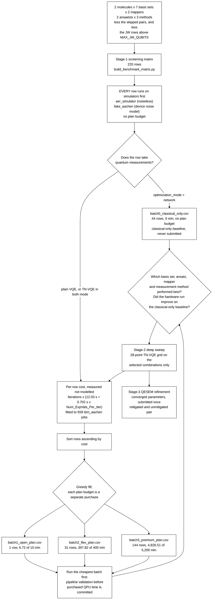

# TN-VQE on IBM hardware, with QESEM-mitigated final energies

## Objective

This campaign measures how much tensor-network VQE (TN-VQE) improves
molecular ground-state energies over a conventional VQE treatment of the
same system on IBM superconducting hardware. In TN-VQE part of the
variational work is carried out classically: a tensor-network
transformation `U(θ)` is contracted on CPU and optimised jointly with a
parameterised quantum circuit `U(φ)` that runs on the QPU. The method
under test is Cebule's `TN_QC_OPT`, following the hybrid tensor-network
and circuit construction of [1].

Plain VQE is the reference treatment, and the measured quantities are:

1. the error of the returned energy against a classical reference energy
   for the same active space and basis set;
2. the convergence behaviour of the optimisation, that is the cost
   history as a function of the number of cost-function evaluations, for
   TN-VQE against plain VQE at matched circuit width and depth;
3. the QPU time consumed to reach a given error. Moving variational work
   onto CPU is not automatically a saving on the quantum side, since
   `U†HU` generally carries more Pauli terms than `H` and a deeper
   network can raise the measurement cost of every evaluation. Whether
   the displacement is real is therefore measured rather than assumed;
4. the dependence of the above on basis set, ansatz, fermion-to-qubit
   mapping and measurement method.

Stage 1 is a screen: it ranks the discrete experimental factors so that
stage 2's more expensive parameter sweep is spent only on the
combinations that earned it.

The experimental design is aligned with IBM's QPU compute-time pricing
plans. Rows are grouped into batches whose estimated QPU time fits within
the budget of a specific access plan, so that the financial cost of
quantum runtime is a controlled and reportable quantity of the study
rather than an uncontrolled consequence of it.

The folder name reads *vendor, method, mitigation*: `ibm` is the hardware
provider whose access plans the campaign buys time on, `tn-vqe` the
method under test, `qesem` the Qedma error-mitigation service applied to
the final energies.

## Campaign structure

The study is divided into three stages at the points where the
experimental decisions fall. Only stage 1 is committed to the repository,
since the inputs of a later stage are an output of the stage preceding
it.

| Stage | Question | File | Rows |
|---|---|---|---|
| **1, screening** | Which basis set, ansatz, mapper and measurement method warrant further study? | `stage1_screening_matrix.csv` | 220, committed |
| **2, deep sweep** | For the selected combinations, how do the TN-VQE sweep parameters `θ` and `φ` behave? | `stage2_deep_sweep.csv` | generated on demand |
| **3, QESEM refinement** | Does error mitigation move the converged energy closer to the classical reference? | `stage3_qesem_refinement.csv` | generated on demand |

```sh
# Stage 1 (committed; regenerate after any generator change)
PYTHONPATH=src python examples/guides/build_benchmark_matrix.py

# Stage 2, once stage-1 results exist
PYTHONPATH=src python examples/guides/build_benchmark_matrix.py --stage 2 \
    --select H2=cc-pvdz --select H2O=def2-svp --ansatz EfficientSU2_circular

# Stage 3, once stage-2 runs have converged
PYTHONPATH=src python examples/guides/build_benchmark_matrix.py --stage 3 \
    --from data/benchmarks/ibm_tn-vqe_qesem/stage2_deep_sweep.csv \
    --refine 17=results/converged/case_17.json --precision 0.0016
```

Each stage refuses to generate without its selection: no `--select`, no
`--refine`, no `--precision`, no output. A silently defaulted selection
would make the provenance of a later stage unrecoverable.

### Every ansatz is run by every method

Both circuit families are run by all three methods, that is plain VQE,
TN-VQE with `optimization_mode="both"`, and the classical-only `network`
control, on the same Hamiltonian, from the same pinned circuit file and
at the same `Phi_Init`. The three rows of such a triple therefore differ
in method alone, which is what makes a difference between them
attributable to the method.

`UCCSD` is not among the families. It builds excitation operators from
fermionic modes, so it exists only on Jordan-Wigner-mapped plain VQE and
cannot be run by the other two methods, nor under mol_map's constraint
encoding. Its builder remains in
[`_ansatz_builders.py`](../../../examples/guides/_ansatz_builders.py) for
a later stage that names it explicitly.

## Simulator characterisation before hardware submission

Before any purchased QPU time is committed, every stage-1 row is executed
on simulators in two configurations. Both consume no plan budget, and
both produce results analysed in their own right. Both run the row's own
pinned OpenQASM circuit.

| Configuration | `TNQCOptInput.backend` | What it establishes |
|---|---|---|
| Noiseless statevector or shot-based simulation | `aer_simulator` | The algorithmic result in the absence of device error, and the reference against which every hardware result is read |
| Noisy simulation with the target device's noise model | `fake_aachen` | The energy shift and the change in convergence behaviour attributable to device error alone |

`fake_aachen` is `qiskit-ibm-runtime`'s offline calibration snapshot of
`ibm_aachen` itself, so the noisy configuration characterises the target
device rather than a stand-in for it, and it needs no credentials.

The rows in `batch0_classical_only.csv` belong to the same pre-hardware
phase and never reach hardware: they optimise `θ` by classical
tensor-network contraction at a frozen `φ`, take no quantum measurements,
and are the baseline every hardware result is read against. Each runs the
same circuit as the rows it controls, at the same `Phi_Init`, which is
why a control on one circuit family gives a different baseline from a
control on another.

Together these give three points of comparison for every hardware
result: the classical-only value, the noiseless simulated value and the
noise-model value, which is what allows an observed hardware error to be
attributed between algorithmic limitation and device error.

## What one cost-function evaluation costs

Evaluating `⟨H⟩` costs one circuit per measurement basis, not one circuit
per evaluation. That count is a property of the Hamiltonian rather than
of the circuit preparing the state, and the campaign's QPU time is
roughly proportional to it. It is recorded per row in
`Num_ExpVals_Per_Iter`.

Fitting 559 completed Estimator jobs on `ibm_aachen`, all at 4,096 shots
with the options this campaign submits under, gives

```
billed QPU seconds per evaluation = 12.03 + 0.702 x Num_ExpVals_Per_Iter
```

IBM's own pre-run estimate over those jobs reads `15.04 + 0.878 E`
seconds, and the jobs whose billed `quantum_seconds` are known came in at
0.80 of it. Two consequences carry into the design:

- **The fixed 12.03 seconds is readout-error calibration**, requested
  once per job by the default Estimator options. Over the campaign's
  9,112 evaluations it is 1,827 minutes, 35% of the total, and therefore
  the largest single lever available: submitting with
  `measure_mitigation` disabled, or amortising the calibration across a
  session, acts on a third of the budget.
- **Circuit duration is not a term.** At 4,096 shots a transpiled circuit
  of this width contributes under 1% of an evaluation, so cost is set by
  the Hamiltonian's measurement count and by the row's evaluation count
  rather than by the ansatz's depth. The ansatz still enters through
  `Iterations`, since parameter count sets the evaluation budget.

The fit was made on shallow circuits at 2 to 8 qubits, the range this
matrix occupies. A deep circuit costs more than the fit predicts.

### Where `Num_ExpVals_Per_Iter` comes from

| `Num_ExpVals_Source` | Rows | Meaning |
|---|---|---|
| `measured_run` | 24 | Counted on a real `ibm_aachen` Estimator job of the same active space |
| `qwc_grouping` | 64 | Computed offline by qubit-wise-commuting grouping of the row's own Hamiltonian, [`count_measurement_bases.py`](../../../examples/guides/count_measurement_bases.py). Greedy and order-dependent, so an upper bound: the one class where both numbers exist reads 34 measured against 46 computed |
| `assumed` | 88 | Neither available, so the largest value measured on that mapper is carried across. A lower bound, and the reason those rows cannot be purchased against |

The `assumed` rows are the mol_map Hamiltonians at 6, 7 and 8 qubits,
which this repository cannot build offline because the constraint
encoding is Cebule's. They are 53% of the campaign's estimated time, so
measuring them is the first thing a real run should report. TN-VQE rows
carry the same value as the plain-VQE rows they are compared against,
which is also a lower bound, since `U†HU` carries more terms than `H`.
The runs behind the table show that directly: a 4-qubit system goes from
14 terms and 2 measurement bases to 186 terms and 81 bases as network
layers grow.

## Allocation of rows to IBM access plans

The stage-1 matrix is partitioned into sequential batches, each sized to
the QPU-time budget of one IBM access plan, by
[`split_benchmark_batches.py`](../../../examples/guides/split_benchmark_batches.py).

Each plan is a separate purchase, and the batches are not one running
total. The Open Plan's 10 free minutes are not deducted from the 400
minutes a Flex Plan purchase buys, and neither of those is deducted from
a Premium Plan allocation. Running the whole campaign therefore means
spending the free 10 minutes on batch1, buying a 400-minute Flex tranche
for batch2, and holding a Premium allocation for batch3.

| File | Rows | Est. QPU time | Plan budget | Headroom |
|---|---|---|---|---|
| `batch0_classical_only.csv` | 44 | 0.00 min | none, since no quantum measurements are taken | n/a |
| `batch1_open_plan.csv` | 1 | 6.72 min | 10 min (Open Plan, free) | 3.28 min |
| `batch2_flex_plan.csv` | 31 | 397.82 min | 400 min (Flex Plan minimum purchase) | 2.18 min |
| `batch3_premium_plan.csv` | 144 | 4,826.51 min | 5,200 min (Premium Plan annual minimum) | 373 min |

The total is 5,231 minutes over 9,112 cost-function evaluations, with
every row accounted for in exactly one file. The figures were generated
on 2026-08-19. Where that time goes:

| Mapper | Molecule | Qubits | `E` | Source | Evaluations | s/eval | Minutes | Share |
|---|---|---|---|---|---|---|---|---|
| JW | H2O | 8 | 29 | `qwc_grouping` | 3,444 | 32.4 | 1,859 | 36% |
| mol_map | H2O | 6 | 37 | `assumed` | 2,660 | 38.0 | 1,685 | 32% |
| mol_map | H2 | 7 | 37 | `assumed` | 856 | 38.0 | 542 | 10% |
| mol_map | H2 | 8 | 37 | `assumed` | 492 | 38.0 | 312 | 6% |
| JW | H2 | 8 | 34 | `measured_run` | 492 | 35.9 | 294 | 6% |
| mol_map | H2 | 6 | 37 | `assumed` | 380 | 38.0 | 241 | 5% |
| mol_map | H2 | 4 | 37 | `measured_run` | 274 | 38.0 | 174 | 3% |
| JW | H2 | 4 | 5 | `qwc_grouping` | 274 | 15.5 | 71 | 1% |
| mol_map | H2 | 2 | 2 | `measured_run` | 240 | 13.4 | 54 | 1% |

The campaign fits the three plan budgets with about 7% to spare, which is
not margin enough to purchase against while half of the measurement
counts are assumed lower bounds.

The fill is greedy, so a batch accepts rows until the next would exceed
its budget, and rows are sorted ascending by cost beforehand, so batch1
is the cheapest work available and serves as a pipeline validation run.
Any change to the shot count, the evaluation budget, the ansatz set or a
measurement count moves the boundary, so the partition is regenerated
rather than edited:

```sh
PYTHONPATH=src python examples/guides/split_benchmark_batches.py
```

## Per-row evaluation budget

`Iterations` is computed per row as `max(30, ceil(1.3 x n_params))` from
that row's own free-parameter count. A single global value cannot be
used, and neither can a rule of the form `n_params + constant`.

COBYLA constructs an initial simplex of `n + 1` points before it can take
a descent step, and `scipy.optimize.minimize` does not honour a `maxiter`
below that value: it raises `maxfun`, emits `COBYLA: Invalid MAXFUN`, and
performs `n + 2` evaluations regardless. A budget set below `n + 2`
therefore does not reduce what a row costs, it misstates it.

The proportionality is what makes rows comparable. COBYLA needs
evaluations in proportion to the parameter count to make a given amount
of progress. Measured on a trigonometric-polynomial objective, the
functional form a VQE energy takes, the evaluations needed to reach a
fixed fraction of the achievable descent scale linearly in `n`: about
`1.3n` for 50%, `4n` for 80% and `12n` for 95%. An additive rule
therefore delivers a shrinking fraction as `n` grows, while a
proportional rule delivers a constant one. Fraction of achievable descent
reached, median over seeds:

| `n` | `max(30, n+2)` | `n+30` | `n+100` | `1.3n` | `2n` | `4n` |
|---|---|---|---|---|---|---|
| 22 | 53% | 65% | 85% | 53% | 61% | 79% |
| 46 | 41% | 54% | 75% | 47% | 64% | 81% |
| 94 | 38% | 51% | 65% | 50% | 63% | 81% |
| 142 | 38% | 49% | 60% | 51% | 65% | 85% |
| 200 | 38% | 47% | 54% | 51% | 62% | 80% |

Under an `n + 2` rule a row reached 53% of its achievable descent at
`n = 22` and 38% at `n = 200`, which made the optimizer budget a
confound correlated with the qubit count, one of the factors the screen
exists to compare. It also unbalanced a triple against itself, since a
`network` control varies `θ` only while the row it controls varies `φ`
and `θ`.

The multipliers are calibrated on a synthetic objective, so they are the
right functional form and order of magnitude rather than tuned values.
`TN_QC_OPT` returns `cost_history`, one entry per cost-function
evaluation, so real runs refine them with no new instrumentation.

`n_params` is the row's own `Num_Opt_Params_Phi + Num_Opt_Params_Theta`,
neither of which follows from the qubit count alone, and on a `network`
row `φ` is frozen and drops out. Across this matrix the budgets run from
the floor of 30 to 91.

Every row therefore reaches roughly half of its own achievable descent,
at every width, so what stage 1 exposes is the initial descent,
comparably across rows, and not the asymptotic energy. Stage-1 energies
are not converged energies and must not be reported as ground-state
energies. Converged energies are the output of stage 2, whose budget
takes the same form at a larger multiplier (`STAGE2_EVALS_PER_PARAM`,
`4n`, about 80% of achievable descent).

## Workflow



Three features carry experimental weight. Everything is simulated before
anything is submitted, so the split that follows is only about which rows
consume purchased hardware time. The loop back into the cost estimate is
the purpose of the staged design, since stage 2 is costed by the same
machinery on the combinations stage 1 selects. And stage 3 depends on
stage 2 rather than on the screen, because refinement consumes converged
parameters.

## Circuit families under test

Two circuit families appear in the stage-1 matrix, each run by all three
methods, and every row supplies its circuit as a committed OpenQASM 3.0
file under `data/qasm/`, named in `Qasm_Ansatz_File` and hashed in
`Qasm_Ansatz_SHA256`. A named ansatz is not a circuit: it is a name that
a library version resolves, and two rows naming one family are comparable
only if they resolve it identically. The files are generated by
[`pin_qasm_ansatz.py`](../../../examples/guides/pin_qasm_ansatz.py), one
per distinct (family, qubits, repetitions), and are dumped with their
parameters free, so that the file says which parameters the optimisation
varies.

Every stage-1 row runs its family at two repetitions. The repetition
count is a property of the pinned file rather than of the method running
it, so it is recorded once, in `Ansatz_Reps`, on every row alike.

The two families differ in what the circuit can reach, not only in size.
`RealAmplitudes` builds from Ry rotations and CX alone, so every
amplitude it produces is real, while `EfficientSU2_circular` adds an Rz
layer per block and can produce complex ones, at twice the parameters. A
real orbital basis gives a real symmetric electronic Hamiltonian, and
mol_map's determinant Hamiltonian is real symmetric too, so a real ground
state always exists and the cheaper family is not handicapped by
construction. Whether the phase freedom earns its cost is therefore a
question with an answer, and under the proportional evaluation budget
that cost is explicit, since twice the parameters is twice the
evaluations.

The diagrams below are drawn from
[`_ansatz_builders.py`](../../../examples/guides/_ansatz_builders.py) and
rendered in the `{Ry, Rz, CX}` basis. They are the same objects the QASM
files hold.

**`RealAmplitudes`**, shown at 4 qubits with `reps = 2` (12 parameters).
One Ry rotation layer per repetition and a reverse-linear CX chain,
Qiskit's default entanglement for this family.

```text
     ┌──────────┐                             ┌──────────┐                          ┌──────────┐
q_0: ┤ Ry(θ[0]) ├──────────────────────■──────┤ Ry(θ[4]) ├───────────────────■──────┤ Ry(θ[8]) ├
     ├──────────┤                    ┌─┴─┐    ├──────────┤                 ┌─┴─┐    ├──────────┤
q_1: ┤ Ry(θ[1]) ├──────────■─────────┤ X ├────┤ Ry(θ[5]) ├──────■──────────┤ X ├────┤ Ry(θ[9]) ├
     ├──────────┤        ┌─┴─┐    ┌──┴───┴───┐└──────────┘    ┌─┴─┐    ┌───┴───┴───┐└──────────┘
q_2: ┤ Ry(θ[2]) ├──■─────┤ X ├────┤ Ry(θ[6]) ├─────■──────────┤ X ├────┤ Ry(θ[10]) ├────────────
     ├──────────┤┌─┴─┐┌──┴───┴───┐└──────────┘   ┌─┴─┐    ┌───┴───┴───┐└───────────┘
q_3: ┤ Ry(θ[3]) ├┤ X ├┤ Ry(θ[7]) ├───────────────┤ X ├────┤ Ry(θ[11]) ├─────────────────────────
     └──────────┘└───┘└──────────┘               └───┘    └───────────┘
```

**`EfficientSU2_circular`**, shown at 4 qubits with `reps = 2` (24
parameters). Ry and Rz rotation layers per repetition, entangled on a
ring rather than the library's default reverse-linear chain. The
wrap-around CX from the last qubit to the first is one more CX per
repetition, 16 against 14 at 8 qubits. At 2 qubits a ring is the chain,
so the two coincide there.

```text
     ┌──────────┐┌──────────┐┌───┐     ┌──────────┐┌───────────┐                          ┌───┐     »
q_0: ┤ Ry(θ[0]) ├┤ Rz(θ[4]) ├┤ X ├──■──┤ Ry(θ[8]) ├┤ Rz(θ[12]) ├──────────────────────────┤ X ├──■──»
     ├──────────┤├──────────┤└─┬─┘┌─┴─┐└──────────┘└┬──────────┤┌───────────┐             └─┬─┘┌─┴─┐»
q_1: ┤ Ry(θ[1]) ├┤ Rz(θ[5]) ├──┼──┤ X ├─────■───────┤ Ry(θ[9]) ├┤ Rz(θ[13]) ├───────────────┼──┤ X ├»
     ├──────────┤├──────────┤  │  └───┘   ┌─┴─┐     └──────────┘├───────────┤┌───────────┐  │  └───┘»
q_2: ┤ Ry(θ[2]) ├┤ Rz(θ[6]) ├──┼──────────┤ X ├──────────■──────┤ Ry(θ[10]) ├┤ Rz(θ[14]) ├──┼───────»
     ├──────────┤├──────────┤  │          └───┘        ┌─┴─┐    ├───────────┤├───────────┤  │       »
q_3: ┤ Ry(θ[3]) ├┤ Rz(θ[7]) ├──■───────────────────────┤ X ├────┤ Ry(θ[11]) ├┤ Rz(θ[15]) ├──■───────»
     └──────────┘└──────────┘                          └───┘    └───────────┘└───────────┘          »
«     ┌───────────┐┌───────────┐
«q_0: ┤ Ry(θ[16]) ├┤ Rz(θ[20]) ├──────────────────────────
«     └───────────┘├───────────┤┌───────────┐
«q_1: ──────■──────┤ Ry(θ[17]) ├┤ Rz(θ[21]) ├─────────────
«         ┌─┴─┐    └───────────┘├───────────┤┌───────────┐
«q_2: ────┤ X ├──────────■──────┤ Ry(θ[18]) ├┤ Rz(θ[22]) ├
«         └───┘        ┌─┴─┐    ├───────────┤├───────────┤
«q_3: ─────────────────┤ X ├────┤ Ry(θ[19]) ├┤ Rz(θ[23]) ├
«                      └───┘    └───────────┘└───────────┘
```

**Why the circuits are supplied rather than defaulted.** A row that let
its stack build a circuit for it would carry a circuit defined by the
installed versions of Qiskit and `TN_QC_OPT` at the moment it ran, and
neither the parameter count nor the entanglement pattern would be
recoverable from the matrix afterwards. Committing the QASM makes the
circuit part of the record, so a reader reproducing a row years later
need not reconstruct which library versions were installed. One
interaction is worth knowing: supplying `qasm_ansatz` changes
`n_layers_circuit`'s effective default from 3 to 1, so pass it
explicitly.

## Active spaces and qubit counts

**H2 carries no active-space restriction.** Every H2 row uses all of its
electrons in every orbital the basis provides, so the basis set is what
the basis-set screen varies. The price is that H2's qubit count follows
the basis:

| Basis | Spatial orbitals | JW qubits | mol_map qubits | Screened under |
|---|---|---|---|---|
| sto-3g | 2 | 4 | 2 | both mappers |
| 6-31G | 4 | 8 | 4 | both mappers |
| qvSZP | 8 | 16 | 6 | mol_map only |
| cc-pVDZ | 10 | 20 | 7 | mol_map only |
| def2-SVP | 10 | 20 | 7 | mol_map only |
| def2-TZVP | 12 | 24 | 8 | mol_map only |
| cc-pVTZ | 28 | 56 | 10 | not screened |

**Above 8 Jordan-Wigner qubits a pair is screened on mol_map alone.** The
limit is `MAX_JW_QUBITS` in the generator, and it is a measurement limit
rather than a circuit one: the number of qubit-wise-commuting measurement
bases of a JW-mapped Hamiltonian grows as roughly N³, measured on these
rows at 5 bases for 4 qubits and 34 for 8, then 325, 762 and 1,444 at 16,
20 and 24. Screening H2's larger bases under Jordan-Wigner would have
cost about 40 times the campaign's plan budget. mol_map holds the same
active spaces at 6 to 8 qubits, so the basis series survives there. What
is given up is the JW against mol_map comparison at those bases, recorded
under [Known limitations](#known-limitations).

**H2/cc-pVTZ is not screened at all**, being 56 Jordan-Wigner qubits
unrestricted. The pair is recorded in `SKIPPED_PAIRS`, and
`--select H2=cc-pvtz` is refused at stage 2. Its mol_map rows alone would
now be affordable, so restoring triple-zeta coverage on that side is a
one-line change if it is wanted.

**H2O keeps a fixed valence CAS, provisionally, and a small one.**
CAS(4,4) with the O 1s frozen, that is 8 Jordan-Wigner qubits and 6 under
mol_map. The standard water valence space is CAS(8,6); it was cut because
measurement cost grows steeply with qubit count and because stage 1 ranks
experimental factors rather than quoting water's correlation energy. It
is a screening space, not a converged-chemistry one, and how far to
restrict this molecule is an open decision awaiting expert input.

**Li2 is not screened.** At any fixed valence CAS it is the same small
active space in every basis, so its rows would have repeated one
Hamiltonian across seven bases.

| Molecule | Electrons | Active space | Frozen | JW qubits | mol_map qubits |
|---|---|---|---|---|---|
| `H2` | 2 | none: all orbitals of the basis | nothing | 4 and 8 screened | 2 to 8 |
| `H2O` | 10 | CAS(4,4), provisional | O 1s and the outer valence | 8 | 6 |

### mol_map qubit counts

Cebule's MOL_MAP encoding indexes only those determinants satisfying the
particle-number and spin constraints, so its qubit count follows the
active space rather than the size of the basis set:

```
n_qubits = ceil(log2( C(n_orbitals, n_alpha) x C(n_orbitals, n_beta) ))
```

The relation is inferred rather than documented by Cebule, but reproduces
exactly all eight real MOL_MAP counts available to this project
([`hamiltonian_sources/mol_map.py`](../../../src/qpubench/hamiltonian_sources/mol_map.py),
pinned by `tests/test_mol_map.py`). Five of the six screened H2 counts
come from real runs on exactly the unrestricted space these rows use;
H2/qvSZP and every H2O row derive from the formula and are marked
`mol_map_inferred` in `N_Qubit_Source`. Two observations distinguish the
relation from a coincidental fit: H2/cc-pVDZ and H2/def2-SVP are
different basis sets with the same active space and the same reported
count, which no basis-size formula predicts, and two spaces sharing 10
orbitals but differing in electron count give the two counts the formula
requires.

## Mapper, method and ansatz are separate columns

`Mapper` records the fermion-to-qubit mapping, `Method` whether the row
runs conventional VQE or TN-VQE through `TN_QC_OPT`, and `Ansatz` the
circuit family. The three vary independently:

| Column | Values | Meaning |
|---|---|---|
| `Mapper` | `JW` | Jordan-Wigner, `2 x active_orbitals` qubits |
| | `mol_map` | Cebule's constraint-based encoding, fewer than `2N` qubits |
| `Method` | `VQE` | plain variational quantum eigensolver |
| | `TN-VQE` | Cebule `TN_QC_OPT`, classical tensor network plus quantum circuit |
| `Ansatz` | `RealAmplitudes`, `EfficientSU2_circular` | the circuit family, as drawn above |

Each family is run by each method under each mapper the row is screened
on. Every hardware row reads `ibm_aachen` in `Backend_Platform`, one
named device for VQE and TN-VQE alike, so the two differ in method rather
than in machine.

## Tensor-network rotation families

`TN_Ansatz` names the family that constructs `U(θ)` on the network side.
All four are members of `M_ANSATZE` (`functions_U.py:150-161`):

| `TN_Ansatz` | Construction | params/node | Entangles | Conserves N |
|---|---|---|---|---|
| `rotation_1param` | one rotation angle per network node | 1 | no | no |
| `rotation_3param` | three angles per node, a general single-qubit rotation; the task default | 3 | no | no |
| `givens` | a Givens rotation per node: one angle, an orbital rotation | 1 | **yes** | **yes** |
| `number_preserving` | five angles per node, the most expressive and the most expensive | 5 | **yes** | **yes** |

Both `rotation_*` families are non-entangling: the network factorises
across the two wires of every M gate, so `U(θ)` only rotates each qubit's
local basis. A design sweeping those two alone never reaches the regime
the method exists for.

**Stage 1 screens on `givens`.** It entangles, conserves particle number,
and is the only family with a fast evaluation path in the implementation,
since `_orbital_pauli_terms` routes it through `OrbitalRotationHamiltonian`
at O(N⁵) cost rather than contracting the network at 2ⁿ cost, so its
stage-1 timings are representative of stage 2's. The choice does not
affect the cost accounting, since the family determines `U(θ)` and not
the circuit. Screening on the task's own default instead is a
single-constant change, `STAGE1_TN_REFERENCE`.

`number_preserving` is marked in `Notes` as a control rather than a
candidate: it is a strict superset of `givens` that is not a
single-particle transformation, so `U†HU` acquires higher-body terms and
substantially more Pauli strings.

### Composition of the stage-2 grid

The stage-2 sweep comprises 28 points, allocated so that all four
families are represented without applying the full grid to each:

| Slice | Points |
|---|---|
| `givens` on the full grid: `network=0` x 4 repetition counts, plus `network∈{1,2,3}` x 4 | 16 |
| family comparison: `rotation_1param` / `rotation_3param` / `number_preserving`, at `network∈{1,3}` x `reps∈{1,2}` | 12 |
| **total** | **28** |

The sweep runs on the circuit family stage 1 selected, and every distinct
circuit shape in it also gets a plain-VQE baseline row at the same
repetition count. Carrying both molecules forward gives 256 rows.
`--sweep-circuit-ansatz` additionally crosses the comparison slice with
`excitation_preserving_linear`, taking the sweep to 40 points and the
file to 368 rows. It is off by default, since `xx_plus_yy` is not an IBM
basis gate on any current device.

## Columns

| Column | Meaning |
|---|---|
| `Case_ID` | Row index |
| `Stage` | `1_screen`, `2_deep` or `3_refine` |
| `Molecule`, `Charge`, `Multiplicity`, `Num_Electrons` | `H2` and `H2O`, both neutral closed-shell singlets |
| `Basis`, `Basis_Source` | 6 Basis Set Exchange [6] names or `qvSZP` |
| `Active_Space` | `full` (no restriction, every H2 row) or `valence_cas` (core frozen, every H2O row) |
| `Active_Electrons`, `Active_Orbitals` | The space the Hamiltonian is built in |
| `Mapper`, `Method`, `Ansatz` | See the table above |
| `Ansatz_Reps` | Repetitions of the circuit family, 2 on every stage-1 row and identical across the three methods, since the pinned QASM file fixes it |
| `N_Qubit`, `N_Qubit_Source` | Qubit count and its provenance: `jw_exact`, `mol_map_run` or `mol_map_inferred` |
| `Backend_Platform` | The device the row runs on, `ibm_aachen` throughout |
| `Optimizer`, `Opt_Options` | `COBYLA`, matching the default of `TNQCOptInput.opt_method`, and the `opt_options` dictionary passed to `scipy.optimize.minimize`. `{}` is a recorded choice, since `rhobeg` affects the evaluation count and therefore the row's cost |
| `Iterations` | Cost-function evaluations the row's optimizer will consume, `max(30, ceil(1.3 x n_params))` on stage-1 rows |
| `Shots` | 4,096, pinned via `TNQCOptInput.n_shots`; `n/a (network mode)` where no quantum measurement is taken |
| `Qiskit_Version` | The installed Qiskit, which fixes the transpiler optimisation level the run receives |
| `TN_Layers_Network` | Layers of θ on the classical tensor-network side, 0 to 3, where 0 is the circuit-only reference; range follows [1]. The φ side of that sweep is `Ansatz_Reps` |
| `TN_Ansatz` | One of the four families above, or `n/a (no TN layers)` / `n/a (not TN-VQE)` |
| `Optimization_Mode` | `both` (jointly optimise θ and φ) or `network` (θ only, no quantum measurements) |
| `Measurement_Method` | `pauli` or `grouped`, matching `TNQCOptInput.measurement_method` |
| `Qasm_Ansatz_File`, `Qasm_Ansatz_SHA256` | The pinned circuit and a hash prefix of it, so that an edited circuit ceases to match |
| `Num_Opt_Params_Phi` | Circuit-side parameter count, and the `num_parameters` the pinned QASM loads with. On a `network` row it is the count held fixed |
| `Phi_Init` | How the circuit's parameters are initialised, fixed by `Ansatz` alone so that rows sharing a circuit share a starting point |
| `Num_Opt_Params_Theta` | Network-side parameter count, `TN_Layers_Network x ((3n - 2) // 2) x params_per_node` |
| `Num_ExpVals_Per_Iter`, `Num_ExpVals_Source` | Measurement circuits one evaluation submits, and where that number came from; see [What one cost-function evaluation costs](#what-one-cost-function-evaluation-costs) |
| `Error_Mitigation` | `none` or `qesem`. Every stage-1 and stage-2 row is genuinely `none` |
| `Precision` | QESEM target σ in Hartree on mitigated rows; `n/a (shot-based)` elsewhere |
| `QESEM_Execution_Mode` | `batch` or `session`; `n/a (not QESEM)` elsewhere |
| `Refines_Case_ID`, `Converged_Params_File`, `Converged_Params_SHA256` | Stage-3 provenance |
| `Notes` | Per-row provenance and caveats |

The batch files carry three further columns, `Est_QPU_Time_Per_Iter_S`,
`Est_QPU_Time_S` and `Est_QPU_Time_Cumulative_S`: what one evaluation
costs, that figure times the row's `Iterations`, and a running total
within the file. `Notes` stays last in every file.

### `Phi_Init`

φ is the circuit's parameter vector, so every row has one: a plain VQE
row has circuit parameters exactly as a TN-VQE row does, and a `network`
row has them frozen rather than absent. The column is therefore keyed on
`Ansatz` alone, so that two rows sharing a family, qubit count and
repetition count start from the same φ. Both families take a seeded
random draw of `2π·U(0,1)` from `numpy.random.default_rng(20260811)`,
passed explicitly through `phi_init`, since all-zero rotations make these
circuits the identity and upstream's own randomisation is unseeded and so
cannot be reproduced.

### `Measurement_Method`: `pauli` and `grouped`

- **`pauli`** is the traditional route: the mapped Hamiltonian is
  decomposed into Pauli strings, each commuting set is measured on the
  device, and the results are recombined with the Hamiltonian's
  coefficients. The number of measurement circuits follows the number of
  commuting sets.
- **`grouped`** instead groups terms by the computational basis-state
  pairs they connect and generates one circuit per grouping,
  reconstructing the expectation value from the resulting bitstring
  distributions. For a constraint-encoded Hamiltonian this is expected to
  need fewer circuits. The scheme is documented in [2] and mirrored in
  [docs/integrations/cebule.md](../../../docs/integrations/cebule.md).

`Num_ExpVals_Per_Iter` records the `pauli` count, so a `grouped` row is
costed conservatively.

## Stage 3: QESEM-mitigated final energies

Stage 3 takes the parameters stage 2 converged to and resubmits each one
twice on `ibm_aachen`, once through Qedma's QESEM [4] and once without
it, reporting both as errors against the classical reference energy. Each
refinement emits two rows, identical except for `Error_Mitigation`, since
a mitigated energy is interpretable only against the same circuit at the
same parameters on the same device. `Iterations` is 1, the parameters
being already converged.

The stage is not yet costed. QESEM's own estimate is either analytical,
consuming no QPU but quantised to 30-minute steps, or empirical, and
neither is comparable to the per-evaluation model used above, so stage 3
needs its own batch and its own cost source. The target σ is also
unsettled: chemical accuracy is about 1.6 mHa, sampling cost scales as
1/σ², and the two ends of that range buy different results, a chemistry
result at the tight end and a demonstration that mitigation reduces error
at the loose end. Both decisions can wait until the service's
documentation covers the submission path this campaign would use.

## Known limitations

- **Half the measurement counts are assumed rather than measured.** The
  mol_map Hamiltonians at 6, 7 and 8 qubits cannot be built offline, so
  those rows carry the largest value measured on that mapper, a lower
  bound. They are 53% of the estimated time, and the campaign fits its
  budget with 7% to spare, so the allocation is not yet a purchase plan.
- **TN-VQE rows are costed at the untransformed Hamiltonian's count.**
  `U†HU` carries more terms than `H`, so every `both`-mode row is a lower
  bound as well.
- **The two ansatz families differ in two factors at once.**
  `RealAmplitudes` is Ry rotations on a reverse-linear chain and
  `EfficientSU2_circular` is Ry+Rz rotations on a ring, so a difference
  between them is attributable to the ansatz but not divisible between
  the rotation set and the entangler topology.
- **H2's larger bases are screened on mol_map only**, so at qvSZP,
  cc-pVDZ, def2-SVP and def2-TZVP there is no JW against mol_map
  comparison. That axis exists at sto-3g and 6-31G for H2, and at every
  basis for H2O.
- **Stage-1 energies are not converged energies**, every row being
  budgeted at roughly half of its own achievable descent by design.
- **H2O's active space is a screening space.** CAS(4,4) is chosen for
  measurement cost, not water's valence space, so an H2O energy here is
  not a chemistry result.
- **Geometries are unspecified.** Every row names a molecule and a basis
  set but no bond length.

## Open campaign decisions

1. **What a mol_map evaluation costs in circuits at 6, 7 and 8 qubits.**
   Everything else about the budget is measured; this is not, and it is
   half the campaign. A handful of real runs settles it, and the same
   runs would settle Cebule's `grouped` scheme and the transformed
   Hamiltonian's term count on TN-VQE rows.
2. **Whether to submit with readout-error calibration enabled.** It is
   35% of the estimated time and is requested by the default Estimator
   options rather than by the campaign.
3. **How far to restrict H2O**, pending expert input: freeze the core
   only, keep a valence CAS, or something between.
4. **Geometries**, and whether to run the full space on the larger basis
   sets.
5. **The evaluation-budget multipliers against real convergence data.**
   The functional form is settled and the constants are not: 1.3 and 4.0
   come from a synthetic objective, and `cost_history` from a handful of
   deliberately generous runs would refine them.
6. **What σ stage 3 targets**, and which stage-2 rows it refines.

## References

1. Y. Sun *et al.*, "Quantum simulation with hybrid tensor networks",
   [arXiv:2402.12105](https://arxiv.org/abs/2402.12105). The hybrid
   tensor-network and circuit construction `TN_QC_OPT` implements, and
   the source of the `TN_Layers_Network` and `Ansatz_Reps` ranges.
2. MQS documentation, quantum-computing section:
   [docs.mqs.dk](https://docs.mqs.dk/sections/section_014_quantum_computing/).
   Cebule's TN-VQE task, the MOL_MAP encoding and the `grouped`
   measurement scheme (checked 2026-07-09).
3. IBM Quantum documentation, "Estimate job run time":
   [quantum.cloud.ibm.com](https://quantum.cloud.ibm.com/docs/en/guides/estimate-job-run-time).
4. Qedma QESEM documentation: [docs.qedma.io](https://docs.qedma.io/),
   mirrored in `schemas/mirrors/qedma_qesem.py`.
5. "Quantum-centric supercomputing at utility scale",
   [arXiv:2508.10997](https://arxiv.org/abs/2508.10997). The precedent
   for refining pre-optimised parameters with error mitigation.
6. Basis Set Exchange:
   [basissetexchange.org](https://www.basissetexchange.org/). The source
   of six of the seven basis sets; the seventh, `qvSZP`, is Grimme's.
