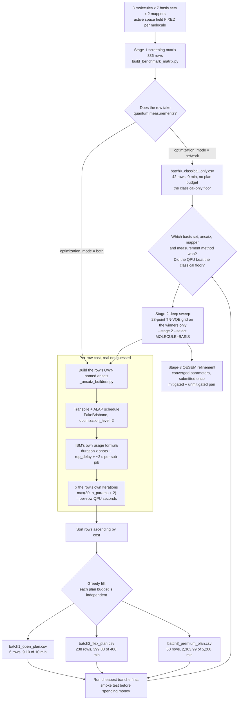

# IBM · TN-VQE · QESEM

A benchmark campaign asking one question: **on real IBM hardware, does
Cebule's tensor-network VQE beat plain VQE, and for which basis set,
mapper and measurement method?** With a Qedma QESEM error-mitigation arm
on the answers that survive.

The folder name reads *vendor · method · mitigation* — `ibm` is the plan
being spent, `tn-vqe` the method under test, `qesem` the error-mitigation
layer refining its results.

## The three stages

The sweep is split where the real decisions fall, so that each stage buys
the information the next one needs. Only stage 1 is committed: a later
stage's inputs are an *output* of the stage before it, and there is no
defensible default for them before those results exist.

| Stage | Question | File | Rows |
|---|---|---|---|
| **1 — screening** | Which basis set, ansatz, mapper and measurement method are worth pursuing? | `stage1_screening_matrix.csv` | 336, committed |
| **2 — deep sweep** | For the winners, how do the TN-VQE sweep parameters behave? | `stage2_deep_sweep.csv` | generated on demand |
| **3 — QESEM refinement** | Does error mitigation move the converged energy closer to the classical reference? | `stage3_qesem_refinement.csv` | generated on demand |

```sh
# Stage 1 (committed; regenerate after any generator change)
PYTHONPATH=src python examples/guides/build_benchmark_matrix.py

# Stage 2, once stage-1 results exist
PYTHONPATH=src python examples/guides/build_benchmark_matrix.py --stage 2 \
    --select H2=cc-pvdz --select Li2=6-31g --select H2O=def2-svp \
    --ansatz EfficientSU2

# Stage 3, once stage-2 runs have converged
PYTHONPATH=src python examples/guides/build_benchmark_matrix.py --stage 3 \
    --from data/benchmarks/ibm_tn-vqe_qesem/stage2_deep_sweep.csv \
    --refine 17=results/converged/case_17.json --precision 0.0016
```

Each stage refuses to run without its selection: no `--select`, no
`--refine`, no `--precision`, no output. That refusal is the design, not
a missing convenience.

## What the tranches cost

The stage-1 matrix is split into sequential tranches sized to each IBM
access plan's QPU-time budget by
[`split_benchmark_batches.py`](../../../examples/guides/split_benchmark_batches.py).
**Each plan's budget is independent, not cumulative** — batch2's 400
minutes is a *fresh* Flex Plan purchase, not 400 minutes on top of what
Open already gave you free.

| File | Rows | Est. QPU time | Plan budget | Headroom |
|---|---|---|---|---|
| `batch0_classical_only.csv` | 42 | 0.00 min | none — takes no quantum measurements | n/a |
| `batch1_open_plan.csv` | 6 | 9.10 min | 10 min (Open Plan, free) | 0.90 min |
| `batch2_flex_plan.csv` | 238 | 399.88 min | 400 min (Flex Plan minimum purchase) | 7 s |
| `batch3_premium_plan.csv` | 50 | 2,363.99 min | 5,200 min (Premium Plan annual minimum) | 2,836 min |

**2,772.97 minutes total**, every row from the master matrix accounted
for in exactly one file. batch2's headroom is thin *by construction*, not
by luck: the fill is greedy, so each tranche takes rows until the next
one would not fit. Any change to the shots, the iteration budget or the
backend re-shuffles the tranche boundary, so the split is **regenerated,
never patched**.

### The optimizer budget is per row, and it is the largest number here

`Iterations` is a real column, computed as `max(30, n_params + 2)` from
each row's own free-parameter count. It replaced a flat 30 applied to
every row, and that was not a conservative assumption but an invalid one:

- COBYLA builds an initial simplex of `n+1` points before it can take a
  single descent step, and `scipy.optimize.minimize` does **not** honour
  a `maxiter` below that. It raises `maxfun`, warns `COBYLA: Invalid
  MAXFUN`, and runs `n+2` evaluations anyway.
- Measured against this repo's own scipy: at 142 parameters, a `maxiter`
  of 30 consumes **144** evaluations and moves the objective by exactly
  zero. All of them go into building the simplex.

So a flat 30 was wrong in both directions at once — it under-billed the
QPU by up to 4.8x on the widest rows, and the 30 submissions it *did*
bill would have bought no optimisation at all. Costing the rows honestly
is what took the campaign from 752 to 2,773 minutes and forced the
tranches to re-cut.

| Row kind | Free parameters | Iterations |
|---|---|---|
| TN-VQE, 2 qubits | 22 | 30 (at the floor) |
| TN-VQE, 4 qubits | 46 | 48 |
| TN-VQE, 8 qubits | 94 | 96 |
| TN-VQE, 12 qubits | 142 | 144 |
| UCCSD, 12 qubits / 8 electrons | 200 | 202 |

**The floor is what stage 1 budgets, and that is a deliberate decision
rather than a cost dodge.** Stage 1 is a *screen*: its job is to rank
rows and prove the pipeline runs end to end, not to converge anything. A
row sitting at the floor completes its simplex and no more, so a stage-1
energy at 8 or 12 qubits is not a converged energy and should never be
quoted as one. Converged runs are stage 2's, at a multiple set from
stage-1 results. Raising `MIN_ITERATIONS` or the multiple in the
generator raises every tranche total roughly in proportion.

One assumption remains inside this: **one circuit submission per
cost-function evaluation**, each paying its own ~2 s of per-sub-job
overhead. If a row's evaluations were batched into fewer sub-jobs that
overhead would amortise and these figures would come down — worth
checking against a real run, though it cannot rescue a flat iteration
count, because the evaluation count itself is what varies.

### Where the money goes

The 14 UCCSD rows at 12 qubits cost ~9,296 s each — **2,169 of the
campaign's 2,773 minutes, 78% of the budget in 4% of the rows**. That is
the 200-operator excitation pool: a deep Trotterized circuit *and* 202
submissions of it. Everything else clusters far lower, where the
per-sub-job overhead dominates the circuit's own execution time.

The lesson worth keeping from an earlier round: **a cost correction
measured on one batch does not generalise to the others**, because the
batches differ in kind. batch2 is hardware-efficient circuits where fixed
overhead dominates; batch3 is deep UCCSD where the circuit itself does.

### Per-row estimates are real, not guessed

Same method as
[`backends/ibm_cost_estimator.py`](../../../docs/integrations/ibm_cost_estimator.md):
real ALAP-scheduled transpilation against a `FakeBrisbane` calibration
snapshot (no credentials needed) plus IBM's own documented usage formula.
Only 14 distinct circuits are actually transpiled across all 294 costed
rows, cached per (ansatz, qubits, reps, electrons, shots) — the matrix
has far more rows than distinct circuits.

Transpilation runs at `optimization_level=2`, which is what the run
really gets: TN-VQE calls `transpile(circuit, backend)` with no
`optimization_level` and offers no way to pass one, and `transpile`'s own
default resolves to 2 under Qiskit 2.x (it was 1 under 1.x). That is why
the matrix records `Qiskit_Version` rather than an optimisation level —
"Qiskit's default" is a version-dependent value, so the version is the
thing worth recording.

Each row's **own** named ansatz is built, not a stand-in, and for the
platform it runs on: Qiskit's `efficient_su2` / `real_amplitudes`, a real
first-order Trotterized `UCCSD` over this project's Jordan-Wigner
singles-and-doubles pool, and — on TN rows — `n_local` with an RzRyRz
rotation block and `'sca'` CX entanglement, the circuit Cebule TN_QC_OPT
builds on its **Qiskit** path.

**`Measurement_Method` does not change this estimate.** The estimator has
no way to know how many distinct circuits Cebule's basis-state-pair
grouping would really produce for a given Hamiltonian; that is an output
of a real run. So every `pauli`/`grouped` pair of an otherwise-identical
row gets an identical estimate and lands in the same tranche. `grouped`
is expected to cost less, which is the whole point of the method, so real
per-row costs would reshuffle rows — especially near batch2's boundary.

**Extra columns** (`Est_QPU_Time_S`, `Est_QPU_Time_Cumulative_S`) are
appended to each tranche file beyond the matrix's own columns, for
auditability. The cumulative column should never exceed that file's plan
budget in seconds.

## The study, end to end



Three things that diagram makes explicit. The **loop back into the
estimator** is the point of the staged design: stage 2 is costed by the
same machinery, on the small set of combinations stage 1 selected, rather
than on all seven bases speculatively. The **classical-only branch
rejoins at the decision node**, not at the end — a `both` row that does
not beat its `network` control has not shown the quantum circuit
contributed anything, which is a stage-1 finding in its own right. And
**stage 3 hangs off stage 2, not off the screen**, because refinement
consumes converged parameters and only a converged run produces them.

## Rows are sorted cheapest-first

Rows are sorted ascending by estimated per-row QPU time before being
greedily filled into each budget in order, so batch1 gets the cheapest
calculations available — a smoke test before spending real money or
quota. That is why batch1 is dominated by 2-qubit `H2` `mol_map` cases
rather than, say, one row per molecule. Prioritising *coverage* over
strict cost minimisation is an equally valid sort strategy; it is a
one-line change to the sort key.

The 42 zero-QPU rows are held out of that sort: their cost is genuinely
zero rather than merely unknown, and left in the ascending sort they
would fill the free tier with rows that cost nothing and displace the
smoke tests it exists for.

## The active space is held fixed across basis sets

Every stage-1 row for a given molecule uses the same active space,
regardless of basis. That is what makes stage 1 a basis-set screen rather
than a confound: the basis is the only thing varying, so a stage-1 energy
difference is attributable to it.

| Molecule | Electrons | Active space | Frozen | JW qubits | mol_map qubits |
|---|---|---|---|---|---|
| `H2` | 2 | CAS(2,2) | nothing to freeze | 4 | 2 |
| `Li2` | 6 | CAS(2,2) | both Li 1s orbitals | 4 | 2 |
| `H2O` | 10 | CAS(8,6) | O 1s | 12 | 8 |

This is also what makes the campaign runnable at all: qubit counts no
longer scale with the basis set, so `H2O`/cc-pVTZ costs the same 12 JW
qubits as `H2O`/sto-3g instead of 116. Stage 2 can opt back into the full
space with `--active-space full` where the hardware (or the local machine
running MOL_MAP) can take it.

## Mapper and method are separate columns

`Mapper` records only the fermion-to-qubit mapping, which is what the
word means. Cebule's TN_QC_OPT is not a mapping and not an ansatz; it is
the optimisation method wrapped around one, so it lives in `Method`:

| Column | Values | Meaning |
|---|---|---|
| `Mapper` | `JW` | Jordan-Wigner, `2 x active_orbitals` qubits |
| | `mol_map` | Cebule's constraint-based encoding, fewer than `2N` qubits |
| `Method` | `VQE` | plain variational eigensolver |
| | `TN-VQE` | Cebule TN_QC_OPT, tensor network plus circuit |
| `Ansatz` | `EfficientSU2`, `RealAmplitudes`, `UCCSD`, `n_local_rzryrz_sca` | the actual circuit family |

`UCCSD` appears on `JW` rows only: it builds excitation operators from
fermionic modes, which needs a fermion-to-qubit mapping to sit on, and
mol_map's qubits index determinants rather than spin orbitals.

`n_local_rzryrz_sca` is TN_QC_OPT's **Qiskit** circuit side —
`n_local(n, ["rz","ry","rz"], "cx", entanglement="sca")` — which is what
runs in an IBM campaign. The task's PennyLane path builds a different
circuit, `StronglyEntanglingLayers`, with a different parameter count
(`3nR` against `3n(R+1)`), so `Backend_Platform` pins which one a row
means.

### `Backend_Platform` is `ibm_brisbane`, and it mixes two vocabularies

TN rows target **real hardware**, not a simulator, so their share of the
Flex Plan is genuinely billed. The value has to be a string TN-VQE's own
`get_backend` really routes to Qiskit, and its dispatch is:

| `backend` string | Routes to |
|---|---|
| `qasm_simulator`, `statevector_simulator`, `unitary_simulator`, `aer_simulator` | Qiskit |
| anything prefixed `fake` | Qiskit |
| anything prefixed `ibm` | Qiskit |
| **everything else** | `qml.device(...)`, i.e. PennyLane |

`ibm_brisbane` hits the third branch, so the column now asserts the same
path its `3n(R+1)` parameter count assumes. An earlier revision used
`qiskit.aer`, which matches none of the Qiskit branches and therefore
selected the *PennyLane* circuit — exactly the ambiguity this column was
added to remove. For a local run the string is `aer_simulator`, not
`qiskit.aer`.

The column deliberately carries two vocabularies: `TNQCOptInput.backend`
on TN rows, qpubench's own `IBMAdapter` name (`ibm_runtime`) on VQE rows.
That is defensible, but it is stated rather than left to be inferred.

## The four TN rotation families

`TN_Ansatz` names which family builds `U(θ)` on the network side. All
four are real `M_ANSATZE` members (`functions_U.py:150-161`):

| `TN_Ansatz` | Reads as | params/node | entangles | conserves N |
|---|---|---|---|---|
| `rotation_1param` | one rotation angle per network node; no entanglement in `U(θ)` | 1 | no | no |
| `rotation_3param` | three angles per node (a general single-qubit rotation); still non-entangling; the task's own default | 3 | no | no |
| `givens` | a Givens rotation per node — one angle, entangling, particle-number conserving; an orbital rotation | 1 | **yes** | **yes** |
| `number_preserving` | five angles per node, entangling, particle-number conserving; the most expressive and the most expensive | 5 | **yes** | **yes** |

Both `rotation_*` families are **non-entangling**: the network factorises
across the two wires of every M gate, so `U(θ)` cannot entangle at all —
it only rotates each qubit's local basis. A matrix sweeping just those
two sweeps two variants of "no entanglement in `U(θ)`" and never touches
the case the method exists for.

**Stage 1's single TN reference point uses `givens`.** It entangles,
conserves particle number, and is the only family with a fast path in the
implementation (`_orbital_pauli_terms` routes it through
`OrbitalRotationHamiltonian` at O(N⁵) instead of contracting the network
at 2ⁿ cost), so it is also the family whose stage-1 timings resemble
stage 2's. The switch costs nothing: the family changes `U(θ)`, not the
circuit, so every per-row QPU estimate is unaffected. To screen on the
task's own default instead, change `STAGE1_TN_REFERENCE` in the
generator — it is one constant.

`number_preserving` is marked in `Notes` as a **control**, not a
candidate: it is a strict superset of `givens` that is not a
single-particle transformation, so `U†HU` picks up higher-body terms and
many more Pauli strings. It is carried to check that on hardware, and it
is the first arm to cut if budget tightens.

### What stage 2's 28 points are, explicitly

Four families fit in the same 28 points two used to occupy, because the
family comparison is a *method* question, not a chemistry-coverage
question, and so does not need the full grid on every family:

| Slice | Points |
|---|---|
| `givens` on the full grid: `network=0` x 4 circuits, plus `network∈{1,2,3}` x 4 circuits | 16 |
| family-comparison core: `rotation_1param` / `rotation_3param` / `number_preserving`, at `network∈{1,3}` x `circuit∈{1,2}` | 12 |
| **total** | **28** |

Pinning `givens` as the reference family rather than `rotation_3param` is
a deliberate choice: a non-entangling `U(θ)` is not a baseline worth
building a grid around. `rotation_3param` survives inside the core, which
is where the comparison against the task's own default belongs.

`--sweep-circuit-ansatz` additionally crosses the 12-point core with
`excitation_preserving_linear`. It is **off by default** because it takes
the sweep from 28 to 40 points and the file from 348 to 492 rows, and
because `xx_plus_yy` is not a FakeBrisbane basis gate — re-cost before
enabling it rather than assuming parity.

## Columns

| Column | Meaning |
|---|---|
| `Case_ID` | Row index |
| `Stage` | `1_screen`, `2_deep` or `3_refine` |
| `Molecule`, `Charge`, `Multiplicity`, `Num_Electrons` | `H2`, `Li2`, `H2O`, all neutral closed-shell singlets |
| `Basis`, `Basis_Source` | 6 [Basis Set Exchange](https://www.basissetexchange.org/) names or `qvSZP`; see [docs/integrations/basis_sets.md](../../../docs/integrations/basis_sets.md) |
| `Active_Space` | `valence_cas` (core frozen) or `full` |
| `Active_Electrons`, `Active_Orbitals` | The space the Hamiltonian is built in; maps onto `BenchmarkRecord.active_electrons` / `.active_orbitals` |
| `Mapper`, `Method`, `Ansatz` | See table above |
| `Ansatz_Reps` | Circuit repetitions; equals `TN_Layers_Circuit` on TN-VQE rows |
| `N_Qubit`, `N_Qubit_Source` | Qubit count and where it came from: `jw_exact`, `mol_map_run` (a real MOL_MAP run) or `mol_map_inferred` (see below) |
| `Backend_Platform` | Which platform's circuit the row means: `ibm_brisbane` (`TNQCOptInput.backend`) on TN rows, `ibm_runtime` (qpubench's own `IBMAdapter`) on VQE rows. Without it, `Num_Opt_Params_Phi` is ambiguous |
| `Optimizer`, `Opt_Options` | `COBYLA`, matching `TNQCOptInput.opt_method`'s default, and the `opt_options` dict passed straight to `scipy.optimize.minimize`. `{}` is a *recorded* choice, not an unexamined one — for COBYLA, `rhobeg` changes both convergence and the evaluation count, i.e. the row's QPU cost |
| `Iterations` | Cost-function evaluations the row's optimizer will really consume, `max(30, n_params + 2)`. Not a global constant: see the optimizer-budget section above |
| `Shots` | 4,096, pinned via `TNQCOptInput.n_shots`; `n/a (network mode)` where no quantum measurement is taken, `n/a (QESEM: precision-driven)` on mitigated rows |
| `Qiskit_Version` | The installed Qiskit, recorded because `transpile`'s default `optimization_level=None` resolves to 2 under Qiskit 2.x and 1 under 1.x — "Qiskit's default" is not a fixed value |
| `TN_Layers_Network`, `TN_Layers_Circuit` | TN-VQE sweep: θ (classical TN side, 0 to 3; 0 = "circuit only" baseline) and φ (quantum circuit side, 1 to 4). Ranges match the reference paper ([arXiv:2402.12105](https://arxiv.org/abs/2402.12105)) |
| `TN_Ansatz` | One of the four families above, or `n/a (no TN layers)` / `n/a (not TN-VQE)` |
| `Optimization_Mode` | `both` (jointly optimise θ and φ) or `network` (θ only, no quantum measurements — the zero-QPU control, see below) |
| `Measurement_Method` | `pauli` or `grouped`, matching `TNQCOptInput.measurement_method` exactly; `n/a` where the dimension does not exist |
| `Qasm_Ansatz_File`, `Qasm_Ansatz_SHA256` | The pinned circuit under `data/qasm/` and a hash prefix of it, so a silently edited circuit stops matching. Generated by [`pin_qasm_ansatz.py`](../../../examples/guides/pin_qasm_ansatz.py) |
| `Num_Opt_Params_Phi` | Circuit-side parameter count, computed per `Backend_Platform`; for `UCCSD` it is one amplitude per singles+doubles excitation, counted from the real pool. On a `network` row it is the count held **fixed**, not optimised |
| `Phi_Init` | `zeros` on `network` rows, `random(seed=N)` on `both` rows, `n/a (not TN-VQE)` elsewhere — see below |
| `Num_Opt_Params_Theta` | Network-side parameter count. Derivable from the inputs, unlike the column below: `TN_Layers_Network x ((3n - 2) // 2) x params_per_node` |
| `Num_ExpVals_Per_Iter` | Blank — an output of a real run, not derivable from inputs |
| `Error_Mitigation` | `none` or `qesem`. Every stage-1 and stage-2 row is genuinely `none`, so the arm is additive |
| `Precision` | QESEM target σ in Hartree on mitigated rows; `n/a (shot-based)` on every row costed in shots |
| `QESEM_Execution_Mode` | `batch` (QPU released between classical steps) or `session`; `n/a (not QESEM)` elsewhere |
| `Refines_Case_ID`, `Converged_Params_File`, `Converged_Params_SHA256` | Stage-3 provenance: which run's converged parameters this row submits, and a hash of them |
| `Notes` | Per-row provenance and caveats |

### `Phi_Init` is scoped to the optimization mode

Upstream randomises φ (`2π·random`, `run_TNQCOpt`) whenever `phi_init` is
`None`, **unseeded** — so an unpinned run has an initialisation nobody
can reproduce. That is the defect. But *which* pinned value is right
differs by mode, and the two must not be conflated:

- **`network` rows get `zeros`.** All-zero RzRyRz rotations make the
  circuit exactly the identity, so the reference state is `|0…0⟩` = the
  reference determinant, and θ then performs orbital optimisation on a
  frozen determinant. That is precisely the classical floor a `both` row
  has to beat. *This rationale is for the control rows specifically — it
  does not generalise.*
- **`both` rows get a seeded random draw.** On a row that actually
  optimises φ, starting at the identity is a liability rather than a
  feature: the initial state is the reference determinant and the
  gradient with respect to many φ parameters vanishes there, a well-known
  bad start for hardware-efficient ansätze. Seeding keeps the
  reproducibility win without changing the character of the
  initialisation, and it matches upstream's own default.

The campaign draws `2π·U(0,1)` from `numpy.random.default_rng(seed)` and
passes the vector explicitly through `phi_init`, because upstream exposes
no seed of its own. The mirror's `phi_init` default is `None`, not `[]`:
`None` is upstream's "unset" sentinel, while an empty list reaches the
shape check as a length-0 array against a `phi_shape` of `(3n(R+1),)` —
neither the documented random init nor a valid one.

### `Num_Opt_Params_Theta` is not just bookkeeping

With COBYLA the evaluation count scales with the parameter count, so a
`number_preserving` row is **5x** the classical optimisation work of a
`givens` row at the same layer count. At stage 1's
`TN_Layers_Network = 2` that is 4 / 12 / 20 parameters at 2 qubits, up to
34 / 102 / 170 at 12 — and via `Iterations`, it is QPU cost too.

`Num_ExpVals_Per_Iter` stays blank because it genuinely is a run output —
and it is the measurement that would support this campaign's most
defensible headline: *`givens` + `grouped` keeps measurement cost flat as
`TN_Layers_Network` grows, `number_preserving` does not.*

### The zero-QPU classical-only control

42 rows (one per molecule × basis × mapper) run
`optimization_mode="network"`: θ is optimised by classical tensor-network
contraction and φ is frozen, so **no quantum measurements are taken at
all**. They cost nothing against any IBM plan budget and live in
`batch0_classical_only.csv`, outside the plan tranches.

They exist because they are the floor every `both` row must be measured
against. This matters most on exactly the `givens` rows stage 1 screens
with: there `U(θ)` is an orbital rotation and can carry a large part of
the correlation energy by itself, so without the control a `both` run
reads as a quantum success when most of the result came from the
classical half.

**"Network" does not mean "no circuit."** `optimize_network` opens with
`circuit_to_mps(circuit, phi)`: the circuit exists at a frozen φ and *is*
the reference state θ is optimised against, which is why two controls
differing only in `TN_Layers_Circuit` give different floors. So these
rows record their real ansatz, reps, pinned QASM and φ count. What
distinguishes the control is that it takes no quantum measurements, and
`Optimization_Mode` already carries that — it does not need a second
marker, and `Shots = 0` was a real shot count where "shots do not apply"
was meant.

### `Measurement_Method` uses Cebule's own vocabulary

The two values are `pauli` and `grouped`, exactly as
`schemas.mirrors.mqsdk_cebule.TNQCOptInput.measurement_method` defines
them. `tests/test_docs_consistency.py` checks this column, and
`TN_Ansatz`, against the mirror's own vocabulary.

### Why there is no `Qiskit_Opt_Level` column

TN-VQE calls `transpile(circuit, backend)` with no `optimization_level`
argument and offers no way to pass one (`functions_qiskit.py:47,205`), so
the column could never be set from a task input. It is dropped rather
than left blank; `Qiskit_Version` records the thing that actually
determines the level.

## The QESEM refinement arm (stage 3)

QESEM belongs in this campaign as a **final-energy refinement**, not as
the measurement layer inside a variational loop.

### Why not an inner loop: throughput, not a structural block

It is tempting to argue that QESEM *cannot* drive a VQE optimizer,
because its characterization saving comes from one job covering many
parameter values supplied up front, while an adaptive optimizer's step
`k+1` depends on step `k`'s measured energy. That argument is about to
stop being true, so it is not the one to rely on:

- **Shared characterization is coming.** Qedma will reuse noise
  characterization across jobs that are close enough in time and similar
  enough to each other. A variational loop is the *good* case for the
  similarity condition: the circuit structure is fixed and only its
  parameter values move.
- **Cebule will expose QESEM as a TN-VQE measurement backend** once the
  feature is public. So the inner-loop pattern will be available; the
  question becomes whether the campaign should buy it, not whether it
  can.
- **The binding constraint is wall-clock throughput.** A mitigated
  evaluation carries queue time, characterization or its reuse check, and
  the mitigation sampling itself, and a variational optimiser needs those
  strictly in sequence. Across the number of systems this campaign
  screens, that does not close in calendar time.
- **The two reuse conditions interact, and this is the part worth writing
  down.** Reuse requires recency, and a variational loop inserts a
  classical optimiser step between every pair of jobs. If that step is
  slow enough — and on the larger rows the tensor-network contraction is
  not trivial — the loop can age out of its own reuse window and silently
  pay a fresh characterization mid-run. So the limit is not merely "this
  takes a long time"; it is that *taking a long time removes the saving
  the approach depends on*. Any future inner-loop experiment should
  measure the reuse window against real per-iteration wall-clock before
  assuming the saving applies.

No number is put on inner-loop cost here. The old "one characterization
per iteration" figure is about to be wrong, and its replacement depends
on a reuse window that is not public.

Where the parameterized path *does* earn its keep is the one place this
campaign has parameter values known in advance: a **dissociation curve or
geometry scan** — several bond lengths, one characterization, no adaptive
dependency. That is independent of the shared-characterization timeline,
and it is a good reason to close the open "geometries are unspecified"
decision below.

### What a refinement row is

**Two submissions, not one.** A mitigated energy on its own says nothing
about mitigation: it can only be read against the same circuit, at the
same parameters, on the same device, without QESEM. So every `--refine`
emits an unmitigated row and a mitigated one, identical but for
`Error_Mitigation`. Without the pair, the arm's headline result is "QESEM
returned a number", which is not a benchmark finding. Both are then
reported as **errors against the classical reference energy** — that is
what turns "the mitigated number is different" into "the mitigated number
is closer", which is the only version worth the QPU time.

**With a pointer to the parameters it refines.** `Refines_Case_ID` plus a
converged-parameter file and its hash. The parameters themselves are far
too long for a CSV cell — the same problem the pinned QASM solved by
going to a file — and without the pointer a refinement result is
unattributable.

**Cheap, because it is one job per row** rather than one job per
optimizer iteration. `Optimizer` reads `n/a (converged parameters)` and
`Iterations` is 1. The arm is few, late and small; it should not look
like a sweep.

### Precision is the arm's cost model, not a column to fill in later

σ determines what the arm costs *and* what it can conclude, so
`--precision` has no default and stage 3 refuses to generate without one.

- Chemical accuracy is about **1.6 mHa**. An energy quoted to ±0.1 Ha
  cannot distinguish basis sets, ansätze or mappers — which is this
  campaign's entire purpose — so a loose σ produces a result that cannot
  support any chemistry conclusion, however well mitigated it is.
- Tightening σ is expensive **superlinearly**: sampling cost scales as
  1/σ², so moving from 0.1 Ha to 1.6 mHa is order 10³–10⁴ times more
  sampling. QESEM's total is not purely sampling, so treat that as an
  order of magnitude rather than a multiplier — the conclusion survives
  the imprecision.
- So choose deliberately between two goals. *"Mitigation runs end to end
  in this pipeline and reduces error by a measurable amount"* is a
  legitimate result at a loose σ and worth reporting. It is a different
  goal from a chemistry result, and only one of the two justifies a
  chemistry-sized spend. **That choice is the decision hiding inside this
  column**, and it is still open.
- **Do not inherit a default σ** from an SDK or a mirrored schema.
  Service defaults are set for general use and tend to be far looser than
  chemistry needs.
- The arm's cost also depends on **which family fed it**: QESEM's
  sampling cost tracks the observable's Pauli-term structure, and the
  transformed Hamiltonian's term count depends on the `TN_Ansatz` that
  produced the converged state. Refining a `number_preserving` state is
  not the same price as refining a `givens` one, so each row says which
  it is doing.

### QESEM rows cannot carry the pauli/grouped comparison

QESEM takes an observable and returns a mitigated expectation value with
an uncertainty. It never exposes the raw bitstring distribution that a
basis-state grouping scheme needs in order to reconstruct expectation
values from grouped measurements. So on a QESEM row there is nothing for
`grouped` to consume and the dimension **collapses** — it is marked
`n/a (QESEM: no bitstring distribution)` rather than left reading `pauli`
as though it were a choice.

This is a property of the service, not of Cebule's integration with it:
the grouping would have to happen inside the mitigation, which the
interface does not expose. **The consequence is worth stating up front**:
*"`grouped` keeps measurement cost flat while `number_preserving` does
not"* is this campaign's most defensible headline, and the QESEM arm
cannot contribute to it. Whatever the arm is for, it is not that.

### Achieved uncertainty is the result, not metadata

QESEM returns an error bar alongside each value, and the requested σ is a
target rather than a guarantee — a job that hits its QPU-time cap first
will differ. Requested and achieved σ are therefore recorded separately,
and the schema already has homes for both:

| Quantity | Where it lives |
|---|---|
| Requested σ | `QESEMJobSpec.precision` (and `Precision` in the matrix) |
| Achieved 1-σ uncertainty | `QESEMExpectationValue.error_bar`, surfaced by `QESEMCircuitResult.mitigated_stds` |

A refinement result without its uncertainty is not interpretable against
either its unmitigated pair or the classical reference, so this gates the
arm's usefulness rather than merely tidying it. The mirror's
`QESEMExecutionMode` (`session` / `batch`) and
`parameterized_values: dict[str, list[float]]` both match the API, so no
new fields are needed — but the mirror should be re-verified against what
is *actually submitted* once the QESEM backend is public, the same
mirror-against-reality exercise the TN_QC_OPT mirror went through.

## mol_map qubit counts are computed, not left blank

Cebule's MOL_MAP encoding indexes only the determinants that satisfy the
particle-number and spin constraints, so its qubit count follows the
active space rather than the basis-set size:

```
n_qubits = ceil(log2( C(n_orbitals, n_alpha) x C(n_orbitals, n_beta) ))
```

This is **inferred**, not documented by Cebule, but it reproduces all
eight real MOL_MAP counts this project knows about exactly, including
both values that arrive independently of the fit
([`hamiltonian_sources/mol_map.py`](../../../src/qpubench/hamiltonian_sources/mol_map.py),
pinned by `tests/test_mol_map.py`):

| Molecule / basis | (orbitals, alpha, beta) | Determinants | Qubits |
|---|---|---|---|
| H2 / sto-3g | (2, 1, 1) | 4 | 2 |
| H2 / 6-31G | (4, 1, 1) | 16 | 4 |
| H2 / cc-pVDZ | (10, 1, 1) | 100 | 7 |
| H2 / def2-SVP | (10, 1, 1) | 100 | 7 |
| H2 / def2-TZVP | (12, 1, 1) | 144 | 8 |
| H2 / cc-pVTZ | (28, 1, 1) | 784 | 10 |
| H2O / sto-3g | (7, 5, 5) | 441 | 9 |
| Li2 / sto-3g | (10, 3, 3) | 14,400 | 14 |

Two checks that this is the rule and not a coincidental fit: H2/cc-pVDZ
and H2/def2-SVP are different basis sets with the same active space and
the same reported count, which no basis-size formula predicts; and
Li2/sto-3g and H2/cc-pVDZ share 10 orbitals but differ in electron count,
giving the 14 and 7 the formula requires.

Rows whose count comes from the formula rather than a real run are marked
`mol_map_inferred` in `N_Qubit_Source`, so they stay distinguishable from
measured ones. Treat them as good enough to size a circuit and cost a
tranche, not as a substitute for a real MOL_MAP run.

## Known limitations

- **Stage-1 energies at 8 and 12 qubits are not converged.** Those rows
  sit at the COBYLA simplex floor by design; they rank rows and prove the
  pipeline, and convergence is stage 2's job.
- **Cost estimates treat `pauli` and `grouped` rows as identical.** The
  circuit-count reduction is an output of a real run, so the
  [IBM cost estimator](../../../docs/integrations/ibm_cost_estimator.md)
  cannot account for it. `grouped` is expected to cost less, so real
  per-row costs would reshuffle rows between tranches.
- **`TN_Layers_Network` is classical compute, not QPU time.** Only
  `TN_Layers_Circuit` affects IBM billing; the two costs move
  independently.
- **The QESEM arm cannot be costed by the transpile model.** QESEM's own
  estimate is either analytical (no QPU consumed, but a pessimistic upper
  bound quantized to 30-minute steps) or empirical (5-minute resolution,
  under 10 minutes of real QPU to obtain). Neither is a transpiled
  duration, and the coarse analytical quantum cannot fit in batch2's
  seconds of headroom — so the arm needs its own tranche and its own cost
  source. Prefer empirical estimation on representative rows.
- **qvSZP qubit counts are computed offline** via
  `hamiltonian_sources.qvszp`.
- **Geometries are unspecified.** Every row names a molecule and a basis
  but no bond length, still an open campaign decision — and the one the
  QESEM parameterized path would most reward closing.

Sources: Cebule docs
([docs.mqs.dk](https://docs.mqs.dk/sections/section_014_quantum_computing/),
checked 2026-07-09) and
[arXiv:2402.12105](https://arxiv.org/abs/2402.12105), cross-checked
against `schemas/mirrors/mqsdk_cebule.py` — itself re-verified against
the TN-VQE implementation (cebule-tn_vqe @ dev-kba `a760489`), with
file:line citations in its docstrings. Qedma's QESEM behaviour is
mirrored in `schemas/mirrors/qedma_qesem.py` from
[docs.qedma.io](https://docs.qedma.io/); the utility-scale precedent for
refining pre-optimized parameters is
[arXiv:2508.10997](https://arxiv.org/abs/2508.10997).

## Open campaign decisions

Tracked as a git-bug item; run `git bug bug --status open` and look for
"IBM VQE campaign". Settled and recorded above: shots, transpiler
optimisation level, the iteration budget, scale, `optimization_mode`,
`Phi_Init`, and the backend. Still open:

1. **What σ, and therefore what the QESEM arm is for** — a chemistry
   result or a mitigation demonstration. Everything else in the arm is
   sized from this.
2. **Geometries**, and whether to run the full space on the larger bases.
3. **Which stage-2 rows get refined, and on what criterion** — best
   energy, widest spread against the classical reference, or one per
   molecule. It is an output of stage 2, so it need not be answered now,
   but the criterion should be written down *before* stage 2 runs rather
   than chosen afterwards from the results.
4. **Whether any grouping-aware or multi-observable QESEM submission path
   exists** (a question for Qedma). If one does, it changes the
   grouped-collapse consequence above rather than just its labelling.
